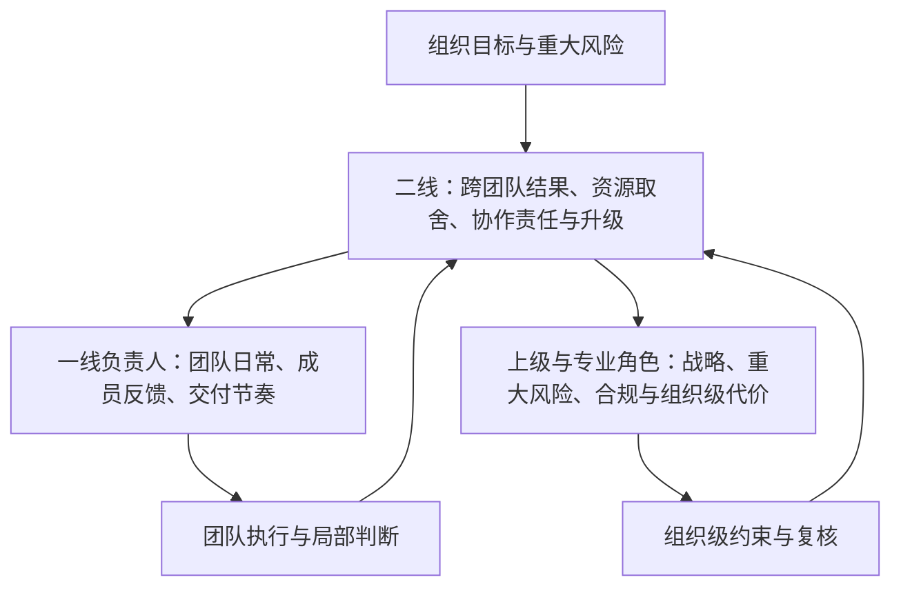

团队从一个方向长到多个方向时，最先变复杂的往往不是人数，而是目标。

原来一个团队能自己决定的事，开始牵动几个技术栈、几个业务线，或者几个不在同一条汇报线上的人。每个团队都很忙，也都能说清自己的理由；难的是，没人能决定哪些事该一起做，哪些事必须停，哪些资源该先投，出了问题又该由谁代表整体作选择。

这时，组织常常会先把问题理解成“再找一个能协调的人”。但协调不是答案。若这个人没有足够的授权，也没有人愿意在关键取舍上和他一起承担结果，他很快会变成更忙的传话人。反过来，若只是多设一个能拍板的层级，又会把所有事情堆到那里，组织只是在新的位置上制造瓶颈。

需要管理管理者的原因，不是一线负责人不够强，也不只是上级管不过来。它更像是业务目标变了以后，原来的组织方式已经无法把不同团队的局部努力连成一个结果。组织需要有人直接管理多个一线负责人，把目标、资源、协作责任和人员管理范围重新放在一起看，并对其中的取舍负责。

这里所说的“二线负责人”，指直接管理多个一线负责人的管理者，也就是英文里的 `manager of managers`。他还要对跨团队结果负责。不同组织可能使用不同的职位名称；本文讨论的是这段责任范围，不是固定职级。

本文里的“一线负责人”指直接管理一个团队、负责日常分工和成员反馈的人；“协作责任”指团队之间如何交接工作、谁负责哪一段以及遇到冲突找谁；“接班安排”指负责人扩大责任、离岗或离开时，谁能够继续承担目标以及组织如何完成交接。

这张图不是汇报线的组织图，而是责任边界图：二线连接必要的背景信息，却不自动接管一线日常，也不能替代上级或专业角色承担组织级风险。

## 问题先出在资源和协作责任上

二线是否必要，不该从“管多少人”开始判断。更值得看的，是组织是否已经出现了几种反复发生的情况。

第一种是资源被拆散。几个团队都在做重要的事，也都能解释为什么需要更多人、更多时间或更多支持。没有整体优先级时，资源会被最紧急的声音、最强的关系或最近的一次事故带着走。每个局部选择都说得通，合起来却没有人知道组织到底把力气放在了哪里。

第二种是协作责任没有明确负责人。一个专项需要产品、工程、业务、运营或其他技术团队一起完成，大家都同意目标，却没有人能代表整体说明范围、节奏和对外承诺。于是内部出现重复投入和相互等待；外部一有压力，每个团队先保护自己的交付，协作反而散掉。

第三种是错误开始变贵。一个团队判断错了，过去可能只影响一段工作；现在一次优先级、一次承诺、一次资源配置，都会同时影响多个团队。问题不在于每个决定都必须上升，而在于总得有人能把局部事实放回整体目标里判断。

举例来说：一家公司要在这个季度上线一个新支付渠道。业务团队想两周内让种子用户跑通流程，好去谈下一轮合作；负责账务核心系统的团队担心，现在的库存扣减逻辑一旦被新渠道并发调用，日终对账很可能对不上；同一时间，另一条产品线还有一份客户合同写死的截止日期，用的是同一批数据库连接。三方各自的判断都站得住，却没人能回答：这个季度最不能丢的是哪一项？如果只能保一个，先放下哪个需求？对外只能承诺一个上线时间时，谁来签这个字？

如果只让这几位负责人"自己多沟通"，大概率是各自回去照自己的优先级排期，谁也说服不了谁；如果事事交给更高层拍板，连账务逻辑改一行代码这种细节也会被送上去等批复。二线在这里要做的，不是替这三个团队重排计划，而是把共同目标、资源取舍和对外承诺放到同一张桌子上过一遍。选完之后，三个团队才知道这个季度谁先推进、谁先放一放，以及下次再撞车时该找谁拍板。

| 看见的现象 | 先要确认的事 | 可能真正缺少的东西 |
| --- | --- | --- |
| 每个团队都在要资源 | 组织这轮最重要的结果是什么 | 整体优先级与取舍责任 |
| 专项反复卡在交接处 | 谁对范围、协作责任和对外承诺负责 | 统一协作责任与升级边界 |
| 同类冲突总要临时协调 | 这次选择里谁承担了代价 | 有授权的结果责任人 |

[人力规划不是比率游戏](/writing/2023/04/headcount-is-not-a-ratio/)讲过，人不够往往只是表象。到了管理管理者的场景，这句话还要再往前走一步：即使资源增加了，组织也要先作选择。否则多出来的资源只会变成更多项目、更多协作责任和更多没人真正负责的事。

## 这个位置通常不是凭空出现的

二线有时是组织调整时新设的正式岗位；也常常是从一个专项开始的。

业务遇到一个原有结构解决不了的问题，先有人牵头把问题说清、定义目标，再向上争取必要的支持。接下来要协调资源，重排优先级，推动不向自己汇报的团队完成各自那一段工作。事情做成以后，组织才会发现：这不是一次临时协调，而是一段持续存在的责任。

有些人把这个过程理解成“先拿结果，再有头衔”。这并不是通行的晋升规则。不同组织可能先任命、后补权限，也可能先给专项、再扩大责任。这里真正重要的是：职位、权限和责任范围最终要与组织需要承接的问题相匹配，而不是只为某个人找一个更高的坑位。

在这个过程中，有一种很难写进组织图、却会影响事情能否推进的**跨团队信任**：没有直线汇报关系的人，为什么愿意在关键时刻跟你一起改优先级、承担代价、调整原先的安排？通常不是因为职位名称，而是因为他们见过你兑现承诺、把代价讲明白、事情出了偏差也不把责任丢给别人。

这种信任撑不起没有授权的决定，遇到真正的取舍还是推不动；但反过来，有授权却没人真心信你，选择也只会停留在一纸通知上。二线需要同时把这两件事都做扎实。

## 二线不是项目负责人放大版

项目负责人也会协调人、推进进度、处理风险。两者的区别不在于谁更忙，而在于责任停在哪里。一个项目负责人可以把一次交付推进到终点；二线还要处理这次交付之后留下的组织问题：资源怎么回到下一轮选择，几个团队的协作责任是否需要重新划分，谁该获得更大的责任，原来的人员管理范围是否还适合新的目标。

因此，二线既不能只看一件事做没做完，也不能只靠职位给自己增加工作。它要对一段时间内多个团队的共同结果负责，但这种责任也有边界。该由一线负责人判断的日常问题，仍应留在一线；该由更高层承担的战略、重大风险或组织级代价，也不应由二线代替承担。

可以把二线看成一个负责多个团队共同结果的管理层级：它向下让团队之间能协同，向上让组织在需要时作出清楚选择。这个位置做得好，大家未必会觉得“多了一个人管我”；更常见的感受是，资源和团队边界终于有人说得清，原来反复卡住的事情开始有地方处理。

## 什么时候不该加这一层

并不是团队一多就该加二线。

如果业务目标仍能由单个团队清楚承接，团队之间的依赖不多，大多数资源和优先级能在原有责任线内解决，那么多加一层通常只会增加解释和等待。此时组织更可能缺的是清楚的目标、明确的协作责任，或者一线负责人尚未得到足够的支持，而不是一个新的人员管理层级。

一个简单的反向检查是：没有更高层逐项介入时，现有负责人能否排出共同优先级、代表整体作出承诺，并在冲突出现时知道谁该决定、谁该承担代价？如果答案大体是肯定的，先不要急着加层。

二线不是为了让组织图更完整。它只在原有结构已经无法把目标、资源和协作连起来时才有价值。它的工作也不是替每个团队做决定，而是让多个团队能够对同一个结果负责。

但“结果”也不是唯一的尺子。若一个新的管理层级只能让组织更快地交付，却把安全、合规、隐私、稳定性或人员公平推给之后再处理，它并没有真正解决目标问题，只是把代价往后挪。二线需要承接的，既包括如何把事情做成，也包括哪些事情不能用结果来交换。

## 二线负责人的画像：先看他能负责什么多团队问题

同样叫二线，重建业务线时需要的人，和维持一套稳定交付时需要的人，可能完全不同。画像应该从问题开始，而不是从一个理想人物开始。

## 先问两个问题

第一，这个位置要拿到什么结果？可能是业务增长、系统重建、多个团队的共同交付，也可能是把一个反复依赖个人的组织重新整理清楚。

第二，为什么现有的一线负责人不能自己承担？是目标之间发生冲突，资源需要重新分配，还是一个专项需要跨越原有汇报线？如果这些问题没有说清，新增岗位很容易变成“找个强的人来看看”。

前文所说的管理管理者里所说的二线负责人，是直接管理多个一线负责人的管理者。它不是单纯的项目协调，也不是所有团队的第二个审批人，而是处理多个负责人之间、多个团队之间，原有管理分工无法独立解决的事情。

## 看一个人能不能把多团队问题推进到结果

可以看一条完整的结果链，而不是只听候选人讲自己“做过什么”——他当时面对的目标是什么，问题为什么复杂，他争取了哪些支持，谁需要改变原来的安排，最后拿到了什么结果。

这里尤其要听他怎么讲没有做的事情。资源不够时，他放弃了什么？跨团队有分歧时，谁承担了代价？结果没有按预期发生时，他先调整目标、组织还是人？这些地方，比“我有很强的推动力”更能说明一个人是否能承接二线的工作。

可以用几个常见场景来追问：

| 场景 | 值得听的证据 | 容易误判的表象 |
| --- | --- | --- |
| 目标冲突 | 能把两个团队的目标放回同一个结果，说明取舍和代价 | 说话强势，最后让别人服从 |
| 资源竞争 | 能争取自己需要的资源，也能说明组织为什么这样分配 | 只会替自己的团队抢更多人 |
| 组织变化 | 能把模糊变化变成一段可执行的责任和协作边界 | 会讲愿景，但没人知道下一步做什么 |

这张表不是打分表。它只是帮助面试者追问事实：当时决定了什么？谁不同意？如何处理？后来什么信号说明选择有效，或者应该重来？

例如，同样是"资源协调"，两位候选人都可能讲出一个把项目推进下去的故事。一个人说的是：自己不停跟进、找关系、加班补位，最后按时完成。另一个人会说：一开始数据团队和渠道团队各自把这个月的排期占满了，他先把共同目标重新讲清，再让双方把各自不能放弃的约束摆出来；最后保住了其中一段关键路径，另一段延期交付，同时把下一次同类冲突该由谁升级的条件写清楚。前者未必做得差，但后者更能说明他是否有能力把一次推进变成组织可以承接的选择。

这不是偏爱会说故事的人。相反，二线的故事越好听，越该追问细节：当时谁拥有最终决定权？哪一项资源没有拿到？哪个人或团队承担了代价？结果如果没有发生，他准备怎样重来？答案里有没有这些具体内容，往往比“战略”“格局”之类的词更可靠。

## 不要把个人能力当成岗位答案

很能交付不等于能管好几个团队；认识的人多、关系广，也不等于复杂局面里还能守住目标。二线需要的，是把判断、授权、资源和关系连成结果的能力。

这也不等于每个人都要“全面”。一线负责人之间可以有不同长处：有人熟悉业务，有人能处理技术和系统，有人善于建立合作，有人能把结果推进到最后。组织要先定一条不能退的底线，再看当前缺哪种能力，而不是把所有人筛选成同一种样子。

互补属于接班安排，但画像在这里至少要留一个问题：组织已经有什么，真正缺什么？如果所有候选人都因为“像现在的人”而被选中，组织很可能只是把原来的盲点复制了一遍。

### 不能只按个人表现给画像

有些候选人在自己的领域里非常可靠：目标清楚、交付稳定、团队也愿意跟随。这些都是重要基础，但二线还会遇到另一类问题：当几个目标互相冲突、资源不够、关系变复杂时，他能不能把原有的做法放下来，重新组织选择？

这也是为什么“他以前带得很好”不能直接推出“他现在适合管理管理者”。前一个岗位可能要求他能把一个团队经营得很稳，后一个岗位要求他让几位负责人在不完全相同的目标下还能一起往前走。放在前一个位置上，亲自下场经常是加分项；换到后一个位置，如果每次还是靠自己补位，团队反而会退回到只认一个人的状态。

反过来也一样。有人擅长打开新的方向、争取资源、处理外部关系，却未必愿意长期经营人员问题和团队能力。画像的意义不是给人排高低，而是让组织在任命之前把这种错配说出来：当前缺的是哪一种能力？这个人会补上什么，又可能留下什么空白？

## 画像会随组织变化

目标变了，岗位要解决的问题变了，画像也应该重新打开。在稳定交付阶段表现很好，不代表他适合带一次业务重组；反过来，擅长开新局的人也不一定适合长期经营一套已经成熟的系统。

这不是否定人的能力，而是把能力放回具体问题里。正如[技术招聘：从招到人到建立长期判断](/writing/2022/01/technical-hiring-long-term-judgment/)所写，先定义未来要解决的问题，再区分不可妥协的条件和可以在工作中培养的部分。

因此，画像不能只在招聘时使用。组织目标、团队边界或结果发生明显变化时，都应该重新问一次：这个岗位还在解决原来的问题吗？如果不在，继续沿用旧画像，反而会让人和组织都承担错误的期待。

## 画像最后要落到什么

画像不是为了给候选人贴标签，而是为了让选人、授权和复盘有共同语言。面试时可以让候选人讲一条完整的结果链；任命之后，看他是否能把目标说清、拿到必要支持、促成不同团队行动；结果出来后，再看他如何解释取舍，以及哪些判断值得留下。

如果一个人只能靠自己亲自解决问题，或者必须把所有决定集中到自己手里，短期可能很有效，长期却很难成为二线。二线要承接的不是更多任务，而是更复杂的结果。

所以，二线负责人的画像不在于“他有多少优点”，而在于：**面对当前组织需要处理的多团队问题，他能否让不同的人和团队作出共同选择，并对结果负责。**
