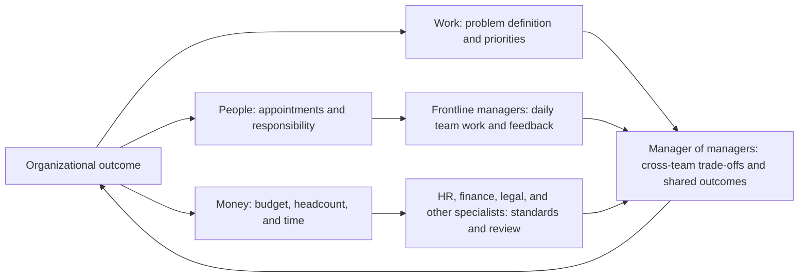

Once someone starts managing multiple frontline managers, many management questions cannot be answered by looking only at the organization chart.

In a large company, this role may be a second-line leader; in a small startup, it may be a VP, CTO, or another leader responsible for turning several teams into one outcome. The titles and company sizes differ, but the need to understand how an organization distributes decisions, responsibility, and resources is the same.

An organization chart shows who reports to whom, but not necessarily who can decide whether to hire, change a priority, or move a budget. A job description says what someone is responsible for, but not necessarily who can stop an existing commitment when several teams’ goals conflict.

One useful way to examine an organization’s operating structure is through three kinds of authority: **people, work, and money**.

“People” means personnel and responsibility authority: who can hire, appoint, evaluate, promote, transfer, or end employment; who can design roles, change reporting relationships, and define a person’s scope of responsibility.

“Work” means authority over problem definition and priorities: who can define the problem, set priorities, change the goal, decide what to do or stop doing, and decide when work should end.

“Money” means authority over budgets and capacity: who can decide budgets, headcount, procurement, vendors, equipment, outsourcing, and team capacity; who can keep an investment going or move resources from one direction to another.

In a small team, these authorities often sit with one person. As an organization grows, or as its business requires more specialization and checks, they are usually divided among levels, functions, committees, and processes. That division reveals how the organization actually operates and determines which decisions a manager can make directly, which require coordination, and which must be escalated.

This diagram shows how conditions for a decision come together, not a fixed organization chart. Different companies may assign these authorities to different roles. The important question is whether the person accountable for an outcome can influence the conditions required to produce it.

## A job title is not the same as authority

Management roles are often treated as packages containing a complete set of powers. In practice, the arrangement is usually more complicated.

Being appointed department head does not mean that someone automatically owns every people, work, and budget decision in the department. They may manage the team day to day without having final authority over key appointments; own a business goal without being able to change it independently; control a budget without being able to turn it into headcount; or own a cross-functional project without being able to direct another team’s resources.

When examining a role, do not ask only “What is this person responsible for?” Ask four more precise questions:

1. What can this person decide directly?
2. What can this person only recommend?
3. Which decisions require whose approval?
4. If people disagree, who has the final veto?

These questions usually reveal the real authority boundary better than the job title does.

Large organizations do not necessarily want one manager to hold all three kinds of authority. Dividing authority has legitimate purposes: personnel decisions need fairness, compliance, and talent standards; budgets need to fit company-wide constraints; and major decisions need a consistent risk standard so that a local team cannot make a choice the organization cannot absorb.

It is common for a manager not to have all three authorities. The next question is whether the outcome they own is broadly matched by the conditions they can influence.

## People authority appears in responsibility structure

People authority is often reduced to “Can this person hire?” or “Can this person terminate employment?” In large organizations, it is also expressed through the structure of responsibility.

Who reports to whom, who owns a domain, who is given more complex problems, who enters a succession plan, and who receives opportunities on important projects all change the organization’s distribution of capability. Changing a reporting relationship can reshape a team more than adding a position. Giving someone a larger problem can change their responsibility and influence more than a pay increase.

People authority is usually shared across several roles:

- The direct manager is closest to day-to-day performance and handles feedback, work allocation, and development.
- The manager of managers sees capability across multiple teams and participates in role design, key appointments, and succession decisions.
- Human resources maintains policy, fairness, compliance, and talent standards.
- More senior leaders decide on key appointments, organizational changes, and long-term cross-team allocation.

The more useful question is: **Who has a voice in which kind of talent decision?**

At the frontline, a manager needs to judge whether someone fits their current responsibility, give specific feedback, and influence their development. If a frontline manager can only assign tasks but cannot participate in evaluation and development, team management becomes scheduling.

At the next level, the manager must ask whether the team lacks a person or a role design; whether the problem is capability or a mismatch between goals and support; and whether to change the person responsible or first change the way teams work together. People authority at this level is not only approving someone into a team. It is changing the responsibility structure across teams.

At a more senior level, people authority must answer organization-wide questions: which capabilities must be built for the future, which roles should be combined, and which management responsibilities should no longer sit with one person.

The higher the level, the more people authority appears as adjustment of organizational positions and responsibility boundaries—not simply management of more people.

## Problem and priority authority starts with problem definition

Authority over problems and priorities is often misunderstood as “Who makes the final call?” A deeper question is who has the authority to define the problem.

A team says, “We need more people.” A senior manager can ask whether the real problem is insufficient staff or too many goals. A team says, “The project is late.” Management can ask whether the problem is execution or a priority that was never actually changed. A department says, “We need a new system.” The organization can ask whether the real issue is the system, or the process, responsibility, and customer commitment around it.

Whoever defines the problem influences all the choices below it:

- which facts are made visible;
- which measures are treated as important;
- which options enter the discussion;
- which risks are acceptable; and
- which work can be stopped.

Priorities usually take shape after the problem has been framed.

In a large organization, problem-definition authority is also distributed:

- A frontline manager defines how the team solves problems and which local constraints need escalation.
- A manager of managers brings several teams’ local problems together and asks whether they share a common cause.
- A business leader decides which problems deserve organization-wide investment.
- Senior executives decide which uncertainties the company is willing to bet on and which opportunities it is willing to give up.

If a manager can only execute a pre-defined problem and cannot question whether the problem itself needs to be revisited, their authority is mainly execution authority. Their authority over problems and priorities is incomplete.

Problem-definition authority should not be delegated without limits. Different levels see different information and bear different consequences. A team can redesign its own process, but it cannot unilaterally change a goal jointly promised by several teams. A business unit can adjust a local priority, but it cannot ignore company-wide risk and resource constraints.

A large organization cannot let everyone decide everything. A workable rule is: **the problem should be reframed by the level that is close enough to the facts and able to bear the relevant consequences.**

## Budget and capacity authority is more than budget approval

In large organizations, budget and capacity authority often appears as budget approval. Scarce resources also include headcount, time, key people’s attention, and stable team capacity.

A project can receive a budget without having a clear owner; money will not automatically become an outcome. A team can receive headcount while keeping every old commitment; new hires will then increase system complexity. A direction can be declared the top priority without any team releasing resources; it remains only a statement.

When examining this authority, ask what the manager can decide:

- which budgets can be used independently;
- which spending requires functional or senior approval;
- whether budget can be converted into headcount;
- whether headcount and time can move from an old direction to a new one; and
- whether an investment can be stopped rather than merely expanded.

Finance and procurement have legitimate reasons to centralize parts of this work: controlling cost, standardizing contracts, identifying risk, and preventing duplicated investment. They also keep a local manager from turning long-term company resources into a one-time local gain.

But budget discipline cannot replace management judgment. A good resource request does not only say, “I need more money.” It explains what outcome should change, what non-investment costs, which lighter options have already been tried, what must stop after the resource is granted, and what signals should trigger continuation, adjustment, or closure.

Resource allocation means: **which outcome the organization is willing to fund, and what it is willing to give up.**

A manager of managers often has to move resource discussions back from the department to the problem: what outcome do budget, headcount, and time serve, and how should capacity shift across teams? Their resource authority is often visible in whether they can make that adjustment.

## When authority is divided, who owns the outcome?

Large organizations divide people, work, and money among roles for checks and specialization. But division creates a continuing management problem: separate people own the three authorities, while someone still has to reconnect them around the final outcome.

Common combinations include:

- The business owner decides the goal, while HR and senior management participate in key personnel decisions.
- The direct manager manages the team, while headcount is allocated by a more senior level.
- A product or project owner drives the work, while engineering, sales, legal, or finance retain their own decision boundaries.
- Finance controls the budget, procurement controls contracts, and the business owns the delivery result.

This arrangement does not by itself indicate poor organization design. The next question is whether there is a clear way to handle conflicts among the three authorities.

For example:

- When the goal changes, who can reallocate people?
- When staffing is insufficient, who can reduce the goal or stop old work?
- When the budget is cut, who can redefine the outcome?
- When a key role is no longer suitable, who can change the responsibility structure?
- When two departments want the same people, who explains the trade-off and carries the opportunity cost?

If these questions can be answered only through temporary relationships, personal willingness, or repeated escalation, the organization develops a gap: the formal structure describes responsibility, while informal relationships get the work done.

Managers may then feel, “I am responsible, but I cannot decide.” That feeling does not necessarily mean someone deliberately took authority away. It may simply mean that the interfaces created by divided authority were never designed clearly enough as the organization grew.

## Judge management authority by what it can influence

To understand a management role’s real authority, do not look only at whether the person manages people, controls a budget, or attends senior meetings. Look at whether they can influence the conditions required for the outcome to exist.

Use three directions of inquiry:

| Area | Questions to ask |
| --- | --- |
| People | Can this person influence appointments, role design, evaluation, and succession? |
| Work | Can this person define the problem, change priorities, and stop ineffective work? |
| Money | Can this person allocate budget, headcount, time, and cross-team capacity? |

Not every manager needs all three authorities in full. The important point is that a larger scope of responsibility should come with a larger and appropriate combination of decisions:

- A frontline manager needs to manage allocation, feedback, and work judgment inside the team.
- A manager of managers needs to adjust the combination of people, work, and money across teams.
- Senior leaders need to decide organizational structure, strategic problems, and resource allocation across directions.

“Appropriate combination” means that each level should have the decision set needed for the outcome it has committed to—not that the same authority is copied at every level.

If someone owns an outcome but cannot influence the critical people, work, or money, the organization needs to provide at least three other things: explicit authority to negotiate, stable resource channels, and a real escalation path. Otherwise, responsibility will exceed influence, and the management role will slowly become a senior coordination role.

## Treat authority allocation as feedback about organizational development

The distribution of people, work, and money changes with organizational scale, business complexity, risk, access to firsthand information, and dependencies on scarce resources. Watching those changes shows what the organization is trying to solve and what it is paying for cooperation and decision-making.

You can record the arrangement along several dimensions:

- which authorities are concentrated at one level and which shared goals they serve;
- which authorities are distributed across teams or functions and what cooperation they depend on;
- which responsibilities sit with frontline managers or managers of managers, and where their decision and resource channels are;
- which processes standardize, control risk, or protect fairness, and how they affect decision speed;
- which conflicts can be resolved within a team and which require senior integration; and
- which managers drive organizational outcomes versus transmit and implement organizational decisions.

This information helps managers understand how the organization operates and whether the current arrangement fits the current problem and stage.

Organizations rearrange people, work, and money at different stages. During exploration, teams close to the facts may need more room to decide about the work. During scaling or high-risk operations, personnel standards, budget discipline, and cross-team coordination may carry more weight. Both arrangements need to fit the business conditions.

Keep checking three relationships:

1. Who helps define the problem?
2. Who can organize the people, work, and resources needed to solve it?
3. Who bears the consequences of the trade-off?

When these three roles are clear and their cooperation responsibilities are stable, managers can work in a more predictable way. When they remain separated, the organization develops waiting, repeated coordination, and unclear responsibility boundaries. Those symptoms are feedback for further organization design.

For a manager of managers, understanding these rules is a way to see which people, decisions, and resources their outcome requires; which choices they can make directly, which they must negotiate, and which they must escalate; and how to organize the relevant roles and conditions into an outcome the organization can deliver as agreed.

## Scope note

This article offers a framework for observing and discussing organizational authority. Its examples are abstract and do not refer to a particular company, person, or internal policy. Actual decisions about personnel, budgets, performance, transfers, and exits must follow the organization’s authorization processes, policies, and applicable law. This is not HR, legal, or compliance advice for a specific case.
