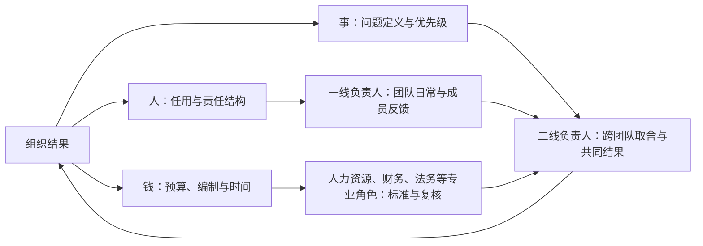

当一个人开始管理多个一线负责人时，很多管理问题不能只看组织架构图。

这个角色在大型公司里可能是二线负责人，在小型创业公司里则可能直接是 VP、CTO 或其他需要把多个团队连成一个结果的管理者。职位名称和公司规模不同，但都需要理解企业如何分配决策、责任和资源。

架构图告诉你谁向谁汇报，却不一定告诉你谁能决定招聘、谁能改变优先级、谁能调动预算；职位说明书告诉你谁负责什么，却不一定告诉你当几个团队的目标冲突时，谁能让组织停下原来的事情。

观察企业的运作结构，可以先拆成三种权力，每一种对应一类不同的问题。

招人、任用、评价、晋升、调动、终止雇佣关系，设计岗位、改变汇报关系——这一组决定的是“谁负责什么”，可以叫作人事权。定义问题、确定优先级、改变目标、决定做什么和不做什么、什么时候叫停一项工作——这一组决定的是“该做什么”，可以叫作问题与优先级决定权。而预算、编制、采购、供应商、设备、外包和团队容量能不能持续投入、能不能从一个方向挪到另一个方向——这一组决定的是“拿什么去做”，可以叫作预算与人员容量配置权。

人、事、钱，说的正是这三组权力。

这三种权力在小团队里经常集中在一个人身上。随着组织变大，或者业务进入需要专业化和制衡的阶段，它们通常会被拆开，进入不同层级、职能、委员会和流程。这套拆分呈现了企业的实际运作方式，也决定了管理者处理问题时可用的入口和边界。

这张图表示的是决定条件如何汇合，不是固定的组织架构。不同公司可能由不同角色拥有这些权力；关键是承担结果的人，能否影响结果所需的条件。

## 职位和权力不是一回事

管理职位常被理解为一组完整权力的打包，但实际情况通常更复杂。

被任命为部门负责人，不代表自动拥有这个部门全部的人事、事项和预算权。

举例来说（这是一个构造出来的场景，用来说明这类落差长什么样）：一位新上任的华东区销售负责人，拿到了团队的日常管理权——排班、分工、绩效谈话都归他决定；但区域内一个关键的大客户经理岗位出缺时，最终人选要经过全国销售总监面签，他只有推荐权，没有否决权。他背的是季度签约额目标，但这个数字是总部按年度规划下发的，他既不能调低，也不能自己拆到月度节奏；他手上有一笔培训和差旅预算，却没有权限把这笔钱转成一个新的招聘编制；他牵头一个跨区域的渠道项目，却调不动华南团队的人手，只能靠邮件和会议去“申请协作”。他确实是这个部门的负责人，但他能直接决定的事情，比“负责人”三个字听起来的要窄得多。

所以观察一个职位，不能只问“他负责什么”，还要问四件事：

1. 他可以直接决定什么？
2. 他只能提出建议什么？
3. 哪些事情必须经过谁批准？
4. 如果意见不一致，谁拥有最终否决权？

这四个问题比职位名称更接近真实的权力边界。

大公司并不一定希望一个管理者同时拥有三种权力的全部。权力拆分有它的合理性：人事决定需要考虑公平、合规与人才标准；预算需要放进公司整体的经营约束；重大事项需要统一风险口径，避免局部团队为了自己的目标做出整体无法承受的选择。

“管理者没有完整的三种权力”是企业中常见的安排。观察时可以进一步看：一个人承担的结果，是否与他能够影响的条件大致匹配。

## 人事权落实在责任结构里

很多人把人事权理解成“能不能招人”和“能不能终止雇佣关系”。但在企业里，人事权更常通过责任结构表现出来。

谁向谁汇报，谁负责一个领域，谁被安排到更复杂的问题上，谁进入继任者名单，谁得到关键项目的机会，这些决定都会改变组织的能力分布。调一个汇报关系，可能比增加一个职位更能改变团队；让一个人承担更大范围的问题，可能比一次加薪更能改变他在组织中的责任和影响范围。

人事权通常会被多个角色共同分享：

- 直属负责人最接近日常表现，负责反馈、分工和培养；
- 二线负责人观察多个团队的能力结构，参与岗位设计、关键任用和后备负责人判断；
- 人力资源部门维护制度、公平、合规和人才标准；
- 更高层决定关键干部、组织调整和跨团队的长期配置。

这里更需要看的是：**谁对哪一类人才判断有发言权。**

在一线，管理者需要能判断一个人是否适合当前责任，能给出具体反馈，也能影响他的成长路径。如果一线 Leader 只能分配任务，不能参与评价和发展，团队管理就会退化为排班。

在二线，管理者需要进一步判断：团队缺的到底是人，还是岗位设计；是能力不够，还是目标和支持不匹配；是应该换责任人，还是应该先改变协作方式。二线的人事权，不只是批准一个人进入团队，而是调整多个团队之间的责任结构。

在更高层，人事权还要回答组织级问题：哪些能力是未来必须建立的，哪些岗位应该合并，哪些管理责任不能继续由同一个人承担。

随着管理范围扩大，人事权越多表现为对组织位置和责任边界的调整，而不只是管理更多人。

## 问题与优先级决定权从问题定义开始

问题与优先级决定权经常被误解成“谁最后拍板”。但更深一层的决定权，是谁有权定义问题。

举例来说：一个客服团队说“我们需要再招三个人”，二线负责人追问下去，发现真正的问题不是人手不足，而是过去半年新增了两条产品线的支持工作，却从没有人重新核算过团队的目标；一个交付团队说“项目要延期两周”，管理层没有直接批延期，而是重新定义问题：真正卡住进度的不是执行效率，而是三个月前就该砍掉的一个低优先级需求，一直没人拍板叫停；一个业务部门说“我们需要上一套新系统”，组织追问下去才发现，真正的问题是几个团队对“客户交付到底谁说了算”始终没有达成一致，换系统只是绕开这个问题的办法。

谁定义问题，谁就影响下面所有选择：

- 哪些事实值得被看见；
- 哪些指标被认为重要；
- 哪些方案进入讨论；
- 哪些风险可以接受；
- 哪些工作可以被停止。

优先级通常是在问题被界定之后形成的。

在企业中，问题定义权也会分层：

- 一线负责人定义团队内部如何解决问题，以及哪些局部约束需要升级；
- 二线负责人把多个团队的局部问题放到一起，判断它们是否有共同原因；
- 业务负责人决定哪些问题值得整个组织投入；
- 高层管理者决定公司要在哪些不确定性上下注，以及愿意放弃哪些机会。

如果管理者只能执行已经确定的问题，不能反馈问题本身是否需要重看，他能够发挥的主要是执行权，对问题和优先级的决定权就不完整。

但问题定义权也不应被无限下放。不同层级看到的信息和承担的后果不同。一个团队可以重新设计自己的流程，却不能单方面改变多个团队共同承诺的目标；一个业务部门可以调整局部优先级，却不能无视公司的风险和资源约束。

企业不可能让所有人决定所有事情。比较合适的安排是：**问题由接近事实、也能够承担相应后果的层级重新界定。**

## 预算与人员容量配置权不止是预算审批

预算与人员容量配置权在企业里常以预算审批的形式出现。实际稀缺的资源还包括编制、时间、关键人的注意力和稳定的团队容量。

举例来说：一个数据中台项目拿到了两百万预算，却始终没有指定一个对结果负责的人，几个季度过去，钱花完了，中台系统还停留在方案阶段；一个团队申请到三个新编制去做智能客服，却没有人去掉团队里任何一项旧承诺，三个新人入职半年后，团队的交接会和对齐会反而变多了；公司把“降本增效”定为年度最高优先级，却没有一个团队因此被批准放下手上的项目去支持这件事——它就一直停留在年会的一页 PPT 上，没有变成任何团队日程表里真正挪出来的时间。

观察这类配置权时，可以看管理者能决定哪些事情：

- 哪些预算可以自主使用；
- 哪些支出必须经过职能部门或高层批准；
- 能否把预算转换成编制；
- 能否把编制和时间从旧方向转移到新方向；
- 能否停止一项投入，而不是只能申请追加投入。

在企业中，财务和采购承担集中管理有其合理性：控制成本、统一合同、识别风险、避免重复建设，也让局部管理者不能轻易把公司的长期资源变成一次性的局部收益。

但预算纪律不能替代管理判断。一个好的资源申请，不只是说“我需要更多钱”，而是要说明：要改变什么结果，不投入的代价是什么，已经尝试过哪些更轻的办法，获得资源后要停止什么，以及什么信号出现时应当继续、调整或结束投入。

资源配置的含义是：**组织愿意为哪一种结果投入，以及愿意放弃什么。**

二线管理者经常需要把资源从部门视角放回问题本身：预算、编制和时间最终服务于什么结果，多个团队之间的容量如何调整。二线的资源配置权，往往体现在能否完成这种调整。

## 三种权力分开后，结果由谁来承担

大公司把人、事、钱拆给不同角色，是为了制衡和专业化。但拆分之后，会产生一个持续的管理问题：三种权力分别有人负责，最终结果却需要有人把它们重新接起来。

常见的组合是：

- 业务负责人决定目标，但人力资源部门和上级管理层参与关键人事；
- 直属负责人管理团队，但编制由更高层统一分配；
- 产品或项目负责人推进事项，但工程、销售、法务或财务拥有自己的决策边界；
- 财务控制预算，采购控制合同，业务却承担交付结果。

这种安排本身不说明组织设计有问题。需要继续看的是：三种权力发生冲突时，组织有没有清楚的处理办法。

例如：

- 目标变了，谁能重新配置人？
- 人员不足，谁能减少目标或停止旧工作？
- 预算被削减，谁能重新定义结果？
- 关键岗位不合适，谁能改变责任结构？
- 两个部门争同一批人，谁能解释取舍并承担机会成本？

如果这些问题只能靠临时关系、个人意愿或反复升级来解决，组织就会出现一种落差：正式架构描述责任，非正式关系推动事情。

这时，管理者可能会产生“我负责，但我不能决定”的感受。这种感受不一定说明有人故意收走了权力，也可能只是组织规模扩大后，权力拆分的接口还没有被设计清楚。

## 管理权看它能影响什么

判断一个管理岗位的实际权限，除了看他是否带人、是否管理预算、是否参加高层会议，还可以看他能否影响结果成立所需要的条件。

可以从三个方向观察：

| 观察方向 | 需要追问的问题 |
| --- | --- |
| 人 | 他能否影响责任人、岗位设计、评价与梯队？ |
| 事 | 他能否定义问题、改变优先级、停止无效工作？ |
| 钱 | 他能否配置预算、编制、时间和跨团队容量？ |

不一定每个管理者都要完整拥有三种权力。关键是，随着负责范围扩大，他应当逐层拥有更大的影响范围：

- 一线负责人需要能管理分工、反馈和团队内的工作判断；
- 二线负责人需要能调整多个团队之间的人、事、钱的组合；
- 更高层需要能决定组织结构、战略问题和各方向的资源分配。

这里说的“逐层拥有”，指的是每一层都应当对自己承诺的结果拥有相应的决策组合，而不是把同样的权力复制给每一级。

如果一个人对某个结果负责，却无法影响关键的人、事、钱，那么组织至少需要补上另外三样东西：明确的协商权、稳定的资源入口和有效的升级路径。否则，负责范围会大于实际可影响的范围，管理岗位就会逐渐变成高级协调岗位。

## 把权力配置看作组织发展的反馈

人、事、钱的分配会随着组织规模、业务复杂程度、风险水平、谁掌握一手信息以及资源依赖关系而变化。观察这些变化，可以看到组织正在优先解决什么问题，也可以看到它在合作与决策上付出的成本。

可以从几个维度记录这种配置：

- 哪些权力集中在同一个层级，它们服务于哪些共同目标；
- 哪些权力分布在不同团队或职能，它们依赖哪些协作接口；
- 哪些责任由一线或二线承担，相应的决定权和资源入口在哪里；
- 哪些流程用于统一标准、控制风险或保障公平，它们对决策速度带来什么影响；
- 哪些冲突可以在团队内部解决，哪些需要由更高层整合取舍；
- 哪些管理者负责推进组织结果，哪些管理者负责传递和落实组织决定。

这些信息可以帮助管理者了解组织的运行方式，判断现有安排是否适合当前的问题和阶段。

组织会在不同阶段重新安排人、事、钱的组合。业务处于探索期时，离信息更近的团队可能需要较大的事项判断空间；业务进入规模化或高风险阶段后，人员标准、预算纪律和跨团队协调通常会占更大比重。两种安排都需要与业务条件相匹配。

持续观察时，可以反复核对三个对应关系：

1. 谁参与定义问题？
2. 谁能够组织解决所需的人、事和资源？
3. 谁承担取舍带来的后果？

当三个角色之间的关系清楚、接口稳定时，管理者更容易形成可预期的协作方式；当它们长期分离时，组织会出现等待、反复协调或责任边界不清等现象。这些现象本身就是组织设计可以继续讨论的反馈。

对多团队管理者来说，读懂这套规则，是为了看清自己负责的结果需要哪些人、哪些决定和哪些资源；哪些可以直接决定，哪些需要协商，哪些必须升级；以及当权力分布在不同层级后，如何把相关角色和条件组织成一个能够按约定交付的结果。

## 公开边界

文中的销售负责人、客服团队、数据中台项目都是我编出来帮你理解判断逻辑的场景，不对应任何一家公司或个人。真要处理具体的人事、预算或绩效决定，还是按你所在组织的流程和法律来，这篇文章给的是一套看问题的框架，不是替你下结论。
