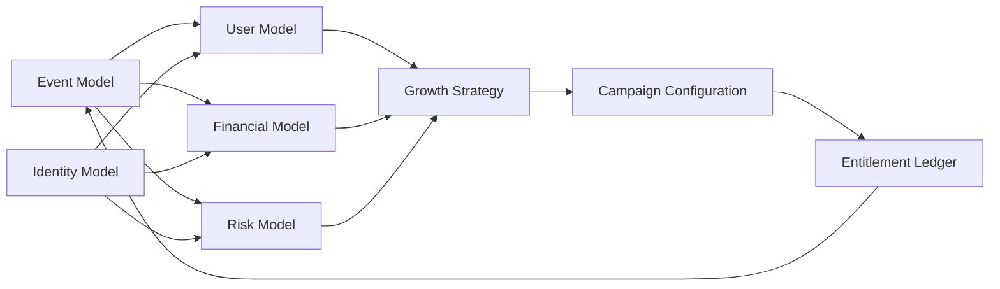
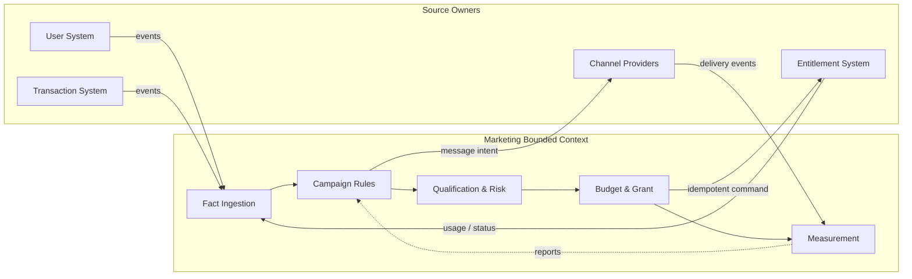
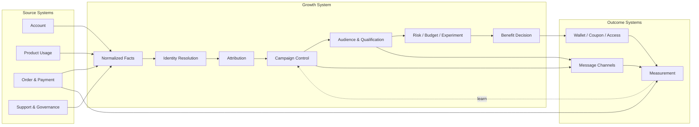
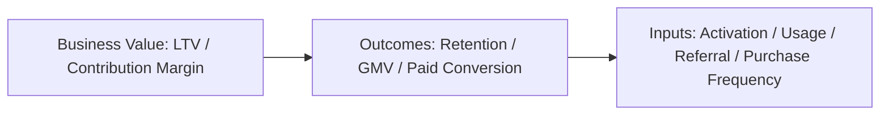
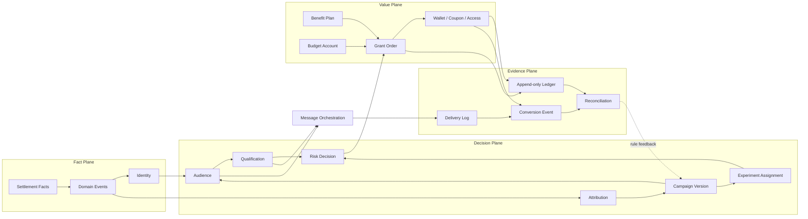
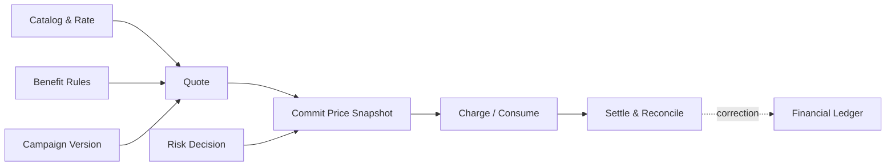
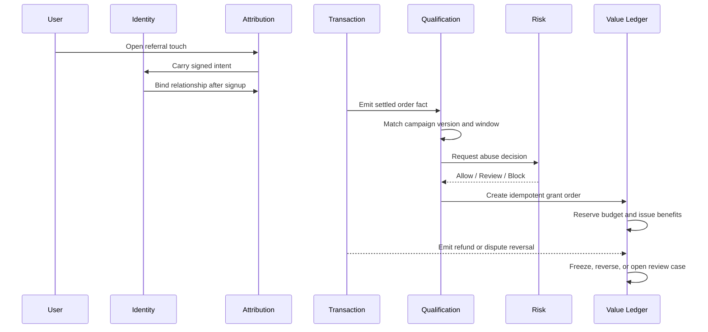
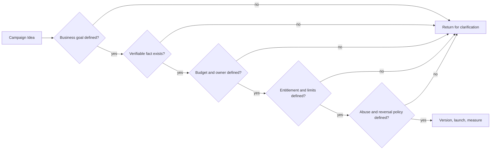
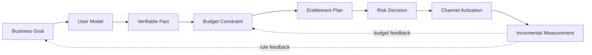

Marketing systems rarely begin inside the marketing department. Their capabilities are usually scattered across commerce, account, product, and support systems.

When a user makes a purchase, the transaction system cares whether the order was paid, how much it was worth, and whether it was refunded. The product system cares whether a feature was unlocked. Support cares whether the user can get an understandable explanation of the charge. Only later does the marketing system ask: where did this transaction come from, should it receive a reward, who pays for that reward, and what happens to an entitlement after a refund?

Marketing infrastructure is therefore the process of turning transaction facts into growth decisions, and then turning those decisions into entitlements and reviewable outcomes. It is not simply another campaign dashboard next to the transaction system.

Being connected to many systems does not mean that the marketing system should be tightly coupled to all of them. The more important the marketing system becomes, the more deliberately decoupled it needs to be. It can subscribe to user and order facts, call controlled entitlement capabilities, and send outcomes to external channels. It should not copy other systems' state machines, database fields, or internal implementations.

My practical model of marketing is close to this: first understand who the user is, then understand how much the business is willing to invest in that user, and finally use risk controls to stop waste and abuse. Referral, first-purchase, reactivation, and coupon campaigns are different configurations of the same capability. Looking back, this model was not wrong; it was missing one layer. These models cannot calculate independently. They need a shared foundation of events, identity, transaction, and entitlement facts.

The work that consumes engineering time is rarely the reward endpoint itself. It is the investigation around it: which account or membership does a user belong to, which entitlements does that account have, which transaction or campaign created them, and which budget should bear the settlement cost? Many incidents can only be explained by tracing the user, order, entitlement, cost, and risk chains together. The root cause may be a bad rule, a late event, or two systems using different definitions for the same concept.

The hardest parts of marketing infrastructure can therefore be grouped into three problems: getting pricing and benefit calculations right, making cross-system boundaries explicit, and spending limited budget on higher-ROI activities. Referrals are simply the clearest case because they expose all three at once.

If readers remember one method, I hope it is these seven questions. Before asking what coupon to issue, ask:

```text
1. Goal       What business result should ultimately change?
2. User       Which users are worth changing?
3. Fact       Which internal fact proves that the behavior happened?
4. Budget     What is the spending limit and who owns it?
5. Benefit    What exactly is being granted to the user?
6. Risk       Which people, behaviors, or anomalies must not be rewarded?
7. Measure    How can we show that the result came from the campaign?
```

These questions also make a useful design review. If any answer is simply “we will decide later,” the campaign is not ready to become an executable system.

The core of a marketing system can be represented by three models and two horizontal foundations:



The financial model is more than a budget table. It includes budget, unit economics, long-term user value, and the cost-recognition policy. Responsibility for the money can still belong to a project or business line. The marketing system should read and enforce that responsibility; it should not become the owner of the financial general ledger by accident.

## 1. Start with boundaries: four integrations that must not be mixed

### 1.1 Internal integrations: marketing consumes facts; it does not manufacture them

Internal systems provide business facts that have already happened and can be traced:

| Internal system | Facts provided to marketing | What marketing must not do | 
| --- | --- | --- |
| Account / Identity | User, account, organization, region, consent | Maintain a second user master | 
| Product / Usage | Signup, activation, usage, retention, feature completion | Treat page exposure as business success | 
| Order / Payment | Order, successful payment, refund, dispute, settlement state | Reward from a client-side amount alone | 
| Entitlement | Subscription, quota, points, coupons, service term | Directly edit a product permission projection | 
| Support / Governance | Appeals, manual review, account restrictions | Override global enforcement with campaign risk logic | 

The principle here is ownership. The order system owns order truth; the wallet or entitlement system owns balance truth; the marketing system owns campaign rules and reward decisions. Marketing may reference an order, but it should not duplicate the order. It may request an entitlement grant, but it should not bypass the entitlement system with `UPDATE balance`.

### 1.2 External integrations: channels provide touchpoints and delivery results

External systems include ad platforms, affiliates, email, SMS, push, customer relationship tools, data warehouses, and experimentation platforms. Their shared property is that data can be delayed, duplicated, missing, or re-attributed after the fact.

External integrations should at least carry `external_event_id`, `occurred_at`, `received_at`, and `schema_version`. Outbound messages should also record `delivery_attempt_id` and the final state. Without these fields, “how many clicks” and “how many messages were sent” are numbers that cannot be independently reviewed.

External channels should not decide entitlements either. An ad platform can report where a click came from, and an email provider can report whether a message was delivered. Whether a user satisfies a first-purchase condition, consumes budget, or receives a coupon must be decided by server-side rules owned by the business.

### 1.3 Many relationships, deliberately loose coupling

Decoupling does not mean “depending on nothing.” It means constraining dependencies to stable contracts:

| Dependency | Recommended approach | Avoid | 
| --- | --- | --- |
| Read user and transaction facts | Normalized events, read-only queries, versioned snapshots | Reading internal tables and relying on field details | 
| Determine campaign eligibility | Marketing rules calculate from facts | Making the order system understand every campaign | 
| Grant points or entitlements | Controlled command with an idempotency key | Marketing directly editing balances or permissions | 
| Send messages | Outbox, message jobs, channel adapters | Synchronously calling every channel in a transaction request | 
| Record results | Independent conversion events and measurement models | Treating an ad report as a financial fact | 
| Handle refunds and reversals | Subscribe to reversal events, then apply campaign policy | Making the payment system understand every reward rule | 

In one sentence: marketing owns campaign rules and reward decisions; other systems own user, transaction, entitlement, and delivery facts. Events and controlled commands connect the two sides. Shared databases and mutual knowledge of every business detail do not.



This is a bounded context, not a demand to split everything into microservices. Marketing can start as a module or a clearly separated boundary inside a monolith. As long as external table structures, states, and rules do not leak into its core model, a later service split will not require inventing the boundary again.

## 2. How a transaction system grows into a growth system

Transaction and growth systems can be viewed as a directed chain:



There are at least three different times in this chain: when an event happened, when the system received it, and when a marketing rule made a decision. Calling all three `created_at` will eventually cause trouble in attribution windows, refund reversals, and experiment analysis.

This is also why DAU, GMV, and LTV cannot replace one another. LTV is closer to final commercial value, but it often takes time to observe. DAU, retention, first purchase, repeat frequency, and order value are earlier signals or intermediate outcomes that campaigns can influence more directly. A mature metric tree looks like this:



Growth systems should therefore neither report only DAU nor demand that every campaign prove full LTV immediately. They should define which metric represents final value, which metrics are leading signals, and how long to wait before judging whether the campaign created incremental value.

### 2.1 Three minimum metric formulas

To make the tree computable, define at least three things first.

Retention is not the feeling that “more people came back.” It is the share of a cohort that still completes the key behavior at a specified time:

```text
retention_d = active_users_in_cohort_on_day_d / users_in_cohort_at_start
```

LTV is not a universally correct constant. A sufficiently honest early estimate can be written as:

```text
LTV ≈ ARPU × gross_margin × expected_lifetime
```

The definition of `gross_margin` must state whether service delivery cost has already been deducted. If it has not, expected service cost must be deducted separately. The same cost must not be deducted twice. Subscription products can estimate lifetime from monthly revenue and churn; transaction products need repeat frequency, average order value, margin, and refunds. This formula is useful for setting budget caps and comparing plans, not for pretending to be final accounting.

Campaign decisions usually depend on incremental contribution rather than all revenue from the treatment group:

```text
incremental_profit
  = eligible_population × (conversion_treatment - conversion_control)
    × contribution_margin_per_conversion
    - realized_subsidy
    - channel_cost
    - fraud_and_operations_cost
```

Without a control group, we can say how many conversions happened during the campaign, but we cannot attribute all of them to the campaign. The value of a growth system is to fix denominators, observation windows, and cost definitions before the campaign starts.

## 3. Cash, points, and entitlements: three ledgers, not one balance field

The easiest marketing system to get wrong is the one that calls everything given to a user `credit`.

### 3.1 Cash ledger: how much did the user pay, and what does the platform owe?

Cash transactions need orders, payment attempts, settlement, refunds, disputes, and fees. Marketing normally reads these states and triggers campaign behavior only from confirmed settlement facts. Seeing a client-side `payment_succeeded` event is not proof that money has arrived.

### 3.2 Entitlement ledger: what did the user receive, even if it is not cash?

Points, coupons, service terms, API quotas, membership levels, and free allowances are entitlements. They have different scopes, expiry rules, consumption order, and reversal policies. A generic balance should not hide those differences.

A general entitlement should include its source campaign, rule version, grant time, expiry, status, scope, and consumption records. For cumulative points or allowances, an append-only ledger is safer:

```text
available = granted + adjusted - used - expired - frozen - reversed
```

This is not to make a report look like a finance system. It is to answer the support question that eventually arrives: “Why did these 20 points disappear?”

### 3.3 Marketing budget ledger: how much is the platform prepared to spend?

Marketing budget is neither user balance nor revenue. At minimum, distinguish allocated, committed, granted, used, frozen, returned, and available amounts:

```text
available_budget = allocated - committed_outstanding - spent_realized - frozen + returned
```

`committed_outstanding` means an amount already promised but not yet converted into realized spend. `spent_realized` means confirmed actual cost. They must not be counted twice. Issuing a $100 coupon and realizing a $35 discount when the coupon is redeemed are not the same cost definition. Finance may choose a different recognition policy, but the underlying fields and events should not be erased.

In a budget-led organization, a marketing project usually requests a budget from the business or finance team. The project owner carries responsibility for the result, while the marketing platform executes and records activity within the approved limit. That arrangement is sound. The two extremes to avoid are a campaign system that knows nothing about budget until it produces an after-the-fact report, and a marketing system that defines revenue and profit on its own and declares ROI without the finance policy. A better design connects project budget, marketing budget entries, and the financial ledger through explicit references rather than copying any ledger into another.

### 3.4 Budget allocation is not “give more money to the campaign with the highest conversion”

When several campaigns compete for one budget, expected incremental return can be modeled as a diminishing function of allocated budget:

```text
maximize  Σ incremental_profit_i(b_i)
subject to
  Σ b_i ≤ total_budget
  b_i ≥ 0
  risk_exposure_i(b_i) ≤ risk_limit_i
```

`b_i` is the budget allocated to campaign `i`. This does not require sophisticated machine learning on day one. Even a bucketed estimate of the marginal return from the first, second, and third $10,000 is closer to the real decision than average conversion rate alone. Budget caps, risk caps, and pause conditions should all be part of configuration.

## 4. Engineering layers of a marketing system

The boundaries above can be implemented as four planes and nine modules:

| Plane | Modules | Main responsibility |
| --- | --- | --- |
| Fact Plane | Identity, Event, Settlement | Normalize facts, identity, and transaction state |
| Decision Plane | Attribution, Campaign, Audience, Qualification, Risk, Experiment | Decide who qualifies, why, and whether a grant is allowed |
| Value Plane | Benefit, Budget, Entitlement | Define budget and benefits, then issue and consume them |
| Evidence Plane | Ledger, Delivery, Conversion, Reconciliation | Preserve immutable evidence and reconcile it |



There is a deliberate gap in this diagram: messaging does not belong in the Value Plane. Sending an email is not granting an entitlement, and clicking a link is not completing a qualification. Messaging hands an existing campaign decision to an external executor. When delivery fails, retry the message; do not recalculate the reward.

## 5. Pricing models: marketing must do more than subtract a discount

Marketing systems often become piles of discount conditions because pricing is not treated as an independent capability. A campaign may change a product price, payable order amount, service term, points return, or platform subsidy. Each outcome has a different calculation, but all need to answer the same questions: what was the list price, which rule version applied, who bears the discount, what did the user pay, and what was finally settled?

For usage- or order-based products, start with an abstraction such as:

```text
gross_amount = Σ quantity_i × list_rate_i
discount_amount = apply_benefit(gross_amount, benefit_plan, user_context)
net_amount = max(gross_amount - discount_amount, minimum_charge)
```

The formula is not enough. Pricing should be separated into four stages:



`Quote` tells the user what the price might be. `Commit` freezes the price and campaign version that applied at the time. `Charge` actually charges money or consumes an entitlement. `Settle` incorporates refunds, disputes, corrections, and differences into the final accounting. A retry must not read today's price to reinterpret yesterday's transaction, and a client-calculated discount must not become the final amount.

Pricing deserves to be an independent capability more than referral rules do. The same price, qualification, and benefit logic may be used by the order page, checkout, usage API, membership renewal, marketing reports, and finance reconciliation. If each surface copies “discounted amount” logic, the user will eventually see one number, the saved order another, and the report a third.

## 6. A referral case: the invitation relationship is only an attribution plugin

Suppose a product runs a campaign in which an inviter shares a link, a new user signs up, and the new user completes a qualifying first purchase within seven days. Both users receive an in-product allowance.

On the surface this is a referral feature. In reality it crosses at least seven boundaries:

1. The link system records a touchpoint but cannot directly bind the reward recipient.
2. The account system creates the user and supplies verifiable identity facts.
3. The attribution module creates an immutable A-to-B relationship.
4. The transaction system confirms that the order settled; a clicked payment button is not enough.
5. Qualification matches the order against the campaign version and time window.
6. Risk checks duplicate accounts, abnormal velocity, and circular arbitrage.
7. Reward consumes marketing budget and writes traceable entries to both entitlement accounts.



The important point is not how much each side receives. A reward decision must not replace a transaction decision. The transaction system decides whether the order is valid. Campaign rules decide whether a reward is warranted. Governance decides whether the grant should be delayed or frozen. The entitlement system projects the final allowance the user sees.

## 7. Two more common campaign cases

### Case 1: a new-user welcome allowance

A welcome campaign may not need an invitation relationship, but it needs strict idempotency and budget handling. The rule might be: the account is created during the campaign window, email verification is complete, each account can claim once, one identity signal can claim at most once during the period, and the campaign has a total cap.

The correct sequence is not “check whether the user has claimed, then add balance.” First use a unique claim constraint, then write the grant order, budget entry, and entitlement entry in one local transaction. Under concurrent signup, the database constraint must be the final gate. IP or device signals are risk signals, not permanent identities. High-risk cases can be delayed or reviewed instead of treating every shared network as fraud.

### Case 2: a reactivation campaign with a coupon

A common rule is: a user has not used the product for 30 days, receives a message, returns within seven days, and completes one key behavior to receive a coupon that applies only to a particular product class.

The system must not record “coupon issued” as a cash transfer. The coupon has scope, stacking rules, redemption time, and an unused-expiry state. The key behavior creates a conversion event; actual redemption creates realized subsidy. Without these state transitions, the team can only see how many coupons were issued, not whether the incentive changed behavior.

## 8. The real problems with external channels: duplicates, late events, and re-attribution

Every external channel can produce three situations: the same event is delivered more than once, an event arrives after the campaign window, or the channel changes attribution after the fact. Engineering should not assume reliability; it should encode the boundary in the interface:

- Deduplicate with `external_event_id` or a business idempotency key.
- Use `occurred_at` for eligibility windows, not message-consumption time.
- Preserve the original touchpoint and the final attribution decision rather than overwriting history.
- Use an outbox, retries, and a dead-letter path for delivery; do not synchronously chain every channel inside a user request.
- Treat unsubscribe, frequency limits, and privacy consent as hard pre-send conditions.
- Accept delivery and interaction facts from channels; never accept a command such as “give this user a $10 balance” as an authoritative instruction.

Products such as Braze Canvas treat multi-message journeys as an execution layer, while Segment's tracking plan separates event definitions, validation, audiences, and downstream connections. For a self-built system, both point to the same conclusion: campaign decisions and channel execution must be decoupled, and event data needs its own governance and versioning. [Braze Canvas](https://www.braze.com/docs/user_guide/messaging/canvas) [Segment tracking plan](https://app-canary.segment.com/academy/collecting-data/how-to-create-a-tracking-plan/)

It is also important to separate deterministic decisions from probabilistic analysis. Whether a payment settled, an entitlement was granted, or a budget was sufficient should use reconcilable facts. Which ad touchpoint contributed more can use a model, but the model version, sample, and uncertainty must be retained. An attribution report that assigns 0.6 conversions must not be written back as 0.6 real transactions in the financial ledger.

Marketing systems really maintain three different kinds of numbers:

| Number type | Typical question | May a model estimate it? |
| --- | --- | --- |
| Fact | Did the order settle? Was the entitlement granted? | Generally, no model may replace it |
| Decision | Is the user qualified? Is budget consumed? Should it enter review? | Rules and risk models are allowed, but replayability is required |
| Measurement | Which touchpoint contributed more? How much incremental value appeared? | Statistical models are allowed, with assumptions disclosed |

All three numbers may appear in one campaign dashboard, but they must not share one field. Writing an estimate back into a fact table is where a marketing system begins to lose trust.

## 9. Risk is a governance chain, not a blacklist

Growth campaigns face more than bots: multiple accounts, shared payment instruments, leaked coupons, circular referrals, refund arbitrage, and manual mistakes. OWASP's anti-automation guidance likewise favors progressively adding verification and limits according to risk rather than trying to identify every bot in one step.

Risk results should therefore be explainable decisions, not a mysterious score:

```text
risk_score
risk_reasons
rule_version
decision: allow | review | block | freeze
action_expiry
```

Low-risk users can receive benefits automatically. Medium-risk users can face delayed entitlement, additional verification, or manual review. High-risk users can be stopped from receiving new rewards, but should not have paid transactions erased automatically. Every decision should answer: which facts were used, which rule version matched, what action was taken, and whether a human later changed the result. [OWASP Bot Management and Anti-Automation](https://cheatsheetseries.owasp.org/cheatsheets/Bot_Management_and_Anti-Automation_Cheat_Sheet.html)

## 10. State machines, idempotency, and reversal

At least four state machines normally exist:

```text
campaign: draft -> scheduled -> running -> paused -> ended
participation: pending -> active -> review -> blocked
qualification: pending -> eligible -> ineligible -> reversed
grant: pending -> reserved -> issued -> frozen -> reversed
```

Do not mutate a published rule in place. Create a new version and preserve the version that produced every historical qualification. Use unique keys, short transactions, and a fixed lock order for reward flows. Coordinate cross-system actions with an outbox or saga; do not put network calls inside a long database transaction. PostgreSQL row locks and unique constraints protect local concurrency, but cannot guarantee that an external service succeeds. Retryable states and reconciliation jobs are still required. [PostgreSQL Explicit Locking](https://www.postgresql.org/docs/17/explicit-locking.html) [AWS Saga Orchestration](https://docs.aws.amazon.com/prescriptive-guidance/latest/cloud-design-patterns/saga-orchestration.html)

Reversal should not edit the original balance back into place. A granted entitlement should produce a new fact through freezing, a negative entry, expiry, or manual review; the original grant remains unchanged. Users, support, finance, and risk teams can then see the same causal chain.

## 11. The admin console is a control plane, not a database browser

The important question for an operations console is not how many fields it can edit, but whether it can safely change future behavior:

| Control surface | Must support | Must retain |
| --- | --- | --- |
| Campaign | Draft, preview, approval, versioning, pause | Operator, time, before/after versions |
| Audience | Size estimate, sampling, exclusions | Query version and snapshot |
| Benefit | Entitlement rules, expiry, scope | Link between grant and entitlement ledger |
| Budget | Allocation, freeze, return | Amount, source, reason, idempotency key |
| Risk | Review, unfreeze, appeal | Evidence, rule version, decision |
| Delivery | Template, channel, frequency limits, unsubscribe | Delivery attempts and final state |
| Measurement | Funnel, cost, incrementality, reconciliation | Metric definition and data version |

An administrator should not edit a user balance directly. A manual compensation creates an adjustment event with a reason and approver. Stopping a campaign pauses its version or freezes a particular grant; it does not delete history.

## 12. Metrics: turn “how much was issued” into an economic chain

At least five groups of metrics should be considered together: reach and delivery, key behavior, entitlement economics, risk governance, and system operations. A simple chain is:

```text
exposed -> engaged -> eligible -> granted -> redeemed -> retained
```

Every step should connect to cost and time. In particular, distinguish planned cost, granted benefit, redeemed subsidy, recovered refund, and incremental margin. Without a control group, say that the campaign was associated with conversion; do not casually claim that it caused incremental conversion. Referral relationships also create network effects, so inviter and invitee are not independent samples.

### 12.1 A minimum campaign review framework

At minimum, keep treatment and control groups:

```text
incremental_lift = metric_treatment - metric_control
incremental_value = cohort_size × incremental_lift × value_per_user
net_effect
  = incremental_value
    - realized_subsidy
    - channel_cost
    - fraud_loss
    - operational_cost
```

`eligible_population` is the full population eligible to encounter the campaign. `cohort_size` is the sample actually placed in an experiment or observation. Do not mix them. If randomization is impossible, use matched cohorts, regional holdouts, or time-based experiments, and lower the strength of the conclusion accordingly. “The treatment group converted well” is not a substitute for “what did the campaign produce beyond no campaign?”

Risk also belongs in the same economic table. The cost of a risk policy includes both abuse that got through and real value lost to false positives:

```text
expected_risk_cost
  = abuse_probability × exposed_budget
    + false_positive_probability × lost_customer_value
```

Strict risk control does not mean rejecting every suspicious user. The better policy is the action with the lowest expected risk cost: allow, add verification, delay the entitlement, send to manual review, or freeze. The formula need not pretend to provide precise probabilities. It first forces the team to acknowledge both kinds of loss.

Data governance is part of growth infrastructure too. Without a tracking plan for event names, properties, versions, and quality, every additional campaign makes reporting less trustworthy. Segment's tracking-plan guidance centers on defining the questions first, then the events and properties needed to answer them, and validating the data. That order is more sustainable than instrumenting first and deciding what to measure later. [Segment data governance](https://segment.com/data-hub/data-governance/)

## 13. A practical implementation path

The first step is not a prettier campaign console. It is establishing ownership of facts and ledgers: transaction state, identity, entitlement, budget, and events should each have one owner.

Next, build one campaign as a vertical slice. Connect campaign version, audience, qualification, risk, budget, grant, entitlement ledger, delivery, and reporting for a small set of explicit scenarios.

Then extract repeated parts into stable contracts: `NormalizedFact`, `Qualification`, `RiskDecision`, `BenefitGrant`, `LedgerEntry`, and `ConversionEvent`. Put campaign differences into plugins and rule versions instead of compressing every business case into one universal table.

Only then should more operations users receive configuration access. Add rollout, approval, budget caps, rollback, retries, reconciliation, audit queries, and data-deletion policy. Without these control-plane capabilities, low-code configuration merely moves risks from source code into an admin console.

## 14. Use one campaign design table to make the method concrete

Consider a reactivation campaign. The goal is to bring back users who have not completed a key behavior for 30 days and have them complete one valid use after returning. The campaign does not issue cash; it grants a time-limited service entitlement with a restricted scope.

| Design question | Executable answer |
| --- | --- |
| Goal | Improve 30-day retention and valid usage; do not treat a click as success |
| User | Users inactive for 30 days who previously completed the key behavior |
| Fact | A server-side valid-use event with user, time, and version |
| Attribution | Record the reactivation touch and campaign version without overwriting other touchpoints |
| Qualification | Complete valid use within seven days of delivery, once per user |
| Benefit | A seven-day, scoped service entitlement, separate from cash balance |
| Budget | Reserve budget for expected redemption and pause automatically at the cap |
| Risk | Account anomalies, bulk signup, and duplicate claims enter review or block |
| Measurement | Incremental retention, redemption, and net contribution for treatment/control |
| Reversal | Freeze unused entitlement after refund or violation and record a reversal entry |

The value of this table is that it turns a campaign idea into an object product, engineering, finance, risk, and operations can review together. It also exposes an overlooked fact: a campaign is not copy or a discount amount. It is an agreement about facts, responsibility, state, and outcome.



## 15. Six common mistakes

### Treating DAU, clicks, or issued coupons as the final result

These are process metrics. They matter commercially only when they explain user value, retention, revenue, or contribution margin.

### Building a copy of the transaction system

Marketing should reference order and payment facts, not copy order states, recalculate payment success, or maintain another balance.

### Calling every entitlement `credit`

Points, discounts, service terms, and cash have different lifecycles. Mixing their names makes accounting and support impossible to explain.

### Treating the last click as the only truth

Last-touch can be a useful operating convention, but it does not mean other touchpoints had no influence or that the channel created causal lift. Attribution models need a version and a scope.

### Treating risk as a blacklist

A blacklist expresses an outcome but not the evidence, rule version, or expiry of the action. Operable risk controls need graduated actions such as allow, review, block, and freeze.

### Treating reporting as the final system step

If budget, entitlement, refund, and delivery facts were not recorded when they happened, a beautiful dashboard cannot reconstruct them later.

## 16. A minimum design checklist

Before a campaign enters development or launch review, it should answer:

- Which long-term value metric does the business goal map to?
- Which internal system provides the fact for user eligibility?
- Does qualification use event time or receipt time?
- Is the campaign version immutable?
- What are the budget cap, project owner, and pause condition?
- Does the entitlement have independent grant, use, expiry, and reversal records?
- What is the idempotency key for duplicate claims?
- Does risk block a transaction or only a reward?
- How are external-channel failures retried and reconciled?
- How will the campaign be compared with a control group, and how will the result inform the next budget allocation?

This checklist does not look like growth magic. It is even a little dull. But marketing systems usually need campaigns that can be explained, constrained, retried, and reviewed more than they need campaigns that appear clever.

## 17. Taking one campaign from idea to settlement

If the principles above remain at the level of nouns, they can easily become another attractive taxonomy. Put them back into one campaign instead: a product wants to reactivate silent users, have them complete a key behavior again, and test whether the investment is worthwhile within a controlled budget.

The first step is not to design an offer; it is to define the goal. The team agrees that the long-term target is higher LTV or contribution margin. Thirty-day retention and valid usage are outcome metrics; message open rate and return rate are earlier input signals. The campaign cannot declare success merely because open rate increased.

The second step is to define the user. The user system provides account, membership, usage history, and consent state. Marketing creates an audience snapshot for users who had no key behavior in the past 30 days, had completed the behavior before, and are currently reachable. Marketing does not copy the user master or treat one email open as user value.

The third step is to confirm the fact. Eligibility accepts only a server-side valid-use event. The event carries the user identifier, occurrence time, product version, and idempotency key. An external click is a touchpoint, not a replacement for valid use. A settled order is a transaction fact, not something the campaign system is allowed to reinterpret.

The fourth step is to put budget into the plan. The project allocates a budget, and the project or business line remains the budget owner. Marketing records available, committed, and realized cost. When the budget is insufficient, the campaign becomes `paused`; it does not quietly borrow from another project.

The fifth step is to define the entitlement. This campaign grants a service entitlement valid for seven days, not cash. The entitlement has independent grant, use, expiry, and freeze states. Its usage cost can flow back to the campaign and budget, but it cannot be mixed with the user's cash balance.

Only then do risk and messaging run. Low-risk users receive the normal message. Medium-risk users receive delayed entitlement or additional verification. High-risk users receive no reward and retain a review record. The messaging system sends, retries, and records delivery; it does not decide eligibility.

Finally, review the result. Compare treatment and control on incremental retention, valid usage, redeemed cost, refunds, and risk loss. Feed the result into the next budget allocation rather than producing only a report of how many coupons were issued.



This is the practical answer to the ten questions that often appear in interviews or design reviews. They are not ten isolated facts; they are decisions made at different stages of the same campaign. In an interview, start from any node and trace the chain. In a lecture, walk through the whole chain from goal to settlement.

## Conclusion: the growth system is first a boundary manager

The hardest part of a marketing system is not designing an attractive reward. It is making sure that, after a transaction passes through internal systems, external channels, campaign rules, risk controls, and entitlement ledgers, the organization can still explain where the fact came from, why the decision was valid, who paid for it, what the user received, and whether the intended behavior actually changed.

Referrals are a useful starting point because they expose the intersection of attribution, identity, transactions, budget, entitlements, and abuse prevention. First purchase, reactivation, coupons, points, membership levels, and channel commissions eventually reach the same questions.

The foundation of a growth system is therefore neither a Campaign object nor a marketing database. It is a boundary manager: the transaction system continues to own transactions, the entitlement system continues to own entitlements, and external channels continue to own delivery. Marketing combines these facts under explicitly versioned rules and leaves evidence for every decision so that it can be replayed, paused, reversed, and reviewed.
