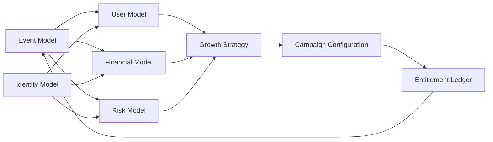
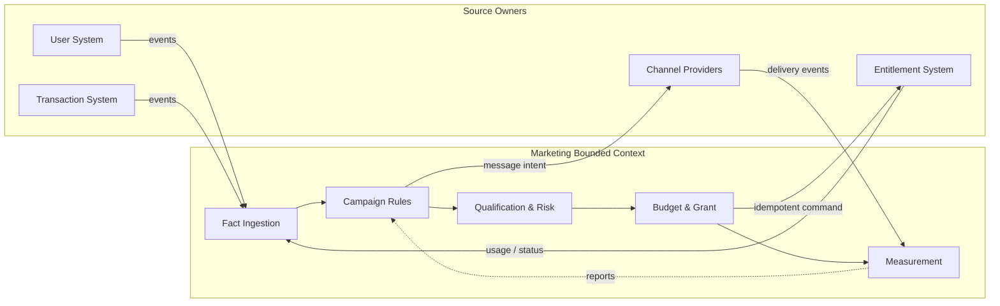
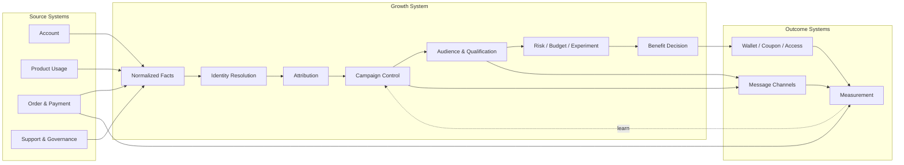
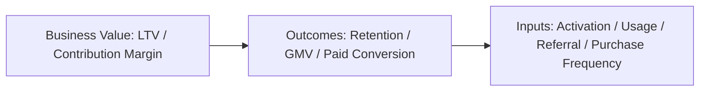
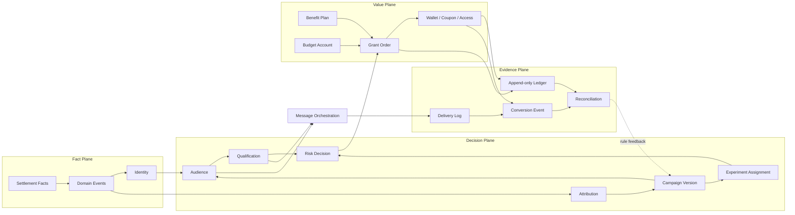
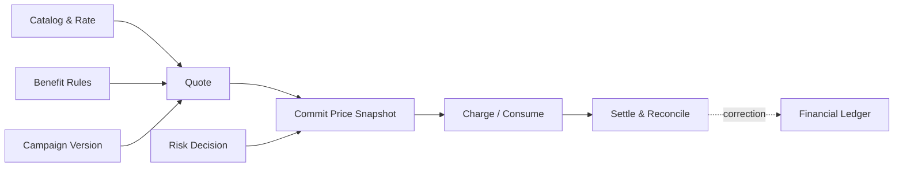
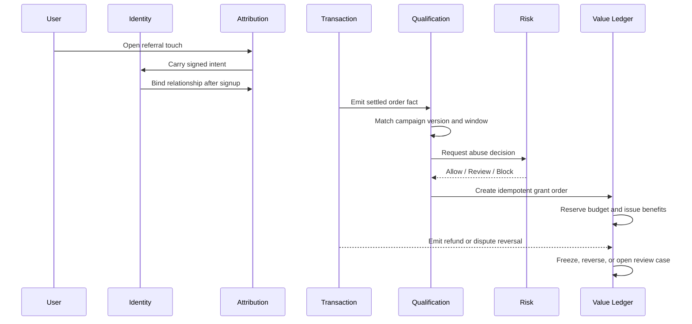
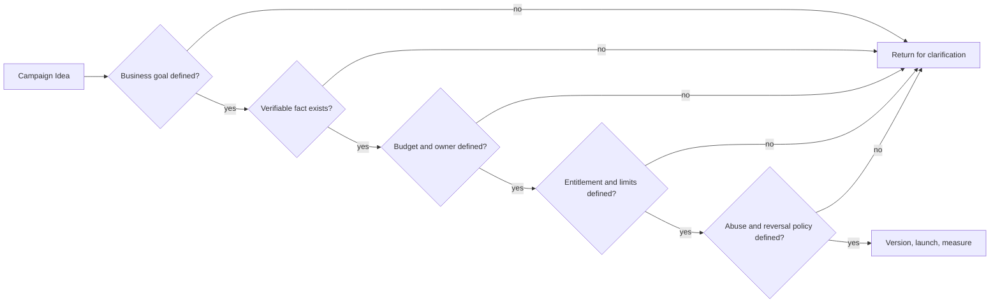
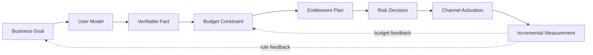

一开始，营销系统并不在营销部门。它通常已经散落在交易、账户、产品和客服系统里。

一个用户完成一次购买，交易系统关心的是订单是否支付、金额是多少、是否退款；产品系统关心的是功能是否解锁；客服系统关心的是用户能否解释这笔钱。营销系统后来才问：这笔交易来自哪里？是否应该奖励？奖励成本由谁承担？如果退款，已经发出去的权益怎么办？

所以营销基础建设，本质上是把“交易事实”转化成“增长决策”，再把决策转化成“权益和可复盘结果”。它不是在交易系统旁边再放一个活动后台。

但“和很多系统有关”不等于“营销系统要和所有系统强耦合”。恰恰相反，营销系统越重要，越需要保持自己的解耦：它可以订阅订单和用户事实，可以调用权益发放能力，可以把结果送到外部渠道，但不应该把别人的状态机、数据库字段和内部实现复制进来。

我过去对营销的理解更接近“围绕用户和预算做一组策略配置”：先知道用户是谁，再知道业务愿意为这类用户投入多少钱，最后用风控把无效和恶意消耗挡住。裂变、首购、召回、优惠券只是配置的不同表现。现在回头看，这个理解并没有错，只是还少了一层：这些模型不能各自计算，必须建立在同一套事件、身份、交易和权益事实之上。

这类系统真正消耗工程时间的地方，往往不是写出一个“发奖励”的接口，而是查数据和查关系：一个用户属于哪个账户或 membership，账户拥有哪种权益，权益由哪笔交易或哪项活动产生，活动结算的钱又应该回到哪个预算口径。很多问题只有沿着用户、订单、权益、成本和风险几条链同时查，才能知道是规则错了、数据迟到了，还是两个系统对同一个概念的定义根本不同。

所以我现在觉得，营销系统最具挑战性的工作可以归为三件事：把算价模型做对，把跨系统边界和耦合关系理清，把有限预算花在更高 ROI 的活动上。裂变只是最容易把这三件事同时暴露出来的案例。

如果读者只带走一套方法，我希望是下面这七个问题。设计任何营销活动之前，先不要问“发什么券”，而是依次问：

```text
1. Goal       最终要改变什么商业结果？
2. User       哪一类用户值得被改变？
3. Fact       哪个内部事实能证明用户完成了行为？
4. Budget     这次投入的上限和责任归属是什么？
5. Benefit    给用户的东西到底是什么权益？
6. Risk       哪些人、哪些行为或哪些异常不能被奖励？
7. Measure    如何证明结果是活动带来的，而不是自然发生的？
```

这七个问题也可以作为一张设计评审表。只要其中一个问题只能回答“以后再看”，活动就还没有进入可执行状态。

可以把营销系统的核心输入写成三种模型，外加两个横向基础：



这里的“财务模型”不只是一张预算表，它至少包含预算、单位经济、用户长期价值和成本确认口径；但资金责任仍然可以属于具体项目或业务线。营销系统要做的是读取和约束这些责任，而不是擅自成为财务总账的 owner。

## 1. 先看边界：四类对接不能混成一类

### 1.1 内部对接：营销系统消费事实，不制造事实

内部系统提供的是已经发生、可以追溯的业务事实：

| 内部系统 | 提供给营销系统的事实 | 营销系统不能越权做什么 |
| --- | --- | --- |
| Account / Identity | 用户、账户、组织、地区、同意状态 | 自己复制一套用户主档 |
| Product / Usage | 注册、激活、使用、留存、功能完成 | 把页面曝光当成业务成功 |
| Order / Payment | 订单、支付成功、退款、争议、结算状态 | 只凭客户端金额发奖励 |
| Entitlement | 订阅、配额、积分、券、服务期限 | 直接改产品权限投影 |
| Support / Governance | 申诉、人工审核、账户限制 | 用活动风控覆盖全局封禁 |

这里的原则是 ownership：订单系统拥有订单真相，钱包或权益系统拥有余额真相，营销系统拥有活动规则和奖励决定。营销系统可以引用一笔订单，但不应该复制一笔订单；可以申请发放权益，但不应该绕过权益系统直接 `UPDATE balance`。

### 1.2 外部对接：外部渠道只负责带来触点和送达结果

外部系统包括广告平台、联盟/达人、邮件服务、短信、推送、客服 CRM、数据仓库和实验平台。它们的共同点是：数据会延迟、重复、缺失，甚至被重新归因。

外部对接至少要有四个字段：`external_event_id`、`occurred_at`、`received_at`、`schema_version`。发送出去的消息还要记录 `delivery_attempt_id` 和最终状态。没有这些字段，营销报表里“点击了多少”“发了多少”只能算一个不可复核的数字。

外部渠道也不应该决定权益。广告平台可以告诉你一次点击从哪里来，邮件平台可以告诉你消息是否送达；最终是否满足首购、是否占用预算、是否发券，必须由自己的服务端规则决定。

### 1.3 关联很多，但边界要解耦

营销系统的解耦，不是“完全不依赖别人”，而是把依赖限制在稳定契约上：

| 依赖方向 | 推荐方式 | 不推荐方式 |
| --- | --- | --- |
| 读取用户和交易事实 | 规范化事件、只读查询、版本化快照 | 直接读取对方内部表并依赖字段细节 |
| 判断活动资格 | 营销规则根据事实计算 | 让订单系统知道每一种营销活动 |
| 发放积分或权益 | 受控 command + 幂等 key | 营销服务直接修改余额或权限字段 |
| 发送消息 | outbox、消息任务、渠道 adapter | 在交易请求里同步调用所有渠道 |
| 记录效果 | 独立 conversion event 和 measurement model | 把广告平台报表当成财务事实 |
| 处理退款和追回 | 订阅 reversal event，再执行活动政策 | 让支付系统反向理解所有奖励规则 |

可以用一句话概括：营销系统拥有“活动规则和奖励决定”，其他系统拥有“用户、交易、权益和送达事实”。两边通过事件和受控命令连接，而不是通过共享数据库和互相知道全部业务细节连接。



这是一种 bounded context，而不是必须拆成多少个微服务。营销可以先作为一个模块或一个单体内的清晰边界存在；只要它不把外部系统的表结构、状态和规则泄漏进自己的核心模型，未来再拆服务也不会重新发明一遍边界。

## 2. 交易系统怎样长出增长系统

交易系统和增长系统可以看成一条有向链：



这条链上至少有三种不同的时间：事件发生的时间、系统收到事件的时间、营销规则作出决定的时间。把它们都叫 `created_at`，后面一定会在归因窗口、退款追回和实验分析里出问题。

这也解释了为什么 DAU、GMV 和 LTV 不能互相替代。LTV 更接近最终商业价值，但通常要经过一段时间才能观测；DAU、留存、首次购买、复购频率和订单金额则是更早、也更容易被活动影响的输入或结果。真正成熟的指标树应该是：



因此，增长系统既不能只报 DAU，也不能要求每个活动立刻证明完整 LTV。它需要提前约定：哪个指标代表最终价值，哪些指标是领先信号，多久之后判断活动是否真的产生了增量。

### 2.1 三个最小指标公式

为了让这棵树可以被计算，至少要先定义三个东西。

留存率不是“回来过的人感觉变多了”，而是一个 cohort 在指定时间点仍然完成关键行为的人数占比：

```text
retention_d = active_users_in_cohort_on_day_d / users_in_cohort_at_start
```

LTV 也不是一个永远正确的常数。一个足够诚实的早期估算可以写成：

```text
LTV ≈ ARPU × gross_margin × expected_lifetime
```

这里的 `gross_margin` 必须先说清楚是否已经扣除了服务交付成本。如果没有扣除，就要单独减去预期服务成本；不能既用毛利率，又把同一项服务成本再扣一次。订阅业务可以用月度收入和流失率估算生命周期，交易业务则需要把复购频率、客单价、毛利和退款放进模型。这个公式适合做预算上限和方案比较，不适合冒充财务最终确认值。

真正用于活动决策的，通常是增量贡献，而不是活动组全部收入：

```text
incremental_profit
  = eligible_population × (conversion_treatment - conversion_control)
    × contribution_margin_per_conversion
    - realized_subsidy
    - channel_cost
    - fraud_and_operations_cost
```

如果没有对照组，就只能说“活动期间发生了多少转化”，不能把全部转化都算成活动带来的结果。增长系统的价值，正是把这些分母、观察窗口和成本口径提前固定下来。

## 3. 钱、积分和权益：三本账，不是一个余额字段

营销系统最容易写错的地方，是把“给用户的东西”都叫作 credit。

### 3.1 现金账：用户付了多少钱，平台承担什么义务

现金交易需要记录订单、支付尝试、结算、退款、争议和手续费。营销系统通常只读这些状态，并根据已经确认的结算事实触发活动。它不应该因为看到一个 `payment_succeeded` 的前端事件，就把它当作钱已经到账。

### 3.2 权益账：用户得到什么，但不一定是钱

积分、优惠券、服务期限、API 配额、会员等级和免费额度都属于权益。它们有不同的可用范围、过期规则、消耗顺序和追回方式，不能用一个通用余额掩盖差异。

一个通用权益至少要有：来源活动、规则版本、授予时间、有效期、状态、可用范围和消费记录。对于可累计的积分或额度，建议使用追加式流水：

```text
available = granted + adjusted - used - expired - frozen - reversed
```

这不是为了让报表看起来像财务系统，而是为了回答客服最常问的那句话：“这 20 个积分为什么没了？”

### 3.3 营销预算账：平台准备花多少钱

营销预算不是用户余额，也不是收入。至少要区分：已拨预算、已承诺、已发放、已使用、已冻结、已追回和可用预算。

```text
available_budget = allocated - committed_outstanding - spent_realized - frozen + returned
```

这里的 `committed_outstanding` 指已经承诺但尚未转成实际支出的额度，`spent_realized` 指已经确认的实际支出；两者不能重复计算。“发出 100 元优惠券”与“用户使用了 35 元优惠”也不是同一个成本口径。前者是负债或承诺，后者才可能接近已实现的补贴成本。财务最终采用哪一种确认口径可以不同，但字段和事件不能因此被抹掉。

预算制企业里，营销项目通常先向业务或财务申请一笔预算，项目负责人承担结果，营销平台负责在这笔预算内执行和留痕。这种组织方式没有问题。需要避免的是两个极端：一边是活动系统完全不知道预算，只在事后报一个“花了多少”；另一边是营销系统自己定义收入和利润，绕过财务口径做出“ROI 已经证明”的结论。更稳妥的做法是让项目预算、营销预算流水和财务总账通过明确的 reference 对接，而不是让任何一方复制另一方的账。

### 3.4 预算分配不是“哪个活动转化高就多给钱”

如果有多个活动同时争夺一笔预算，可以把每个活动的预期增量收益写成随预算递减的函数：

```text
maximize  Σ incremental_profit_i(b_i)
subject to
  Σ b_i ≤ total_budget
  b_i ≥ 0
  risk_exposure_i(b_i) ≤ risk_limit_i
```

`b_i` 是分配给活动 `i` 的预算。这个模型不要求一开始就用复杂的机器学习；哪怕先用分档实验估计“前 1 万元、第二个 1 万元、第三个 1 万元”的边际回报，也比只看平均转化率更接近真实决策。活动的预算上限、风险上限和可暂停条件，都应该是配置的一部分。

## 4. 营销系统的工程分层

把前面的边界落到系统设计上，可以分成四个平面和九个模块：

| 平面 | 模块 | 主要职责 |
| --- | --- | --- |
| Fact Plane | Identity、Event、Settlement | 事实、身份、交易状态的规范化 |
| Decision Plane | Attribution、Campaign、Audience、Qualification、Risk、Experiment | 决定谁参加、为何合格、是否允许发放 |
| Value Plane | Benefit、Budget、Entitlement | 预算、权益计划、发放和消费 |
| Evidence Plane | Ledger、Delivery、Conversion、Reconciliation | 留下不可变证据并对账 |



这张图里有一个刻意的空隙：触达不在 Value Plane 里。发一封邮件不是发权益，点击一个链接也不是完成资格。触达是把一个已经存在的活动决定交给外部渠道执行；它失败时应该重试消息，不应该重新计算奖励。

## 5. 算价模型：营销系统不能只会算“减多少钱”

很多营销系统最后会变成一堆折扣条件，是因为没有把算价拆成独立能力。一个活动可能改变商品价格、订单应付金额、服务期限、积分返还或平台补贴；这些结果的计算方式不同，但都需要回答同一组问题：原价是什么，适用哪一版规则，优惠由谁承担，用户实际支付多少，最终结算多少。

对于按用量或订单金额计算的产品，可以先抽象成：

```text
gross_amount = Σ quantity_i × list_rate_i
discount_amount = apply_benefit(gross_amount, benefit_plan, user_context)
net_amount = max(gross_amount - discount_amount, minimum_charge)
```

但公式本身不够。算价至少要分成四个阶段：



`Quote` 是告诉用户可能多少钱，`Commit` 是把当时命中的价格和活动版本冻结下来，`Charge` 是实际扣款或消耗权益，`Settle` 才是把退款、争议、补扣和差异纳入最终账务。不能让重试任务重新读取今天的价格去解释昨天的交易，也不能让前端计算出的折扣成为最终金额。

算价模型通常比裂变规则更值得独立建设，因为同一套价格、资格和权益逻辑会被订单页、支付页、API 用量、会员续费、营销报表和财务对账同时使用。只要这些地方各自复制一份“优惠后金额”的计算，系统迟早会出现用户看到一个数、订单保存另一个数、报表又出现第三个数的情况。

## 6. 一个裂变案例：邀请关系只是 Attribution 插件

假设一个产品做“邀请新用户并完成首次购买”的活动。邀请人分享链接，新用户注册，七天内完成一笔满足门槛的订单，双方各得一份站内额度。

表面上它是一个 referral 功能，实际上至少穿过七个系统边界：

1. 链接系统记录触点，但不能直接绑定奖励对象；
2. 账户系统创建用户，并提供可验证的身份事实；
3. 归因模块建立不可变的 A→B 关系；
4. 交易系统确认订单已经结算，而不是只看到支付按钮被点击；
5. Qualification 判断订单是否命中活动版本和窗口；
6. Risk 判断是否重复账户、异常速度或循环套利；
7. Reward 同时占用营销预算，并向两个权益账户写入可追溯流水。



这个案例里最重要的不是“双方各得多少”，而是奖励决定不能替代交易决定。订单是否有效由交易系统决定；奖励是否值得发由活动规则决定；是否应该延迟或冻结由治理模块决定；最终用户看到的额度由权益系统投影出来。

## 7. 两个更常见的活动案例

### 案例一：新用户欢迎额度

欢迎活动通常不需要邀请关系，但需要更严格地处理幂等和预算。规则可能是：账户在活动窗口内创建、完成邮箱验证、每个账户最多一次、同一识别信号在活动周期内最多一次，活动总额度有上限。

正确的实现顺序不是“查一下有没有领过，然后加余额”，而是：先用唯一约束 claim，再在同一事务里写奖励订单、预算流水和权益流水。并发注册时，数据库约束必须成为最后一道闸门。IP 或设备信号只能作为风险信号，不能被误当成一个人的永久身份证；高风险时可以延迟或人工审核，而不是把所有共享网络用户一概当成作弊者。

### 案例二：召回活动与折扣券

召回活动常见规则是：过去 30 天没有使用，收到消息后 7 天内回访并完成一次关键行为，获得一张只适用于某类商品的折扣券。

这里不能把“发券”记成“转账”。券有适用范围、叠加规则、核销时间和未使用过期状态；用户完成关键行为后才产生转化事件，优惠真正被核销后才产生已实现补贴。活动系统要保存这几次状态变化，否则最后只能看见“发了多少券”，无法知道优惠是否真的改变了行为。

## 8. 外部渠道的真实问题：重复、迟到和重新归因

任何外部渠道都可能出现三种情况：同一个事件重复投递，事件晚于活动窗口到达，或者渠道在事后修改归因结果。工程上要做的不是假设它们可靠，而是把边界写进接口：

- 用 `external_event_id` 或业务幂等键去重；
- 用 `occurred_at` 判断资格窗口，而不是用消费队列时间；
- 保存原始触点和最终归因决定，不能覆盖原记录；
- 外部消息发送采用 outbox、重试和死信，不在用户请求里同步串起所有渠道；
- 退订、频控和隐私同意是发送前的硬条件；
- 外部渠道只回传送达和互动事实，不能回传“请给这个用户发 10 元余额”这种权威指令。

Braze Canvas 这类产品把多消息用户旅程编排成独立的执行层；Segment 的 tracking plan 则把事件定义、校验、受众和下游连接分开。对自建系统而言，这两个方向都指向同一个结论：活动决策和渠道执行必须解耦，事件数据还要有自己的治理和版本。[Braze Canvas](https://www.braze.com/docs/user_guide/messaging/canvas) [Segment tracking plan](https://app-canary.segment.com/academy/collecting-data/how-to-create-a-tracking-plan/)

这里还要区分“确定性决策”和“概率性分析”。支付是否结算、权益是否发放、预算是否足够，应该使用能被对账的确定性事实；哪个广告触点对转化贡献更大，则可以使用模型，但必须保留模型版本、样本范围和不确定性。不能因为归因报告给出了 0.6 次转化，就把它当成财务账上的 0.6 笔真实交易。

更完整一点，营销系统其实维护三种不同的数：

| 数的类型 | 典型问题 | 是否允许模型估算 |
| --- | --- | --- |
| Fact | 订单是否结算、权益是否发放 | 原则上不允许用模型替代 |
| Decision | 是否合格、是否占预算、是否进入 review | 可以使用规则和风险模型，但要可重放 |
| Measurement | 哪个触点贡献更大、带来多少增量 | 可以使用统计模型，但要披露假设 |

这三个数字都可能出现在同一个活动后台，但不能共享同一个字段。把估算值写回事实表，是营销系统逐渐失去可信度的开始。

## 9. 风控不是一个黑名单，而是一条治理链

增长活动面对的不是单纯的 bot 问题，还包括多账户、共享支付工具、优惠券泄露、循环邀请、退款套利和人工误操作。OWASP 对自动化滥用的建议也不是试图一次性识别所有机器人，而是根据风险逐步增加验证和限制。

因此风险结果应该是可解释的决定，而不是一个神秘分数：

```text
risk_score
risk_reasons
rule_version
decision: allow | review | block | freeze
action_expiry
```

低风险可以自动发放；中风险延迟权益、要求额外验证或进入人工 review；高风险阻止新增奖励，但不应自动抹掉用户已经支付的交易。每个决定都要能回答：当时用了哪些事实、命中了哪一版规则、采取了什么动作、之后是否被人工改判。[OWASP Bot Management and Anti-Automation](https://cheatsheetseries.owasp.org/cheatsheets/Bot_Management_and_Anti-Automation_Cheat_Sheet.html)

## 10. 状态机、幂等和追回

营销系统至少有四条状态机：

```text
campaign: draft -> scheduled -> running -> paused -> ended
participation: pending -> active -> review -> blocked
qualification: pending -> eligible -> ineligible -> reversed
grant: pending -> reserved -> issued -> frozen -> reversed
```

规则发布后不原地修改，而是创建新版本。历史资格必须保留命中的规则版本。奖励流程使用唯一键、短事务和固定锁顺序；跨系统动作通过 outbox 或 saga 编排，不把网络调用塞进长数据库事务。PostgreSQL 的行锁和唯一约束可以保护本地并发，但不能替你保证外部服务一定成功，因此还需要可重试状态和对账任务。[PostgreSQL Explicit Locking](https://www.postgresql.org/docs/17/explicit-locking.html) [AWS Saga Orchestration](https://docs.aws.amazon.com/prescriptive-guidance/latest/cloud-design-patterns/saga-orchestration.html)

追回也不是把原来的余额改回去。已经发放的权益应该通过冻结、负向流水、过期或人工 review 形成新的事实；原始 grant 保留不动。这样用户、客服、财务和风控看到的是同一条因果链。

## 11. 管理后台：控制面而不是数据库浏览器

运营后台的核心不是“能编辑多少字段”，而是能否安全地改变未来行为：

| 控制面 | 必须支持 | 必须留下 |
| --- | --- | --- |
| Campaign | 草稿、预览、审批、版本、暂停 | 操作人、时间、前后版本 |
| Audience | 规模预估、抽样、排除 | 查询版本和快照 |
| Benefit | 权益规则、有效期、适用范围 | grant 与权益流水关联 |
| Budget | 预算拨款、冻结、返还 | 金额、来源、理由、幂等键 |
| Risk | review、解冻、申诉 | 证据、规则版本、决定 |
| Delivery | 模板、渠道、频控、退订 | 投递尝试和最终状态 |
| Measurement | 漏斗、成本、增量、对账 | 指标定义和数据版本 |

管理员不应该直接编辑用户余额。需要人工补偿时，创建一笔带理由和审批人的 adjustment 事件；需要停止活动时，暂停活动版本或冻结具体 grant，而不是删除历史数据。

## 12. 指标：把“发了多少”拆成一条经济链

至少要同时看五组指标：覆盖和触达、关键行为、权益经济、风险治理、系统运营。更具体一点：

```text
exposed -> engaged -> eligible -> granted -> redeemed -> retained
```

每一步都要能连接到成本和时间。尤其要区分“计划成本”“已发权益”“已核销补贴”“退款追回”和“增量毛利”。没有对照组时，可以说活动与转化相关；不能轻易说活动带来了增量。邀请关系还会产生网络效应，邀请人和被邀请人并不是独立样本。

### 12.1 活动复盘的最小计算框架

一个活动至少需要同时保留 treatment 和 control 两组：

```text
incremental_lift = metric_treatment - metric_control
incremental_value = cohort_size × incremental_lift × value_per_user
net_effect
  = incremental_value
    - realized_subsidy
    - channel_cost
    - fraud_loss
    - operational_cost
```

`eligible_population` 是原本有资格接触活动的总体，`cohort_size` 是实际进入实验或观察的样本；两者不要混用。如果活动无法随机分组，可以使用匹配 cohort、分区域 holdout 或分时段实验，但结论强度要相应降低。不要用“活动组转化率很高”替代“活动比没有活动多产生了什么”。

风控也可以进入同一张经济表。一个风险策略的代价不仅是拦住了多少坏用户，还包括误伤了多少真实价值：

```text
expected_risk_cost
  = abuse_probability × exposed_budget
    + false_positive_probability × lost_customer_value
```

严格风控并不意味着把所有可疑用户都拒绝。更好的策略是选择让预期风险成本最低的动作：放行、增加验证、延迟权益、人工审核或冻结。这个公式不需要假装给出精确概率，它首先要求团队承认两种损失都存在。

数据治理也属于增长基础设施的一部分。事件命名、属性、版本和数据质量如果没有 tracking plan，活动越多，报表越不可信。Segment 对 tracking plan 的核心总结是先定义要回答的问题，再定义事件及其属性，并对数据进行校验；这个顺序比“先埋点，之后再想看什么”更适合长期运营。[Segment data governance](https://segment.com/data-hub/data-governance/)

## 13. 一条可落地的建设路线

第一步不是做一个更漂亮的活动后台，而是建立事实和账务边界：交易状态、身份、权益、预算和事件各自只有一个 owner。

第二步，把一个活动做成纵向切片：活动版本、受众、资格、风险、预算、grant、权益流水、触达和报表全部串起来，先支持少数明确场景。

第三步，把重复部分抽成稳定契约：`NormalizedFact`、`Qualification`、`RiskDecision`、`BenefitGrant`、`LedgerEntry`、`ConversionEvent`。活动差异放在插件和规则版本里，不要把所有业务压进一张万能表。

第四步，再开放给更多运营角色。此时要补齐灰度、审批、预算上限、回滚、重试、对账、审计查询和数据删除策略。没有这些控制面，低代码配置只会把代码里的风险搬到后台。

## 14. 用一张活动设计表把方法落下来

举一个召回活动的例子：目标是让连续 30 天没有完成关键行为的用户回来，并在回来后完成一次有效使用。活动不直接发现金，而是发一项有期限、有限使用范围的服务权益。

| 设计问题 | 一个可执行的回答 |
| --- | --- |
| Goal | 提高 30 日留存和有效使用，不把单次点击当成成功 |
| User | 最近 30 天沉默、过去曾经完成过关键行为的用户 |
| Fact | 服务端记录的有效使用事件，带有用户、时间和版本 |
| Attribution | 记录召回触达和活动版本，不覆盖用户原有其他触点 |
| Qualification | 消息送达后 7 天内完成有效使用，且每人一次 |
| Benefit | 7 天有效的特定服务权益，不与现金余额混用 |
| Budget | 按预计核销量预留预算，超过上限自动暂停 |
| Risk | 账号异常、批量注册、重复领取进入 review 或 block |
| Measurement | treatment/control 的增量留存、核销率和净贡献 |
| Reversal | 退款或违规时冻结未使用权益，留下逆向流水 |

这张表的价值在于，它把“活动想法”变成了可以交给产品、工程、财务、风控和运营共同评审的对象。它还暴露出一个经常被忽略的事实：活动不是一条文案，也不是一个优惠金额，而是一组对事实、责任、状态和结果的约定。



## 15. 最容易犯的六个错误

### 把 DAU、点击或发券量当成最终结果

这些是过程指标，只有在能解释用户价值、留存、收入或贡献毛利时，才有经营意义。

### 把营销系统做成交易系统的副本

营销应该引用订单和支付事实，而不是复制订单状态、重新计算支付成功或维护另一套余额。

### 把所有权益都叫 credit

积分、折扣、服务期限和现金的生命周期不同。名称混在一起，账务和客服都会变得不可解释。

### 把最后一次点击当成唯一真相

last-touch 可以作为一种运营口径，但不代表其他触点没有作用，也不代表这个渠道产生了因果增量。归因模型必须带版本和适用场景。

### 把风控理解成一个黑名单

黑名单只能表达结果，不能表达证据、规则版本和处理期限。真正可运营的风控需要 allow、review、block、freeze 等分级动作。

### 把报表当成系统的最后一步

如果预算、权益、退款和渠道投递没有在交易发生时留下结构化证据，事后再做一个漂亮的 dashboard，也无法补回缺失的事实。

## 16. 一份最小设计检查清单

一项营销活动进入开发或上线评审前，至少应该能回答：

- 业务目标对应哪个长期价值指标？
- 用户资格由哪个内部系统提供事实？
- 资格判断使用事件发生时间还是接收时间？
- 活动版本和规则是否不可变？
- 预算上限、项目 owner 和暂停条件是什么？
- 权益是否有独立的余额、使用、过期和追回记录？
- 同一用户重复领取的幂等键是什么？
- 风控是阻断交易，还是只阻断奖励？
- 外部渠道失败后如何重试和对账？
- 活动结束后如何和 control 组比较，并把结果回流到下一轮预算？

这份清单看起来不像增长黑科技，甚至有点笨。但营销系统真正需要的通常不是更聪明的活动，而是让每一个活动都能被解释、被限制、被重试和被复盘。

## 17. 把一场活动从想法做到结算

前面的原则如果停在名词层面，很容易又变成一套漂亮的目录。下面把它们放回同一个活动里：一个产品希望召回沉默用户，让他们重新完成一次关键行为，并在预算可控的前提下验证这项投入是否值得。

第一步不是设计优惠，而是确定目标。团队先约定长期目标是提高 LTV 或贡献毛利，30 日留存和有效使用是结果指标，触达打开率和回访率只是更早的输入指标。这样活动不会因为打开率上升就提前宣布成功。

第二步是定义用户。用户系统提供账户、membership、历史使用和同意状态；营销系统生成“过去 30 天没有关键行为、曾经完成过关键行为、当前允许触达”的受众快照。营销不复制用户主档，也不把一次打开邮件当成用户价值。

第三步是确认事实。活动资格只接受服务端记录的有效使用事件，事件必须带用户标识、发生时间、产品版本和幂等键。外部渠道的点击可以作为触点，但不能替代有效使用；订单系统的结算可以作为交易事实，但不能被活动系统重新解释。

第四步是把预算写进方案。项目批给这项活动一笔预算，预算 owner 仍然属于项目或业务线；营销系统记录可用额度、已承诺额度和实际核销成本。预算不足时活动进入 paused，而不是从另一个项目悄悄借钱。

第五步是定义权益。这里发的是一项 7 天有效的服务权益，而不是现金。权益有独立的 grant、使用、过期和冻结状态；它的使用成本可以回到活动和预算，但不能和用户的现金余额混在一起。

第六步才是风控和触达。低风险用户正常发送，中风险用户延迟发放或增加验证，高风险用户不发奖励并保留 review 记录。消息系统只负责发送、重试和记录送达；它不负责判断用户是否合格。

最后是复盘。活动组和 control 组比较增量留存、有效使用、核销成本、退款和风险损失。结果回到下一轮预算分配，而不是只生成一张“本次发了多少券”的报表。



这就是前面十个问题的实际答案：它们不是十个孤立的知识点，而是同一个活动在不同阶段必须做出的决定。面试时可以从其中任意一个节点开始讲；授课时则可以沿着这条链完整走一遍。

## 结尾：增长系统首先是一座边界管理器

营销系统最难的部分，不是设计一个足够诱人的奖励，而是让一次交易经过内部系统、外部渠道、活动规则、风控和权益账之后，仍然能说清楚：事实从哪里来，决定为什么成立，钱由谁承担，用户拿到的是什么，最后有没有产生想要的行为。

裂变只是一个很好的起点，因为它同时暴露了归因、身份、交易、预算、权益和反作弊的交界处。首购、召回、优惠券、积分、会员等级和渠道返佣，最终都会走到相同的问题上。

所以，增长系统的基座不是 Campaign，也不是一个营销数据库。它更像一套边界管理器：让交易系统继续负责交易，让权益系统继续负责权益，让外部渠道继续负责触达；营销系统只负责把这些事实在明确版本的规则下组合起来，并把每一次决定留下可以重放、暂停、追回和复盘的证据。
