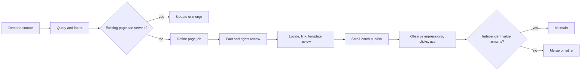

I have seen keyword expansion become a supply race: the list grew, pages shipped, and useful pages did not grow with it. The problem was not a lack of candidates. Candidates were not being filtered for intent, independent value, locale, links, and exit conditions.

## A keyword ledger, not a keyword pile

Record source, locale, market, intent, page type, primary page, evidence strength, downstream action, state, owner, and exit reason. Search Console, site search, support questions, public competitor pages, trends, and AI candidates answer different questions; they should not become one “keyword score.” Similar strings do not necessarily mean similar intent.

Check whether an existing page can be updated or consolidated before creating a new one. A new page should ship with stable identity, internal links, and an observation task. Low-value, duplicate, or purposeless candidates should enter an exit queue.

## Gates for scale

```text
Demand evidence → independent value → fact/copyright/privacy review
→ locale adaptation → identity/canonical/links → quality sample → publish → retire
```

AI, translation, OCR, and transcription can produce candidates and drafts, but not direct publication. Record version, sources, model/tool, owner, and human edits. A multilingual page is not a string replacement; query context, facts, units, links, and user job need revalidation.

## Retirement is part of production

When a page lacks independent value, ask whether it can be merged into a page that satisfies the original intent. Use a one-to-one migration when it can; retire honestly when it cannot. Do not redirect every old page to the homepage or keep orphan pages to preserve a count.

Measure useful pages, indexing, consumption, downstream value, duplication, factual errors, complaints, orphan pages, and governance debt. Production count, keyword count, and generation speed measure supply—not usefulness.

## A routing table for content scale

After inventory, I do not put every page into “optimize.” I route pages to retain when demand and independent value are healthy; update when the facts or structure are stale; merge when several pages serve one intent; localize when the target language needs a real version; and retire when there is no independent job or evidence of use.

Keyword candidates use the same table. Record why a candidate was found, whether an existing page can carry it, and whether the page has a task, factual source, and downstream link. Trends can justify limited coverage, but need a window and exit condition; a trend is not a permanent page asset.

Keep generation and publication separate. A model can suggest summaries, titles, translation drafts, OCR text, and FAQs. Each candidate still needs input version, source, model, confidence, review state, and owner. Factual error often means correct information in the wrong locale, time, or page context.

The valuable system is not the fastest generator. It is the system that can pause, sample, roll back, and retire content. Without those controls, every new page creates governance debt.

## From candidate to retirement



The important nodes are the decisions, not “publish.” If an existing page fully answers the new query, opening another URL only increases maintenance. If several pages each answer one necessary part, merging them mechanically may also damage the user task.

$$
\text{Useful Page Rate} = \frac{\text{Pages with Independent Value and Recent Use}}{\text{Published Pages}}
$$

Define “recent use” as impressions, clicks, completed page tasks, or downstream product action for the relevant business. There is no universal default window.

## Public references

- [Google Helpful content](https://developers.google.com/search/docs/fundamentals/creating-helpful-content)
- [Google Using generative AI](https://developers.google.com/search/docs/fundamentals/using-gen-ai-content)
- [Google Managing multilingual sites](https://developers.google.com/search/docs/specialty/international/managing-multi-regional-sites)
- [Google Consolidate duplicate URLs](https://developers.google.com/search/docs/crawling-indexing/consolidate-duplicate-urls)
