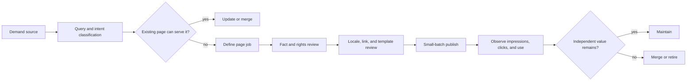

关键词扩展最容易让人产生进展感：表格每天变长，生成任务也不断完成。但页面数量增加以后，真正有访问、有阅读、有后续动作的页面没有变多。回头看，问题往往不是候选词少，而是没有先问这个词对应什么任务、现有页面能不能接住、做出来以后谁来维护。

## 关键词是台账，不是词库

每个候选至少记录来源、语言、地区、意图、页面类型、主页面、证据强度、业务后续、状态、负责人和退出理由。Search Console、站内搜索、客服问题、竞品公开页面、外部热点和 AI 候选回答的是不同问题，不能混成一个“关键词分数”。相似字符串也不等于相似意图。

先检查已有页面能否更新或合并，再决定是否新建页面。新页发布时同时创建稳定 URL、主身份、内链入口和观察任务；低价值、重复或没有后续任务的候选进入退出队列。

## 内容规模需要闸门

```text
需求证据 → 独立价值 → 事实/版权/隐私复核 → 语言地区适配
→ 页面身份/canonical/内链 → 质量抽样 → 发布 → 上线后退出
```

AIGC、翻译、OCR 和视频转写可以产生候选、摘要、标签和草稿，但不能直接放行。版本、来源、模型/工具、责任人和人工修改要写入内容记录。多语言版本不是把中文字符串替换成英文：目标语言的查询语境、事实、单位、内链和页面任务都需要重新验收。



拿一个候选词做例子：如果“蓝牙耳机延迟怎么测”已有一篇教程完整回答，就把新需求记到原页面的更新队列；如果现有页面只有产品列表，没有测试步骤，才建立新的页面任务。图里的第一个分叉由用户任务决定，不由词表长度决定。

## 页面什么时候应该退出

页面没有独立价值时，先判断是否能合并到真正满足原意图的页面；能合并就做一对一迁移，不能合并就诚实下线。不要把所有旧页面跳到首页，也不要为了保持页面总数而长期保留孤立页。

## 规模的验收

看有效页面、索引率、页面消费、后续转化、重复率、事实错误、投诉、孤立页和治理债务。生产次数、关键词数量和生成速度只能说明供给，不说明帮助。内容系统真正成熟的标志，是可以暂停生产、回滚版本和批量治理，而不是永远能继续生成。

## 一个内容规模项目的分流表

存量盘点后，我不会把所有页面放进“继续优化”队列，而是先分流：有稳定需求、有独立价值且状态健康的页面保留；有需求但事实或结构落后的页面更新；多个页面满足同一意图的页面合并；语言版本只是缺翻译的页面进入本地化复核；没有独立任务、没有来源或长期没有消费的页面进入退出评估。

关键词扩展也要经过同一张表。候选词先记录它为什么被发现，再判断已有页面是否能承接；只有当页面任务、事实来源和后续内链都说得清，才进入生产。热点可以有限覆盖，但必须有时间窗口和退出条件；热点不是永久的页面资产。

AI 生产链路需要把“生成”与“发布”分开。模型可以生成摘要、标题候选、翻译初稿、OCR 文本和 FAQ 草稿，但每个候选都要带输入版本、来源、模型、置信度、审核状态和责任人。事实错误往往不是模型完全胡说，而是把正确信息放到了错误的语言、国家、时间或页面语境里。

批量做内容时，我最想要的不是一个更快的生成按钮，而是随时能暂停的开关。抽样发现事实错了，能停整批；发现意图重复，能合并；发现来源过期，能批量回查。没有这些能力，页面越多，未来就越难知道哪些内容值得相信。

## 给候选词一个可解释的分数

我不太相信一个把所有因素压成 0–100 的总分。更实用的做法是把候选拆成几个可回答的问题：是否有真实需求证据，是否存在独立页面任务，是否有可靠来源，是否能由现有内链承接，是否有明确负责人，是否有上线后的观察窗口。任何一个关键问题答不上来，候选就留在研究队列，而不是因为总分够高被生产。

内容台账还要保存“为什么不做”。合并到已有页、暂时没有足够证据、涉及地区事实无法确认、只是同义词重复、热点已过期，这些拒绝理由会成为下一轮复盘的资产。没有拒绝记录，团队每次扩词都会重新争论同一批低价值候选。

## 生成流水线要像发布流水线一样有闸门

流程分成候选、草稿、事实审核、语言审核、链接审核、抽样发布和上线观察。每一阶段只推进带齐必要字段的内容。模型生成的内容要能回到输入来源；翻译要检查目标语言的单位、地区表达、产品术语和内链；批量发布要抽样检查页面是否真的有独立价值。

批量生产时，抽样不应该只抽“最漂亮”的页面。按模板、语言、来源、模型版本和风险等级分层抽取，重点看边界样本：没有足够来源的词、跨地区事实、重复意图、图片 OCR 不确定和长期没有消费的页面。发现系统性错误时，要能暂停整批并回滚版本。

## 写一篇页面之前先问三个问题

第一，这个页面要替谁解决什么问题；第二，读者为什么不直接看已有页面；第三，发布以后谁能发现事实过期。三个问题有一个答不上来，我通常不会马上生成正文。旧页面流量低，不代表一定要删；流量高，也不代表一定值得保留。先看它是否仍然完成一个清楚的任务，再决定更新、合并或退出。

$$
\text{Useful Page Rate} = \frac{\text{Pages with Independent Value and Recent Use}}{\text{Published Pages}}
$$

例如 1,000 个已发布页面里，420 个同时有独立任务和过去 90 天的有效使用，那么 Useful Page Rate 是 42%。这个比例下降时，先查内容分流和退出治理，不要立刻用生成速度补页面。

## 公开资料

- [Google Helpful content](https://developers.google.com/search/docs/fundamentals/creating-helpful-content)
- [Google Using generative AI](https://developers.google.com/search/docs/fundamentals/using-gen-ai-content)
- [Google Managing multilingual sites](https://developers.google.com/search/docs/specialty/international/managing-multi-regional-sites)
- [Google Consolidate duplicate URLs](https://developers.google.com/search/docs/crawling-indexing/consolidate-duplicate-urls)
