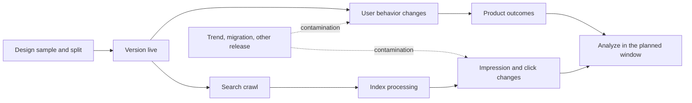

In one recommendation experiment, Web clicks rose the same day while search exposure had not redistributed. A hot page later lifted the experiment average. We checked assignment, versions, crawl state, and historical traffic and learned that assignment had started; the search experiment had not yet matured.

## Freeze the protocol

Define unit, assignment key, treatment, primary metric, guardrails, pre-period covariates, minimum window, contamination exclusions, stopping rule, and rollback before launch. Track page version, canonical, robots, sitemap timing, cache, and template. Run an A/A or sample-ratio check first.

CUPED can reduce variance using pre-period data. It cannot repair bad assignment, bots, duplicate users, missing events, or a version the search system has not processed. Covariates and estimation must be fixed before reading results. [Microsoft Research: CUPED](https://www.microsoft.com/en-us/research/publication/improving-the-sensitivity-of-online-controlled-experiments-by-utilizing-pre-experiment-data/)

## Investigate traffic changes with the same method

Check releases, 5xx, DNS/CDN, robots, canonical, sitemap, crawling, and indexing first. Then segment templates, topics, countries, queries, devices, and page age. Only after that add public algorithm updates as context. Record experiments, hot topics, and release contamination on the same timeline.

“Not significant” means evidence is insufficient. “Significant” does not excuse contamination or guardrail regression. The decision may be adopt, extend, pause, or roll back. Submission can reduce discovery delay; it cannot force a search system to adopt a version.

Reports should retain assignment balance, treatment coverage, window, uncertainty, processing delay, version integrity, primary metrics, and guardrails. The next incident should be replayable rather than another debate about whether an update happened.

## A complete experiment timeline

Before launch, freeze page sample, assignment unit, and version. On launch day, record when the treatment actually became active. Observe user behavior and search processing separately, then analyze. User clicks may change today; search exposure may redistribute days later; App retention belongs to a still later window.

Hot topics, migrations, template releases, and algorithm updates inside the window are contamination events, not footnotes. CUPED can reduce variance; it cannot clean a contaminated experiment.

Keep three actions in the protocol: adopt, extend, and roll back. Extend means search processing or sample is incomplete. Roll back does not necessarily disprove the hypothesis; a guardrail may have failed first. The valuable output is a reusable agreement about assignment, metrics, waiting, stopping, and evidence.

## Check sample ratio and version integrity

The first post-launch check is not the primary metric. Check whether the split matches the design, whether the treatment reached the intended pages, and whether treatment and control had similar pre-period histories. Caches, bots, sharing, and overlapping experiments can contaminate the sample; mark contamination instead of silently deleting inconvenient rows.

Search experiments have several clocks: treatment activation, crawl, index processing, and exposure change. Record all four. Publishing a version does not mean that search has processed it.

## Turn uncertainty into an action

A report needs sample size, window, uncertainty, guardrails, contamination handling, and version integrity—not just uplift. Adopt when the pre-agreed boundary is met; extend when processing or sample is incomplete; pause or roll back when a guardrail worsens; record a rejected hypothesis when evidence is sufficient.

## Do not call every inflection an algorithm update

An update can belong on the timeline, but it should not be the default explanation. Check releases, status codes, cache, robots, canonical, templates, and segments first. Record what was checked and what remains unknown; “no deployment issue found” is still evidence.

## The timing of an SEO experiment

$$
\text{Uplift} = \frac{\bar{Y}_{treatment} - \bar{Y}_{control}}{\bar{Y}_{control}}
$$

With CUPED, document that the covariate came from before the experiment, how it was estimated, and which samples were excluded. CUPED can reduce variance; it cannot repair a bad split or a contaminated window.

## Public references

- [Google Website testing and search](https://developers.google.com/search/docs/crawling-indexing/website-testing)
- [Google Search Status Dashboard](https://status.search.google.com/)
- [Google Core updates](https://developers.google.com/search/updates/core-updates)
- [Microsoft Research CUPED](https://www.microsoft.com/en-us/research/publication/improving-the-sensitivity-of-online-controlled-experiments-by-utilizing-pre-experiment-data/)
