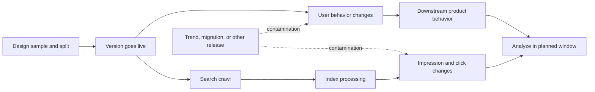

一次推荐模块实验里，Web 点击当天就涨了，搜索曝光却没有变化。几天后，一个热点页面把实验组平均值推高，群里已经有人准备写“实验成功”。我们把分组、页面版本、抓取状态和历史流量放到同一条时间线上，才发现分流开始、搜索看到版本、用户行为变化根本不是同一个时刻。

## 先冻结协议

上线前固定实验单位、分流键、处理变量、主指标、保护性指标、前置协变量、最小观察窗口、污染排除、停止规则和回滚动作。页面版本、canonical、robots、Sitemap 更新时间、缓存和模板必须可追踪。先做 A/A 或样本比例检查，再看结果。

CUPED 可以利用实验前数据降低方差，但不能修复错误分流、机器人污染、重复用户、漏埋点或搜索系统尚未处理的版本。协变量必须来自实验前，估计方式也要写进协议。[Microsoft Research: CUPED](https://www.microsoft.com/en-us/research/publication/improving-the-sensitivity-of-online-controlled-experiments-by-utilizing-pre-experiment-data/)

## 用同一条方法排查流量异常

流量下降先查部署、5xx、DNS/CDN、robots、canonical、Sitemap、抓取和索引，再按模板、主题、国家、查询、设备和页面年龄切片，最后才把公开算法更新作为背景。实验、热点和版本污染都写在时间线上。

“尚未显著”表示证据不足，不等于没有效果；“显著”也不能跳过污染和保护性指标。决策可以是采用、延长、暂停或回滚。主动提交只能减少发现延迟，不能强迫搜索系统采用某个版本。

## 结果报告必须留下什么

样本比例、处理覆盖、观察周期、不确定性、搜索处理延迟、版本一致性、主要指标和保护性指标都要写。下一次团队再看到拐点时，应该能够复用时间线和证据等级，而不是重新争论“是不是算法更新”。

## 一个 SEO 实验的完整时间线

实验开始前，先固定页面样本、分流单位和版本；上线当天记录处理变量真正生效的时间；随后分别观察用户行为和搜索系统处理；最后才进入统计分析。用户点击可以当天变化，搜索曝光可能几天后才开始重新分布，App 留存又属于更晚的窗口。

假设对照组 10,000 个页面带来 1,000 次合格任务，实验组带来 1,080 次，uplift 是 8%。但如果实验组里混入了一个热点页面带来的 200 次任务，这个 8% 就不能直接归因于处理变量，必须先标记污染并重新分析。

如果热点、迁移、模板发布或算法更新落在实验窗口里，就不能只在结果表里加一个备注，而要把它标成污染事件，说明影响了哪些页面和指标。CUPED 能降低方差，却不能把被污染的实验变干净。

报告里我更愿意保留三种动作：采用、延长、回滚。延长不是失败，而是搜索处理或样本仍不足；回滚也不一定说明假设错误，可能是保护性指标先恶化。重要的是每个动作都有预先写好的条件，而不是结果出来后临时发明解释。

实验最后留下来的，最好不只是一句“显著”或“不显著”。下一次有人提议改标题、改模板或改推荐模块时，团队应该知道怎么分组、等多久、什么情况停止，以及哪些证据要留下。这个协议比一次漂亮的 uplift 更耐用。

## 先做样本比例和版本检查

实验开始后，第一项检查不是看主指标，而是看实际分流是否接近设计比例，处理变量是否真的覆盖目标页面，实验组和对照组是否在上线前具有相近的历史轨迹。页面被缓存、被机器人访问、被用户分享或被多个实验同时修改时，都可能形成污染。发现污染后先标记样本，不要偷偷删掉不符合预期的记录。

搜索实验还有一个额外难点：处理变量生效的时间、抓取时间、索引处理时间和曝光变化时间不是同一个时间。报告里要分别记下这四个时间点。否则团队很容易把“我们发布了”当成“搜索已经看到了”，再把没有即时变化解释成方案失败。

## 把不确定性写成动作

报告不只给一个 uplift。它还要说明样本量、观察窗口、区间或不确定性、保护性指标、污染处理和版本一致性。结果落在预设边界内时采用；搜索处理未完成或样本不足时延长；保护性指标恶化时暂停或回滚；结果方向相反且证据充分时记录假设被否定。

每一个动作最好绑定负责人和截止时间。延长观察不是把实验无限挂着，回滚也不是删掉结果。把决定和证据一起保存，下一次才知道哪些结论来自真实实验，哪些只是当时的合理猜测。

## 别急着把拐点叫成算法更新

流量拐点出现时，算法更新当然可以放进时间线，但不要把它当作默认答案。先查部署、响应码、缓存、robots、canonical、模板和页面分层；这些都没有变化，再看需求、竞争和公开更新。排查记录里要写“查过什么”和“还没查什么”，因为“没有发现部署问题”本身也是证据，后面接手的人也需要知道检查范围。

实验 uplift 可以先用最简单的形式表达：

$$
\text{Uplift} = \frac{\bar{Y}_{treatment} - \bar{Y}_{control}}{\bar{Y}_{control}}
$$

如果使用 CUPED，调整后的结果还要说明协变量来自实验前、如何估计以及哪些样本被排除。CUPED 能减少方差，不能修复分流错误或时间窗口污染。

## 公开资料

- [Google Website testing and search](https://developers.google.com/search/docs/crawling-indexing/website-testing)
- [Google Search Status Dashboard](https://status.search.google.com/)
- [Google Core updates](https://developers.google.com/search/updates/core-updates)
- [Microsoft Research CUPED](https://www.microsoft.com/en-us/research/publication/improving-the-sensitivity-of-online-controlled-experiments-by-utilizing-pre-experiment-data/)
