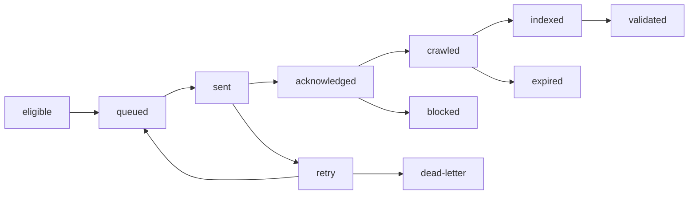

A successful submission creates a dangerous illusion: the task was sent, but the page may not be crawled; a crawl may not become an index record; a traffic decline may not be an algorithm update. A reliable system keeps these states separate.

```text
eligible → queued → sent → acknowledged → crawled → indexed → validated
             ↘ retry / dead-letter / blocked / expired
```

Normalize URL, locale, parameters, and canonical before submission. Use a content version or URL hash as an idempotency key. Add leases, backoff, rate limits, and dead letters. Sending successfully must not change index state. Sitemaps are a durable discovery path; eligible official APIs are notification mechanisms for specific page types, not ranking or forced-indexing interfaces.

The task table should include URL, version, state, last attempt, next attempt, failure class, owner, and evidence. Restarts, duplicate jobs, and quota exhaustion must be recoverable.

## Treat traffic loss as an incident

When traffic turns down, teams often say “the algorithm changed” first. I check releases and configuration, 5xx/DNS/CDN, robots/canonical/sitemap, crawl and index state, and then segment templates, topics, countries, queries, devices, and page age. Only after that do I place a public algorithm update on the timeline as context.

Change one main variable per repair batch. Retain, update, merge, redirect, retire, or observe with a recorded reason and exit condition. A public update can explain a window; it does not prove causality.

## Artifacts and acceptance

Leave a URL state machine, failure taxonomy, task table, affected-page sample, internal/external timeline, repair batches, observation window, and rollback runbook. Acceptance is not “traffic returned today”; it is whether the team can distinguish sending, crawling, indexing, search performance, and business validation and replay the investigation later.

## Replay one failed task

A failed submission should not be reduced to an error string. Store normalized URL, content version, submission reason, attempt count, latest error, next retry, response evidence, and final human action. This distinguishes “never sent,” “rejected,” “not processed yet,” and “processed but not visible.”

Idempotency and dead letters are easy to omit. Publish triggers, scheduled checks, and manual retries may enqueue one URL at the same time. Without an idempotency key, quota is wasted and reports count one release as several submissions. Without dead letters, one permanently failing URL retries forever and hides new failures.

Incident investigation also preserves evidence of what did not change. If release, response status, robots, canonical, and crawl state are stable, and the decline is limited to one market or query, demand and competition become reasonable next checks. If a template just shipped, start with the diff rather than an algorithm story.

Recovery is complete when the state machine explains every important URL, the team knows what it is waiting for, and the next incident can start from the same timeline.

## Failure classes should determine the next action

Separate temporary failures such as timeouts, rate limits, and network errors; request errors such as malformed URLs or invalid permissions; page-state errors such as 404, soft 404, noindex, and canonical conflicts; and unknown states where the search system has not yet produced a confirmed result. Temporary failures can usually retry, page-state failures need repair, and unknown states need observation rather than a false success.

## The smallest incident evidence pack

Freeze affected-page samples, before-and-after versions, status codes, response time, robots/canonical, crawl and index observations, impressions, clicks, product consumption, recent releases, and external events. Attach source and collection time to each item. A “site-wide decline” without a sample is an alert, not a diagnosis.

## A submission request is not the outcome

The submission tool puts an eligible task into a queue; the inspection tool observes state; an editor or engineer still decides whether the page is worth keeping. An API acknowledgement must not automatically become `indexed`, a publication decision, or a batch push of weak pages.

## The indexing task state machine



`acknowledged` means that the submission endpoint accepted the task. `crawled` means the page was requested. `indexed` is the materially different state. Turning all three into `success: true` makes a report look healthy while failures accumulate downstream.

$$
\text{Retry Rate} = \frac{\text{Tasks Entering Retry}}{\text{Sent Tasks}},\qquad
\text{Dead-letter Rate} = \frac{\text{Dead-letter Tasks}}{\text{Sent Tasks}}
$$

Break both rates down by error class. Rate limiting and canonical conflicts should not land in the same queue.

## Public references

- [Google Sitemaps overview](https://developers.google.com/search/docs/crawling-indexing/sitemaps/overview)
- [Google Ask to recrawl](https://developers.google.com/search/docs/crawling-indexing/ask-google-to-recrawl)
- [Google Indexing API](https://developers.google.com/search/apis/indexing-api/v3/quickstart)
- [Google Search Status Dashboard](https://status.search.google.com/)
- [Google Spam policies](https://developers.google.com/search/docs/essentials/spam-policies)
