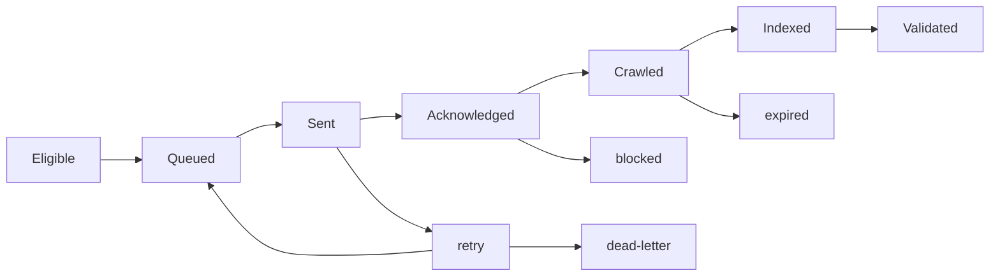

提交接口很容易让人误以为事情已经完成。接口返回成功，只说明请求被接收；页面可能还没被抓取，抓取后也可能因为重复、质量或技术设置没有进入索引。流量突然下降时，先找算法更新也很诱人，但一次错误部署、一个 noindex，或者一批 canonical 改错，往往更值得先查。

## 一条可恢复的状态机

```text
eligible → queued → sent → acknowledged → crawled → indexed → validated
             ↘ retry / dead-letter / blocked / expired
```

提交前规范化 URL、语言、参数和 canonical；用内容版本或 URL 哈希做幂等键；队列有租约、退避、限速和死信；发送成功不改变索引状态；巡检任务只负责观察，不假装替搜索系统做决定。Sitemap 是稳定的发现渠道，适用的官方 API 只是特定页面类型的通知机制，不是排名或强制收录接口。



一次任务从 `sent` 到 `acknowledged` 只说明提交端收到了请求；从 `acknowledged` 到 `crawled` 才是搜索系统实际请求页面；`indexed` 还要经过搜索系统自己的判断。把三个状态写成一个 `success: true`，会让排查失去方向。

任务表至少记录 URL、版本、状态、最近尝试、下次尝试、错误分类、责任人和证据链接。worker 重启、重复任务和配额耗尽都必须可以恢复。

## 流量下降按事故处理

一次流量拐点出现后，团队很容易先说“算法更新了”。排查顺序应当是：部署和配置、5xx/DNS/CDN、robots/canonical/Sitemap、抓取与索引、模板/主题/国家/查询/设备/页面年龄分层，最后才把公开算法更新放进时间线作为背景。

修复一次只改一类主要变量。页面进入保留、更新、合并、301、404/410 或继续观察，都要记录证据和退出条件。公开更新能解释时间窗口，不能自动证明因果；如果站内页面状态已经提供了更直接的证据，就先修站内问题。

## 项目交付物

- URL 状态机和失败分类；
- 提交/巡检任务表；
- 受影响 URL 样本；
- 变更与外部事件时间线；
- 恢复批次、观察窗口和回滚手册。

验收不是“今天流量回来了”，而是团队可以区分发送、抓取、索引、搜索表现和业务验证，并能在下一次异常时重放同一套排查路径。

## 从一个失败任务回放整条链

一次提交任务失败，不能只保存接口返回的错误字符串。任务记录至少要有规范化 URL、内容版本、提交原因、尝试次数、最近错误、下次重试时间、响应证据和最终人工动作。这样才能区分“请求没有发出去”“请求发出但被拒绝”“搜索系统尚未处理”和“页面已经处理但仍未获得曝光”。

队列设计里最容易漏掉的是幂等和死信。发布触发、定时巡检和人工补交可能同时把同一个 URL 放入队列；没有幂等键，就会重复消耗配额，也会让报表把一次发布算成多次提交。没有死信，就会让一个永久失败的 URL 无限重试，掩盖真正的新问题。

流量事故排查也要保留“没有改变”的证据。如果部署、响应码、robots、canonical 和抓取状态都没有变化，且下降集中在某个查询或市场，才有理由把需求和竞争放进下一层；如果模板刚刚发布，先回到版本差异，不要从公开算法更新开始讲故事。

恢复完成不一定意味着总流量当天回到旧峰值。更可靠的判断是：关键 URL 的状态说得清楚，修复动作有证据，哪些变化需要等待搜索系统处理也写清楚。下一次出问题时，值班的人能从同一份时间线开始，而不是重新猜一遍。

## 失败分类要能指导下一步

错误至少分成四类：暂时性错误，例如超时、限流和网络失败；请求错误，例如 URL 不规范、权限或参数不合法；页面状态错误，例如 404、软 404、noindex 和 canonical 冲突；未知状态，例如请求成功但搜索系统尚未给出可确认结果。前两类通常可以自动重试，第三类应进入修复队列，第四类只能进入观察，不应该被伪装成成功。

重试也要有边界。每次尝试保存开始时间、结束时间、错误分类和响应证据；退避时间逐步增加，超过次数后进入死信。人工修复后用新的内容版本或明确的重放原因重新排队，避免旧任务无限复活。配额接近上限时，优先处理近期发布、重要更新和有真实用户需求的 URL，并把降级策略写进运行手册。

## 流量事故的最小证据包

事故开始后先冻结一份窗口数据：受影响页面样本、前后版本、状态码、响应时间、robots/canonical、抓取和索引观测、曝光点击、产品消费，以及最近的部署和外部事件。每一项都标明数据来源和采集时间。没有样本的“全站下降”只能算报警，不能算诊断。

修复时每批只处理一个主要原因，批次之间保留间隔。比如先撤掉错误的 noindex，再观察搜索处理；不要同时重写内容、改 URL 和换模板。恢复不完整时，记录哪些页面恢复、哪些页面没有恢复，以及下一层假设。这样事故复盘才会产生下一次可以执行的检查，而不是一句“注意算法变化”。

## 不要把“请求收录”当成工作成果

提交工具的成果是把合格任务送进队列，巡检工具的成果是收集状态，编辑或工程负责人仍然要决定页面是否值得保留。API 返回成功不能把页面自动标成 indexed，更不能因此批量发布低质量页面。自动化应该减少重复劳动，不应该让错误更快地扩散。

$$
\text{Retry Rate} = \frac{\text{Tasks Entering Retry}}{\text{Sent Tasks}},\qquad
\text{Dead-letter Rate} = \frac{\text{Dead-letter Tasks}}{\text{Sent Tasks}}
$$

这两个比例也要按错误类别拆开。限流导致的重试和 canonical 冲突导致的重试，不应由同一个负责人处理。

## 公开资料

- [Google Sitemaps overview](https://developers.google.com/search/docs/crawling-indexing/sitemaps/overview)
- [Google Ask to recrawl](https://developers.google.com/search/docs/crawling-indexing/ask-google-to-recrawl)
- [Google Indexing API](https://developers.google.com/search/apis/indexing-api/v3/quickstart)
- [Google Search Status Dashboard](https://status.search.google.com/)
- [Google Spam policies](https://developers.google.com/search/docs/essentials/spam-policies)
