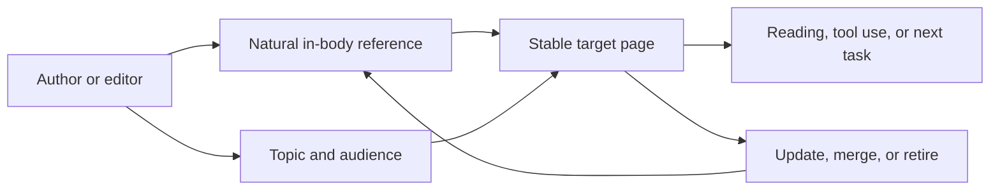

In one backlink review, link count kept growing while real referral traffic did not. Opening the sources one by one made the problem obvious: many links came from low-relevance directories, templated articles, or exchanges. Few had topic context and real readers.

## A link is not a score

Links can help discovery and bring readers, but being linked is not the same as being editorially recommended. DR, DA, and Authority Score can rank candidates within one tool and time window. They are not Google-published ranking scores and cannot alone prove a penalty, risk, or causal effect. [Ahrefs DR](https://help.ahrefs.com/en/articles/1409408-what-is-domain-rating-dr) · [Moz DA](https://moz.com/learn/seo/domain-authority) · [Semrush Authority Score](https://www.semrush.com/kb/747-authority-score-backlink-scores)

## Build citable assets

Start with unique facts, public data, reusable tools, clear definitions, or verifiable cases. The source ledger records topic, audience, body context, destination, anchor, referral visits, survival, acquisition method, risk, and review date.

Record rejection reasons: irrelevant topic, bulk exchange, fixed anchors, automation, no audience, or a destination that cannot carry the intent. A competitor having a link is not a reason to copy it.

Review dead targets, topic drift, unusual exchanges, and destination quality monthly. Acceptance is explainability, replayable referral traffic, real destination consumption, and less low-quality acquisition—not a larger link count or score.

Keep public policy, vendor metric definitions, page samples, and project inference separate. Without source samples, do not write “the score rose, therefore rankings rose.”

## How a link enters the acquisition list

I ask why a source would cite the page before asking for its third-party score. The source should serve a recognizable audience, have a topic relationship with the destination, place the link in editorial context, and give the reader a useful next step. Without that, the candidate stays in research.

Record rejection reasons: irrelevant directories, bulk exchanges, fixed anchors, automated articles, and pages with no real audience. A rejection list matters because it prevents “the competitor has it” from becoming a last-minute acquisition requirement.

Link governance includes the destination. When the target is stale, migrated, or no longer satisfies the intent, the relationship needs repair too. Referral visits and destination consumption are closer to a real relationship than link count, but they still do not prove long-term ranking causality.

This work is slower than buying a score report, but it tells the team why each relationship exists and when to stop maintaining it.

## Build a source research list

Start with people who might genuinely cite the information: industry publishers, researchers, author communities, documentation teams, local organizations, or products solving a related problem. Record audience, topic relation, body context, freshness, editorial process, destination, and possible referral path. The list can be small if every candidate has a reason a reader would click.

The asset needs review before promotion. A data page needs scope, dates, sample, and limitations; a tool needs to work; a case needs to separate public fact from interpretation. A vague “authoritative” page is difficult to cite naturally.

Assume a researcher links to a data page and sends 20 visits. If 8 continue reading and 3 complete the tool task, that relationship has a useful path even though the link count increased by only one.

## Source, target page, and reader

This keeps link work from becoming a count of sources. When the target URL changes, facts expire, or the page stops serving the original intent, the maintenance path matters too. Track source relevance, valid arrival rate, and page-task completion separately instead of substituting a third-party authority score.

## Public references

- [Google Crawlable links](https://developers.google.com/search/docs/crawling-indexing/links-crawlable)
- [Google Spam policies](https://developers.google.com/search/docs/essentials/spam-policies)
- [Ahrefs Link Building Guide](https://ahrefs.com/seo/link-building)
