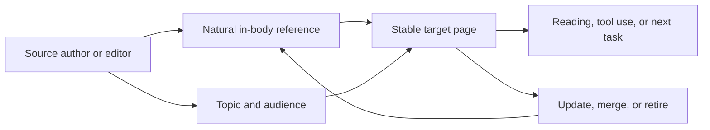

一次外链盘点里，报表上的链接数一直在涨，真实引荐却几乎没动。我们把来源页面逐条打开，才发现很多链接来自低相关目录、模板文章或互换页面。它们在工具里算一条链接，但没有读者会顺着它来，也没有编辑语境可以解释为什么要引用。

## 链接不是分数

外链可以帮助发现页面，也可能带来真实读者；但“被链接”不等于“被推荐”。DR、DA 和 Authority Score 可以在同一工具、同一时间窗口内帮助排序候选，但不是 Google 公布的排名分数，也不能单独证明惩罚、风险或因果。[Ahrefs DR](https://help.ahrefs.com/en/articles/1409408-what-is-domain-rating-dr) · [Moz DA](https://moz.com/learn/seo/domain-authority) · [Semrush Authority Score](https://www.semrush.com/kb/747-authority-score-backlink-scores)

## 获取可引用资产

我更愿意先做独特事实、公开数据、可复用工具、清楚定义或可核验案例，再寻找真正有主题关系的来源。来源台账记录主题、受众、正文语境、目标页、锚文本、引荐访问、存活状态、获取方式、风险和复核日期。

假设一个研究者引用了你的数据页面，链接带来 20 次访问，其中 8 人继续阅读，3 人完成工具操作。这个来源的价值不在“增加了 1 条链接”，而在于它把一批主题匹配的读者带到了能继续完成任务的页面。

拒绝候选也要记录理由：主题不相关、批量交换、固定锚文本、自动生成、没有真实受众或目标页无法承接。不能因为竞争对手也有，就把它列为必须复制的链接。

## 治理和验收

每月复核失效目标、主题漂移、异常互链和目标页质量；需要迁移或下线内容时同步处理链接。验收看来源是否更容易解释、引荐访问是否可回放、目标页消费是否真实、低质获取是否减少，而不是链接总数和第三方分数是否上涨。

公开政策、厂商指标、页面样本和本文推断要分开写。没有原始样本，就不把“分数上涨后排名上涨”写成因果。

## 一条外链怎样进入获取名单

我会先问来源是否有理由引用，而不是先问它的第三方分数。一个来源页面需要说明它服务什么读者、和目标页面有什么主题关系、链接是否出现在自然正文语境里、读者点击后能否继续完成任务。没有这些信息，候选就停在研究阶段。

获取台账还要记录拒绝原因。低相关目录、批量互链、固定锚文本、自动生成文章和只为传递分数的页面，都应该留下为什么不做的记录。拒绝清单很有价值，因为它能阻止团队在压力下把“竞争对手有”重新解释成“我们也必须有”。

外链治理也包括站内目标页。目标页失效、主题已经迁移、内容不再满足原意图时，来源关系本身就需要重新处理。引荐访问、页面消费和来源持续时间比链接总数更接近真实关系，但它们仍然不能自动证明长期排名因果。

这会比买一份分数报告慢，而且经常没有一条立刻好看的曲线。但至少团队知道每条关系为什么存在，目标页坏了以后应该找谁处理，也知道哪些机会从一开始就不值得做。

## 做一份来源研究清单

来源研究可以从真正会引用这类信息的人开始：行业媒体、研究机构、作者社区、工具文档、地方组织和解决同一问题的产品。每个候选记录受众、主题关系、正文位置、页面更新时间、是否有编辑流程、目标页和潜在引荐路径。名单不需要很大，但每一项都应该能回答“为什么这位读者会愿意点开”。

资产也要先验收再推广。一个数据页面需要说明口径、时间范围、样本和限制；一个工具需要真的能用；一个案例需要区分公开事实和主观判断。没有可核验边界的“权威内容”，很难得到自然引用，强行推广只会把低质关系带进系统。

## 先把被引用的东西做好

来源点击后落到哪里，决定了这段关系是不是有用。目标页要能在首屏解释主题，提供证据、下一步和稳定 URL；如果它已经合并、过期或转向另一个意图，就要更新来源沟通、重定向或下线。外链建设不是把链接送到站内任意页面，而是维护一条读者可以走通的路径。

每月抽样看来源实际带来的读者：他们是否进入正确页面，是否继续阅读或使用工具，是否遇到过期信息。引荐量小不代表来源没有价值；一个真正相关的研究者可能只带来几次访问，但比一批没有上下文的点击更值得维护。反过来，来源有流量也不等于它适合长期保留。

这张图能防止外链工作只盯着来源数量。目标页换了 URL、事实过期或不再承接原意图时，右边的维护动作同样重要。可以把引荐价值拆成来源相关性、有效到达率和页面任务完成率三个指标，不用一个第三方权威分数代替它们。

## 引用来源

- [Google Crawlable links](https://developers.google.com/search/docs/crawling-indexing/links-crawlable)
- [Google Spam policies](https://developers.google.com/search/docs/essentials/spam-policies)
- [Ahrefs Link Building Guide](https://ahrefs.com/seo/link-building)
