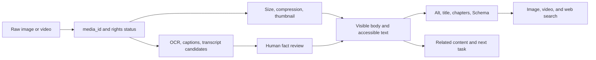
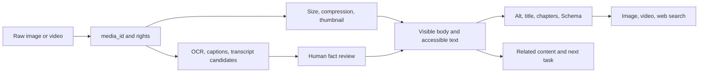

People can understand an image or short video while a search system sees an empty player, a vague title, or a file without context. We first tried to solve this with media fields. The real gap was a translation chain: the media object, page text, structured data, and recommendations must describe the same thing.

## Model facts before Schema

For each page type, record facts that truly exist, their sources, update time, and visible location. Map those facts to Schema types and fields. JSON-LD should express visible, verifiable facts; it should not invent ratings, authors, prices, videos, or list relationships. Run Rich Results Test, a Schema validator, and a page sample before release.

List, detail, and video pages have different jobs. A missing rich result does not mean the page has no value, and structured data is not a substitute for quality.

For example, OCR can extract text from a screenshot of an error message, but the error code, version, and user information still need review. Once confirmed, the useful facts belong in the body and accessible text; alt should describe the image’s role on the page.

## Media needs a lifecycle

A media table should include media ID, original file, page relationship, alt, title, captions, OCR/transcription source, copyright/privacy state, dimensions, loading strategy, markup, and retirement time. OCR and transcription are candidates first. Review people, places, numbers, brands, and sensitive attributes; unreliable recognition should not enter titles, alt, or Schema.

Retiring an asset means cleaning pages, links, sitemaps, players, and markup together. Observe image, video, Web, and on-site discovery separately.

Alt text describes why an image matters to the current page; it is not a keyword bucket. Video title, introduction, captions, chapters, thumbnail, and player should agree. The acceptance test is not the number of added fields, but whether users, search systems, and recommendation systems see the same factual object.

## From asset to page

An image should not become alt text immediately. Give it a stable media ID and store the original file and copyright/privacy state. Generate OCR, subject, title, and topic candidates. Only then decide which facts belong in page text, captions, alt, recommendations, and structured data.

Video adds time: transcripts need timestamps, chapters need to match the actual scene, and a thumbnail cannot stand in for playback. Image search, video search, Web search, and on-site recommendations are different entry points.

Template bugs are common. A field that is optional on the page becomes a default value in JSON-LD; a list page gets marked as a single entity to seek a rich result. The release gate should compare visible content with markup, not only validate JSON syntax.

## Image, video, and structured-data checks

Size images for their actual display path. A list thumbnail, detail-page hero image, and social card may need different derivatives. Reserve dimensions to avoid layout shifts. A video page needs a title, summary, thumbnail, opening text, captions, and chapters that let a person understand and locate the content before and after playback. If 500 media interactions produce 80 completed page tasks, the media-assisted task rate is 16%; exposure alone would hide that result.

Success is factual consistency, accessibility, and useful consumption—not the number of added fields.

## How media becomes a searchable page

Media impressions alone are a weak outcome. A useful operational metric is:

$$
\text{Media-assisted Task Rate} = \frac{\text{Tasks Completed after Media Interaction}}{\text{Media Interactions}}
$$

If many people click an image but do not continue reading, the missing piece may be page context rather than another image field.

## Public references

- [Google Structured data introduction](https://developers.google.com/search/docs/appearance/structured-data/intro-structured-data)
- [Google Structured data policies](https://developers.google.com/search/docs/appearance/structured-data/sd-policies)
- [Google Image SEO](https://developers.google.com/search/docs/appearance/google-images)
- [Google Video SEO](https://developers.google.com/search/docs/appearance/video)
- [Schema.org](https://schema.org/)
