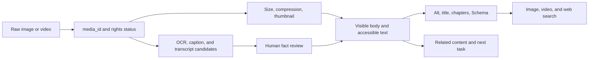

人看到一张截图，往往马上知道它在说明什么；搜索系统看到的可能只是一个文件名和一块播放器。以前我也会先想给图片补 alt、给视频补 Schema，做完才发现正文没有说明这份媒体为什么放在这里。标签补齐了，页面还是没有变得更好懂。

## 先建立页面事实模型

为每种页面类型记录页面真实存在的事实、来源、更新时间和可见位置，再映射到 Schema 类型和字段。JSON-LD 只能表达页面中真实可见且可验证的事实；它不应该创造页面没有的评分、作者、价格、视频或列表关系。发布前同时跑 Rich Results Test、Schema validator 和人工页面抽样。

例如一张包含产品错误提示的截图，OCR 可以先提取文字，但错误码、版本号和用户信息必须经过审核；确认后，相关事实进入正文和可访问文本，alt 只描述图片对当前页面的用途。媒体文件本身不是页面，承载它的上下文才决定它能否帮助用户。

聚合页、详情页和视频页的任务不同，不能用一个模板强行填满所有字段。没有 rich result 不等于页面没有价值，结构化数据也不是质量的替身。

## 媒体是有生命周期的对象

媒体表至少需要 media_id、原始文件、页面关系、alt、标题、字幕、OCR/转写来源、版权/隐私状态、尺寸、加载策略、结构化数据和下线时间。OCR 与转写先作为候选，人物、地点、数字、品牌和敏感属性要经过事实与权限复核；不可靠的识别结果宁可不进标题、alt 或 Schema。

下线媒体时同步清理页面、内链、Sitemap、播放器和结构化数据。图片搜索、视频搜索、网页搜索和站内推荐分别观察，不把媒体曝光压成一个总数。

## 页面上下文比字段更多

图片 alt 描述它对当前页面有什么用，装饰图不需要塞关键词；视频标题、首段、字幕、章节、缩略图和播放器状态应互相印证。页面正文说明媒体解决什么问题，内链把用户带到同一主题的下一步。

检查媒体时，先问用户能不能不用猜就知道它的用途，再看搜索系统能不能从正文、文件和结构化数据得到相同答案。JSON-LD 多几个字段不是成果，事实没有对应到页面上，字段越多反而越危险。

## 从素材到页面的处理链

一张图片进入内容系统后，不应该直接变成一条 alt。先给它稳定的 media_id，保存原始文件和版权/隐私状态；再产生 OCR、主体识别、标题候选和主题候选；最后由页面作者或审核规则决定哪些事实进入正文、字幕、alt、推荐和结构化数据。

视频还要多一层时间关系：转写文本需要时间戳，章节需要和实际画面对应，缩略图不能冒充已经播放的视频。图片和视频的搜索入口也不是同一个入口，站内推荐更不应该只因为它们共享几个关键词就把用户送过去。

结构化数据的工程问题经常出在模板：一个字段在页面上是可选的，在 Schema 中却被批量填成默认值；一个聚合页为了获得详情展示，被错误地标成了单个实体。发布闸门应当比较可见正文与 JSON-LD，而不是只检查 JSON 是否语法合法。

真正值得观测的是事实一致性、媒体可访问性、页面消费和后续关系。字段数量增加，却没有让用户更快理解页面，就不算一次成功的 SEO 改动。

## 图片优化先看展示路径

图片文件名、尺寸和格式要由真实展示位置决定。列表缩略图、详情页主图和社交分享图通常不是同一份资产；可以共用源文件，但应生成适合各自容器的版本。压缩时保留主体清晰度、避免把关键文字压进无法放大的图片，并为布局预留宽高，防止图片加载后把正文推走。

alt 的写法也应该从页面任务出发：如果图片展示一个界面，描述用户需要理解的界面状态；如果只是装饰，空 alt 可能比关键词堆砌更诚实；如果图片包含关键信息，正文或可访问文本也要提供同等信息。图片搜索带来的访问必须能够回到完整页面，而不是只留下一个孤立文件。

## 视频页面要有“看之前”和“看之后”

视频页至少需要一个能在不播放时理解主题的标题、摘要、缩略图和首段；播放后，章节、字幕和转写让用户可以定位到具体信息。视频结束后，内链或 CTA 要接住下一步任务。只有播放器、没有正文和上下文的页面，即使有视频文件，也很难形成稳定的搜索入口。

发布时抽样验证视频 URL、缩略图、字幕时间戳、结构化数据和页面可见文本是否一致。视频被下线或替换后，同时清理旧的媒体关系，避免搜索系统和用户继续进入失效播放器。

## 结构化数据别从模板默认值开始

为每种页面类型留一份最小 JSON-LD 样例就够了。模板改动时，拿页面上的实体、URL、作者、日期、图片和视频逐项对照；页面没有评分就不要填评分，没有视频就不要从默认值里生成视频字段。语法通过只是起点，读者在页面上能看到、能核对，才值得继续测试富结果。

媒体曝光率不能只看文件有没有被抓取。更实际的指标是媒体访问后是否进入承载页面，以及视频或图片是否帮助用户完成页面任务：

$$
\text{Media-assisted Task Rate} = \frac{\text{Tasks Completed after Media Interaction}}{\text{Media Interactions}}
$$

假设 500 次图片交互带来 80 次承载页面任务完成，Media-assisted Task Rate 是 16%。如果只看图片曝光，会漏掉“图片被看到了但没有帮助用户继续做事”的问题。

## 公开资料

- [Google Structured data introduction](https://developers.google.com/search/docs/appearance/structured-data/intro-structured-data)
- [Google Structured data policies](https://developers.google.com/search/docs/appearance/structured-data/sd-policies)
- [Google Image SEO](https://developers.google.com/search/docs/appearance/google-images)
- [Google Video SEO](https://developers.google.com/search/docs/appearance/video)
- [Schema.org](https://schema.org/)
