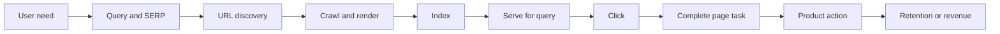

When I started working on SEO systems, I made the common mistake of treating “the page opens” as proof that the search path worked. Once we split a shared-content return path into visits, reading, downloads, first opens, and retention, every stage had a different failure mode. SEO is not a button; it is an observable system.

```text
User need → query / SERP → URL discovery → crawl → understanding and index
→ result serving → impression → click → page consumption → product action → retention / revenue
```

A sitemap can help discovery but cannot guarantee indexing. robots.txt controls crawling boundaries, not removal from search. noindex controls indexing. A canonical is a duplicate-URL preference signal. A ranking change does not directly prove business value. Google’s public starter guide also makes clear that no SEO technique guarantees inclusion or first place, and that there is no magical word-count target. [Google SEO Starter Guide](https://developers.google.com/search/docs/fundamentals/seo-starter-guide)

| State       | Question                         | What it does not prove            |
| ----------- | -------------------------------- | --------------------------------- |
| Discovery   | Does the system know the URL?    | Sitemap submission means indexing |
| Crawl       | Was the page requested and read? | A successful crawl means ranking  |
| Index       | Is it searchable?                | Every existing URL is searchable  |
| Impression  | Was it shown?                    | Users understood it               |
| Click       | Did a user enter?                | CTR growth is business success    |
| Consumption | Did the page complete its job?   | One visit is qualified            |
| Conversion  | Did the product goal happen?     | A download is long-term value     |

## Start with one project, not scale

Choose one page type and one user job. Write a one-page contract describing the user, demand evidence, primary metric, guardrails, observation window, owner, and stop conditions. Start with a 50–200 URL sample and a ledger like this:

```text
url | page_type | intent | locale | canonical | crawl | index
    | impressions | clicks | consumption | owner | next_action | evidence
```

Write conclusions as observed fact → sample and window → possible explanations → next discriminating action. “A template lost impressions” is a fact, not an algorithm diagnosis. The next check may be demand, canonical, crawling, page quality, or competition.

Every iteration should leave a page sample, change log, metric snapshot, and decision log. The team should be able to explain why it will continue, pause, roll back, merge, or wait.

The rest of this series is organized around decisions: value and funnel, technical foundations, indexing and recovery, content and media, links, experiments, and AI search. Official sources define facts; Ahrefs, Semrush, and Moz are useful references for learning paths and checklists, not public ranking formulas. [Ahrefs SEO Guide](https://ahrefs.com/seo/) · [Semrush Academy](https://www.semrush.com/academy/courses/)

If the team cannot explain its URL states, primary metric, guardrails, and evidence window, it should not generate ten thousand pages yet.

## The page basics a beginner needs

A search result usually shows a title and a snippet, and may show breadcrumbs, images, or other enhancements. A title should say what the page is; it should not be a string of synonyms. A snippet is not a hard ranking control, but it affects whether a person clicks. The first `h1` should agree with the page body: a page titled “camera buying guide” should not spend its opening section on brand history.

Keyword research is not a contest for the largest search volume. Ask what problem the user is describing, whether they want a definition, comparison, fix, or purchase, and whether an existing page actually answers it. “Bluetooth headphones” is broad; “how to measure Bluetooth headphone latency” describes a more concrete page job.

Internal links are part of the page job. Add links to the next useful page, the prerequisite concept, and the next product task. Link text should tell the reader what is on the other side. Search systems use crawlable links to discover pages; readers use them to understand the site.

Search Console shows what happened in search: queries, impressions, clicks, and possible index issues. Server logs show what crawlers actually requested. Product analytics shows what people did after arriving. None of the three can stand in for the others.

## Checking a new article

Open the page in a browser first. Confirm that the main text does not require a click to appear and that the title and first paragraph explain the page job. Then inspect the rendered HTML for canonical, robots, locale links, and internal links; check that the URL is in the sitemap; finally record its state in URL Inspection rather than repeatedly requesting indexing and expecting an immediate result.

If a page has impressions but few clicks, compare the query with the title and snippet. If it has clicks but little consumption, check the first screen and whether the page delivers the promise. If it has no impressions, return to discovery, crawling, indexing, and demand.

For a simple example, a tutorial that receives 1,000 impressions and 30 clicks has a 3% CTR. If 8% of those clicks complete the page task, the raw estimate is 2.4 tasks; production reporting must use deduplicated events and real users, not treat the decimal as a person.

## How a minimum project runs

Imagine that you own a question-detail page. In the first week, do not start with keyword expansion. Pick 100 existing URLs and fill in page type, identity, locale, publish time, last change, canonical, sitemap state, and owner. Join samples from server logs, Search Console, and product events to see whether the fields actually connect.

In week two, fix one problem only: perhaps 18 pages have no stable internal entry point, or 24 canonicals point to a template homepage. Do not rewrite titles, replace the template, and add a CTA at the same time. Freeze the sample, record expected changes and guardrails, and observe crawl, index, impression, click, and consumption delays.

Do not announce a result too early. A crawl improvement without an impression change does not automatically mean the engineering failed; an impression improvement with worse consumption is not SEO success. The first SEO artifact is a reviewable set of pages, states, evidence, and next actions.

## The search path: every stage can lose the user



Read this diagram from the right when diagnosing a result. No revenue means checking the product action first; no product action means checking whether the page task was completed; no clicks means checking the query, title, snippet, and position; no impressions means going back to discovery, crawling, and indexing.

$$
\text{Index Rate} = \frac{\text{Indexed Eligible URLs}}{\text{Eligible URLs}}
$$

$$
\text{CTR} = \frac{\text{Clicks}}{\text{Impressions}},\qquad
\text{Task Completion Rate} = \frac{\text{Completed Tasks}}{\text{Clicks}}
$$

Keep the denominators stable. Mixing all URLs, submitted URLs, and URLs that are actually eligible for indexing produces a clean-looking ratio that cannot guide a fix.

## Public references

- [Google Search Essentials](https://developers.google.com/search/docs/essentials)
- [Google Crawling and Indexing](https://developers.google.com/search/docs/crawling-indexing)
- [Bing Webmaster Guidelines](https://www.bing.com/webmasters/help/webmaster-guidelines-30fba23a)
