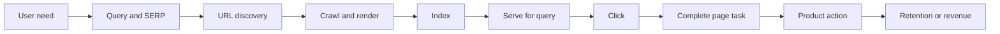

刚开始做 SEO 的时候，很多人会从标题和关键词开始。这并没有错，只是经常开始得太早：页面可能根本没有被搜索引擎发现，或者被抓取了却因为 `noindex` 没进索引。标题写得再好，也解决不了这些问题。

我早期也把“页面能打开”当成“搜索链路已经成立”。后来把一条分享返回路径拆开，才发现访问、阅读、下载、首次打开和留存之间，每一步都可能丢失。SEO 不是一个按钮，而是一条需要被观测的系统。

## 先记住这条链

```text
用户需求 → 查询 / SERP → 发现 URL → 抓取 → 理解与索引
→ 针对查询提供结果 → 曝光 → 点击 → 页面消费 → 产品行为 → 留存 / 收入
```

先把几个经常被混在一起的词分开。Sitemap 是一份“我希望你知道这些 URL”的清单，不是收录申请；robots.txt 主要控制抓取，不是可靠的删除结果方法；`noindex` 是告诉搜索引擎不要把页面放进索引；canonical 是重复或近似 URL 之间的偏好提示。它们都不是“排名开关”。Google 也明确说，满足基础要求不代表页面一定会被抓取、索引或展示，更没有保证第一名的写法。[Google Search Essentials](https://developers.google.com/search/docs/essentials)



拿一个具体页面沿着这条链走一遍，通常比背术语快。比如一个教程页面返回 200，说明它能访问；Search Console 没有曝光，说明还不能证明它进入了有效的搜索结果；有 1,000 次曝光、30 次点击，CTR 是 3%；其中 8% 完成了页面任务，就是 2.4 次，实际业务上要按事件去重，不能把小数当成真实用户数。

| 状态        | 要回答的问题         | 不应该推出的结论        |
| ----------- | -------------------- | ----------------------- |
| Discovery   | 搜索系统是否知道 URL | 提交 Sitemap 就等于收录 |
| Crawl       | 是否请求并读取页面   | 抓取成功就能排名        |
| Index       | 是否进入可检索索引   | URL 存在就一定可搜索    |
| Impression  | 是否在结果中展示     | 展示就代表用户理解      |
| Click       | 是否从结果进入       | CTR 上升就是业务成功    |
| Consumption | 是否完成页面任务     | 一次访问就是有效访问    |
| Conversion  | 是否完成产品目标     | 下载就是长期价值        |

## 第一个项目不要从扩量开始

项目一开始，先选一种页面类型和一个用户任务，写一页项目契约：页面要帮助谁完成什么事，需求证据来自哪里，主要指标是什么，哪些指标恶化就停止，观察窗口多长，谁负责回写结论。

最小 URL 台账可以只有这些字段：

```text
url | page_type | intent | locale | canonical | crawl | index
    | impressions | clicks | consumption | owner | next_action | evidence
```

先抽 50–200 个 URL，而不是追求全量。每个结论都按“事实 → 样本与窗口 → 可能解释 → 下一项区分证据的动作”写下来。比如“某模板曝光下降”只是事实，下一步要区分需求、canonical、抓取、页面质量和竞争变化，而不是马上宣布算法惩罚。

每轮至少留下页面样本、变更记录、指标快照和决策日志。团队最后应该能回答：哪一步变了，证据是什么，下一步为什么是继续、暂停、回滚、合并或等待。

## 怎么使用后面的章节

本系列不再按术语堆成十几篇短文，而是按项目决策组织：先看价值和漏斗，再做技术底盘；然后处理收录、内容、媒体和来源；最后做实验与 GEO。官方资料负责事实边界，Ahrefs、Semrush、Moz 等公开课程可以用来参考工作流和检查清单，但厂商指标不应伪装成搜索引擎公开排名公式。[Ahrefs SEO Guide](https://ahrefs.com/seo/) · [Semrush Academy](https://www.semrush.com/academy/courses/)

如果一个团队还不能解释自己的 URL 状态、主要指标、保护性指标和证据窗口，就不应该先生成一万页。先让一个小页面类型跑通，才有资格谈规模。

## 新手最先要学会的页面基础

一张搜索结果卡片通常会显示页面的标题和一段摘要，有时还会显示面包屑、图片或其他增强信息。标题最好直接说明页面是什么，不要为了塞关键词写成一串同义词；摘要不是硬性排名因素，但它会影响用户是否愿意点进来；页面的第一个 `h1` 应该和正文主题一致，别让标题说“相机选购”，正文却从品牌历史讲起。

关键词研究也不等于找一个搜索量最大的词。一个刚学 SEO 的人可以先问三件事：用户会用什么词描述问题？他是在找定义、比较方案、解决故障，还是准备购买？现有页面有没有真正回答这个问题？“蓝牙耳机”可能是泛需求，“蓝牙耳机延迟怎么测”已经更像一项具体任务。后者的页面更容易写清楚，也更容易判断用户有没有得到帮助。

内链是最容易被低估的基础工作。文章写完以后，找三类链接：用户读到这里可能继续看的页面、解释前置概念的页面、完成下一步任务的页面。链接文字要让人知道点过去会看到什么，别全站都写“点击这里”。搜索引擎可以通过可抓取的链接发现页面，读者也需要靠这些链接理解网站结构。

Search Console 适合回答“搜索里发生了什么”：哪些查询带来曝光和点击、哪些页面有变化、哪些 URL 可能存在索引问题。服务器日志更适合回答“爬虫实际请求了什么”；产品分析工具则回答“用户进来以后做了什么”。这三种数据各有盲区，不能拿其中一个工具的数字替代另外两个。

## 检查一篇新文章时看什么

先用浏览器打开它，确认正文不依赖点击按钮才出现，主标题和首段能说明页面用途。然后看源 HTML 里的 canonical、robots、语言标记和内部链接，再检查 Sitemap 是否包含它。最后把 URL 放进 Search Console 的检查工具，记录当前状态，而不是反复点击“请求编入索引”期待马上有结果。

如果页面已经有曝光但点击很少，我先看查询和标题是否匹配；如果有点击却很快离开，再看首屏是否兑现了摘要里的承诺；如果完全没有曝光，才回头检查发现、抓取、索引和需求。这个顺序不神秘，只是能少走一点弯路。

## 一个最小项目怎样跑完

假设你负责一个问答详情页。第一周不要先做关键词扩展，而是选 100 个已有 URL，给它们补齐页面类型、主身份、语言、发布时间、最近变更、canonical、Sitemap 状态和内容负责人。然后从服务器日志、Search Console 和产品事件里各取一份样本，确认这些字段能不能连起来。

第二周只修一个问题：比如 100 个页面里有 18 个没有稳定内链入口，或者 24 个页面的 canonical 指向了模板首页。修复时不要同时重写标题、换模板和加 CTA，否则即使流量变化，也没有办法知道是哪一个动作造成的。上线前固定样本，写下预期变化和保护性指标；上线后记录抓取、索引、曝光、点击和页面消费的延迟。

第三到四周不急着宣布结果。你要回答的是：修复是否真的改变了页面状态？搜索系统是否重新处理了页面？用户是否完成了页面任务？如果只看到抓取改善，没有看到曝光，不代表工程失败；如果曝光改善但页面消费下降，也不能写成 SEO 成功。

这就是我希望读者从基础篇带走的项目感：SEO 的第一件产物不是一篇文章，而是一组能够被复查的页面、状态、证据和下一步。

## 把第一张台账做成可用的版本

第一版台账不用追求字段齐全，但必须能让另一个人接手。`url` 是被观察的对象，`page_type` 和 `intent` 解释它为什么存在，`canonical`、`crawl` 和 `index` 描述搜索状态，`impressions` 和 `clicks` 描述结果，`consumption` 和 `next_action` 才把结果接回产品工作。字段为空时要写“未知”或“未采集”，不要用零代替未知。

台账里的证据分三类：页面本身的事实、搜索平台的观测、产品事件的观测。比如页面返回 200 是第一类，Search Console 里出现曝光是第二类，用户完成导出是第三类。三类证据可以放在同一行，但不要把它们拼成一个“SEO 状态”。发现流量下降时，排查人能立刻知道是页面坏了、搜索还没处理，还是用户进来后没有完成任务。

## 每周复盘只推动一个主要变化

小项目最容易失败在一次改太多：标题、模板、内链、图片和 CTA 同时换，最后曲线变了却没人知道原因。我更倾向于每周只推动一个主要变化，同时把其他变化冻结；如果必须同时改，就把它们视为一个版本，降低结论强度，并保留变更前后的 HTML、截图和配置。

一个可执行的周报可以只有四段：本周确认了什么事实；哪些解释被排除了；下周要补哪一项证据；如果证据不支持假设，准备回滚或停止什么。SEO 的学习速度不取决于报告有多长，而取决于每次行动是否让不确定性少一点。

## 常见的三个误区

第一，把 Sitemap 当成收录申请表。它是发现和更新的重要输入，但不能替搜索系统做质量判断。第二，把 URL Inspection 的少量抽样当成全站真相。抽样结果只能说明这些 URL 在那个时间点的状态。第三，把排名当成最终目标。排名可以作为诊断信号，却要和点击后的页面任务、产品行为一起看。

如果只能做一件事，先选一个页面类型，把状态、版本和用户任务串起来。一个能解释的 100 个 URL 项目，比一个没有证据链的十万页计划更适合成为团队的起点。

$$
\text{Index Rate} = \frac{\text{Indexed Eligible URLs}}{\text{Eligible URLs}}
$$

$$
\text{CTR} = \frac{\text{Clicks}}{\text{Impressions}},\qquad
\text{Task Completion Rate} = \frac{\text{Completed Tasks}}{\text{Clicks}}
$$

分母要固定。把所有 URL、已提交 URL 和真正应该进入索引的 URL 混在一起，比例会看起来很好看，但不能指导排查。

## 公开资料

- [Google Search Essentials](https://developers.google.com/search/docs/essentials)
- [Google Crawling and Indexing](https://developers.google.com/search/docs/crawling-indexing)
- [Bing Webmaster Guidelines](https://www.bing.com/webmasters/help/webmaster-guidelines-30fba23a)
- [web.dev Performance](https://web.dev/learn/performance)
