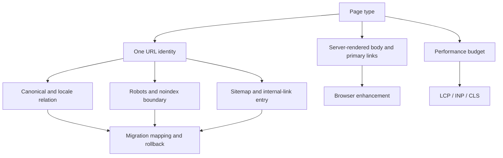

The failures were concrete: one piece of content had multiple URLs, canonical pointed to the wrong version, an old domain had incomplete mappings, and robots blocked paths that mattered. The server returned HTML, but not the same useful semantics to users and search systems. Performance work was often reduced to “add a preload.”

I brought these problems into one page contract.

## The page contract

For every page type, define the primary URL, protocol, host, case, trailing slash, locale path, canonical, robots, noindex, sitemap, internal links, and server-rendered content. Tracking parameters do not define identity. Multilingual pages need independent checks for title, body, facts, and links in addition to language alternates.

Server or pre-rendered output must contain readable text and primary links. Client JavaScript should enhance interaction, not create a second core document. A 200 response with no useful content is a soft-404 risk.

For example, if the same article exists at `/guide/a`, `/guide/a?utm_source=x`, and an old-domain URL, the contract must decide identity before it decides canonical, redirects, parameters, and links. Each setting can look correct in isolation while the combination still creates duplicate URLs.

## Map a migration before switching

The migration table needs old URL, new URL, action, canonical, redirect chain, owner, and rollback. Keep redirects one-to-one where possible. A merge target must satisfy the original intent; otherwise return 404 or 410 instead of redirecting every old page to the homepage. Observe crawl errors, indexing, impressions, visits, and business behavior during the migration window.

## Performance is not one trick

Use real-user and lab data to classify LCP, INP, and CLS, then trace the cause to server response, critical resources, long tasks, layout shifts, or third-party scripts. Size images for their display area. Do not lazy-load the actual LCP image by accident. Reserve space for lists, ads, and async modules. Streaming SSR helps one path; it does not replace image, content, or main-thread work.

Set budgets per template and bind them to releases, waterfalls, and user segments. A lab pass does not prove mobile real-user success. Guardrail regression should pause a release.

## Acceptance

Key URLs are reachable and have one identity; rendered content matches the user-facing core meaning; there is no accidental robots/noindex block; migration mappings cover equivalent, merged, and retired pages; LCP/INP/CLS can be traced to a template and release; regressions can roll back.

## The execution order for a migration

Freeze the URL inventory and page identity before switching. For each old URL, decide whether it is a one-to-one move, a merge, an intentional retirement, or an observation case. This decision matters more than writing a redirect rule: a wrong merge loses the original user intent.

During the window, observe four groups together: old-URL requests and redirects, new-URL crawl and index state, page-level impressions and clicks, and business consumption. A 404 is not automatically an incident, and a 200 is not automatically success. The destination must actually carry the old content job.

Use the same evidence order for performance. Find the real-user and template bottleneck first, then use waterfalls, long tasks, and resource size to locate the cause. Do not enable preload, Streaming SSR, or lazy loading everywhere because the technique is popular; ask whether it improves the critical path and what caching, layout, or fallback risk it adds.

The migration table should be machine-readable: `old_url`, `new_url`, `action`, `reason`, `canonical_target`, `owner`, `test_case`, and `rollback_note`. A mapping counts as covered only after the final status and destination page have been replayed.

## Release checks before and after a change

Before release, sample URL identity, first-response content, canonical and locale links, robots/noindex, image dimensions, and the next internal link. After release, check redirect hops, crawl errors, index state, and page consumption. The first check verifies configuration; the second verifies actual behavior.

Technical SEO has a human shape in these trade-offs: knowing what to fix, what not to fix yet, and when a beautiful metric does not mean the user completed the task.

## How the page contract connects

The contract is the smallest set of facts needed to understand whether a URL can be interpreted consistently. Start with identity during a migration and with real-user metrics during a performance regression; fixing one field does not make the other relationships correct.

$$
\text{Mapping Coverage} = \frac{\text{Old URLs with Tested Actions}}{\text{Old URLs in Inventory}}
$$

“Tested” includes the final status and the destination page. A row in a CSV that was never replayed is not coverage.

## Public references

- [Google Crawling and Indexing](https://developers.google.com/search/docs/crawling-indexing)
- [Google Robots.txt specifications](https://developers.google.com/search/docs/crawling-indexing/robots/robots_txt)
- [Google Site moves](https://developers.google.com/search/docs/crawling-indexing/site-move-with-url-changes)
- [web.dev Core Web Vitals](https://web.dev/articles/vitals)
