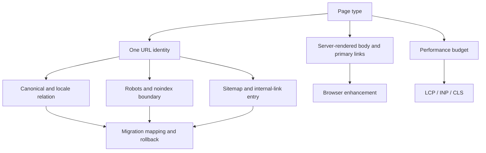

技术 SEO 的问题通常很具体：同一篇内容有带参数和不带参数的多个地址，canonical 指到了一个旧模板；迁移时只做了域名级跳转，旧文章没有对应的新页面；某个前端路由在浏览器里能打开，爬虫拿到的 HTML 却只有一个空壳。性能问题也常被简化成“加一个 preload 就好了”，但真正慢的可能是服务器、图片、长任务或第三方脚本。

我的做法是把这些问题收进页面合同，而不是逐个打标签。

## 页面合同

每种页面类型明确：主 URL、协议、主机名、大小写、尾斜杠、语言路径、canonical、robots、noindex、Sitemap、内链和预渲染正文。追踪参数不参与主身份；多语言页面除了 hreflang，还要独立验收标题、正文、事实和内链。

预渲染或服务端输出必须包含可读正文语义和主要链接，客户端只补交互，不给用户和搜索系统两套核心内容。页面返回 200 但没有有效内容时，要识别软 404。

比如同一篇文章同时存在 `/guide/a`、`/guide/a?utm_source=x` 和旧域名地址时，页面合同要先决定哪个是主身份，再决定参数、canonical、重定向和内链怎么处理。否则每一项配置单独看都可能正确，组合起来仍然会产生重复 URL。

## 迁移先做映射

迁移表至少包含旧 URL、新 URL、处理动作、canonical、重定向链、责任人和回滚方式。301/308 尽量一对一；合并目标必须真正满足原意图；没有等价内容就返回 404/410，不能把所有旧页面跳到首页。迁移窗口内同时观察抓取错误、索引、曝光、访问和业务行为。

## 性能不是单点优化

先用真实用户数据和 Lighthouse 区分 LCP、INP、CLS，再追到服务器响应、关键资源、长任务、布局抖动和第三方脚本。图片尺寸由展示区域决定；真正的 LCP 图片不能被错误懒加载；大列表、广告和异步模块要预留布局尺寸。Streaming SSR 只解决一部分首屏路径，不能替代内容、图片和主线程治理。

每种模板设性能预算，把版本、请求瀑布和真实用户分组绑定。实验室通过不代表移动端真实用户通过；保护性指标恶化时，发布应该暂停。

## 最小验收清单

- 核心 URL 可访问且主身份唯一；
- 预渲染正文与用户看到的核心语义一致；
- 没有意外的 robots/noindex 阻断；
- 迁移映射覆盖等价、合并和无替代页面；
- LCP、INP、CLS 能定位到模板和版本；
- 性能回归可以触发回滚。

我会把技术 SEO 当成上线前的页面自检，而不是单独的一门玄学。页面能访问、正文真的在响应里、URL 只有一个主身份，搜索引擎才有机会继续理解它。后面的排名、摘要和转化，不能拿来补一个坏掉的页面底座。

## 一个迁移项目的执行顺序

迁移前先冻结 URL 清单和页面主身份。对每个旧 URL，人工或规则判断它属于一对一迁移、多个页面合并、没有替代内容，还是应该保留观察。这个判断比写一条 301 规则重要得多，因为错误的合并会让搜索系统和用户都失去原来的意图。

迁移窗口里至少同时看四组数据：旧 URL 的请求和重定向，新 URL 的抓取和索引，页面级曝光与点击，以及业务页面消费。发现 404 不一定是事故，发现 200 也不一定是成功；关键是目标页面是否真正承接了原内容。

性能优化也采用同样的证据顺序。先按设备和模板找出真实用户的主要问题，再用请求瀑布、长任务和资源体积定位原因。我们不会因为某个工程方案流行就全站启用 preload、Streaming SSR 或懒加载，而是先问它是否改善了关键路径，是否引入了缓存、布局或降级风险。

技术 SEO 的“人味”来自这些取舍：知道什么能修，知道什么暂时不修，也知道一个看似漂亮的指标什么时候不能代表用户真的完成了任务。

## 迁移表要能直接交给工程执行

迁移表可以拆成机器可读字段，而不是只放一列“旧地址 → 新地址”：`old_url`、`new_url`、`action`、`reason`、`canonical_target`、`owner`、`test_case` 和 `rollback_note`。一对一迁移、合并和下线分别用不同动作值；规则无法覆盖的 URL 单独进入人工队列。这样上线前可以检查重复目标、循环重定向、目标不存在和协议/主机名混用。

迁移前先抽取旧站真实被访问过的 URL，包括日志、站内链接、Sitemap、Search Console 和外部引用。只从当前数据库导出的“理论 URL”通常会漏掉历史参数、旧语言路径和曾经被引用的页面。迁移后再用同一批 URL 回放，比较状态码、最终 URL、正文主身份和业务事件，不能只看 301 数量。

## 性能预算应该绑定到页面任务

预算不只是“LCP 小于某个数”。对文章页，首屏正文可读和主图稳定可能比某个装饰模块更重要；对工具页，输入控件能否及时响应是关键；对列表页，滚动时布局是否稳定更重要。预算表要绑定模板、设备分组、真实用户指标、实验室指标和降级动作。第三方脚本超过预算时，要明确谁批准继续，而不是把问题留在性能报告里。

排查时保存版本号、请求瀑布和关键资源尺寸。一次优化如果只改善实验室分数，却让低端设备的交互延迟变差，就应该回到保护性指标。性能工作的成果是用户更快完成任务，不是报告里多出一个绿色圆点。

## 发布前后各做一次“页面合同”检查

发布前抽样检查：主 URL 是否唯一、正文是否在首个响应中、canonical 和语言链接是否互相一致、robots 与 noindex 是否符合意图、关键图片是否有尺寸、内部链接是否能到达下一步。发布后检查：重定向是否一跳完成、抓取是否遇到异常、索引状态是否按预期变化、页面消费是否有回归。

这两次检查最好由不同的人或不同的脚本完成。发布前检查的是配置，发布后检查的是实际行为；一个 canonical 配对得很漂亮，不代表线上没有缓存旧 HTML。只有两边都过，迁移或性能发布才算真的结束。

$$
\text{Mapping Coverage} = \frac{\text{Old URLs with Tested Actions}}{\text{Old URLs in Inventory}}
$$

分子里的“tested actions”必须包括最终状态和目标页检查，只有写进 CSV 但没有回放过的映射不算覆盖。

## 公开资料

- [Google Crawling and Indexing](https://developers.google.com/search/docs/crawling-indexing)
- [Google Robots.txt specifications](https://developers.google.com/search/docs/crawling-indexing/robots/robots_txt)
- [Google Site moves](https://developers.google.com/search/docs/crawling-indexing/site-move-with-url-changes)
- [web.dev Core Web Vitals](https://web.dev/articles/vitals)
