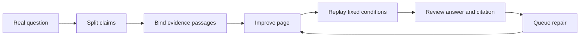
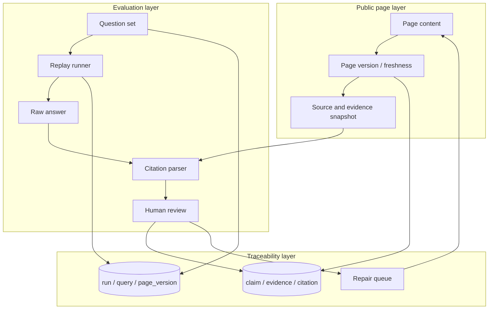
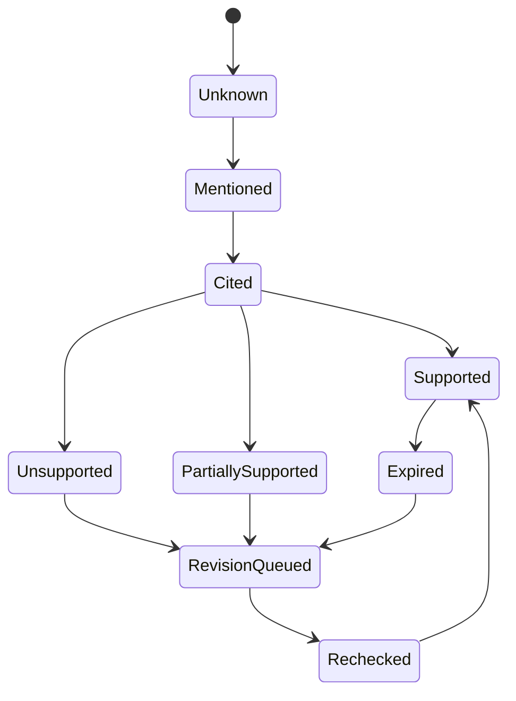

GEO is easy to turn into a new ranking trick: buy a visibility score, run a few questions, and rewrite titles around the result. The more useful questions are simpler: can the page be read, are its facts clear, does the citation support the claim, and can the user complete the next task?

## How GEO differs from SEO

SEO mainly asks whether a page can be discovered, understood, displayed, and clicked. GEO continues the chain: once the page is found, can it be selected as a source, support a claim in an answer, and help the user take the next step?

They share the same foundation: accessible pages, visible text, clear definitions and scope, trustworthy sources, stable URLs and links, and understandable update times. GEO is not a replacement for SEO; it follows the page into how it is used.

In this article's working model, traditional SEO covers the accessibility, discovery, indexing, understanding, and quality of public pages. AI search adds query expansion, source selection, evidence composition, answer generation, and downstream action. Internal RAG is different again because permissions, versions, freshness, and business tasks constrain it. This is an operational model for decomposing the problem, not an official process shared by every platform.

Google Search, OpenAI/ChatGPT, Perplexity, and Anthropic maintain distinct crawler, index, retrieval, citation, and training pipelines; you cannot assume that an access setting in one system carries over to another. Allowing a crawler means only that the relevant site policy did not block it; it does not guarantee indexing, inclusion in an answer, or citation. `llms.txt` is an open community proposal that can be tested as an experimental navigation file, but it is not a citation switch. [Google AI features](https://developers.google.com/search/docs/appearance/ai-features) · [OpenAI crawlers](https://developers.openai.com/api/docs/bots) · [Perplexity crawlers](https://docs.perplexity.ai/docs/resources/perplexity-crawlers) · [Anthropic crawler controls](https://privacy.claude.com/en/articles/8896518-does-anthropic-crawl-data-from-the-web-and-how-can-site-owners-block-the-crawler)

## Cut through a few popular myths

The official guidance is more useful than most GEO folklore. Google says that AI Overviews and AI Mode have no additional technical requirements: a page must meet the normal Search requirements, be indexed, and be eligible to appear with a snippet. There is no special AI Schema, AI file, special markup, or generative-AI-specific Markdown requirement. Structured data can still help with applicable Search features and understanding, but it must accurately describe the page and match visible content; it is neither an AI citation switch nor a guarantee of display or citation. See [Google's AI features documentation](https://developers.google.com/search/docs/appearance/ai-features) and its [generative AI optimization guide](https://developers.google.com/search/docs/fundamentals/ai-optimization-guide).

That rules out several weak tactics:

- Do not mass-produce low-value pages to cover every imagined fan-out variant. A fan-out page is not inherently a violation; content produced at scale primarily to manipulate rankings or generative results, without adding value for users, may fall under Google's scaled content abuse policy.
- Do not force every page into tiny chunks. Google's public guidance does not prescribe a fixed chunk size, paragraph length, or ideal page length for these AI features; organize the page around the reader's task.
- Do not treat purchased or manufactured out-of-context mentions as this article's GEO evaluation strategy. Record mention volume separately from factual trust and whether a citation supports a specific claim.
- Do not treat `llms.txt`, an AI-specific file, or a new schema as an access switch. It is an open community proposal and experimental navigation file; Google's guidance does not require such an entry point, and structured data should still serve ordinary Search features and match visible content.

The useful alternative is non-commodity content: first-hand observations, data, boundaries, and verifiable details that add something beyond a generic summary. Google also explains that generative Search may use query fan-out, splitting one question into related subqueries. That is a reason to cover the user task and its necessary context, not a reason to manufacture a page for every query variant.

## Check access before optimizing content

“The AI cannot see my site” is one access-control question worth checking first. Robots.txt, a CDN, or a WAF may be treating different bot purposes as one. The user agents have different meanings:

| User agent | Purpose | What the control means |
| --- | --- | --- |
| `OAI-SearchBot` | Surface sites in ChatGPT Search | Controls automatic search crawling; opting out affects Search visibility |
| `GPTBot` | Content that may be used for foundation-model training | Independent from Search visibility |
| `ChatGPT-User` | A user-triggered fetch from ChatGPT or a Custom GPT | Not automatic crawling and not a Search eligibility control |
| `PerplexityBot` | Discover and link sites in Perplexity Search | Different from user-triggered `Perplexity-User` |
| `Perplexity-User` | Fetch a page in response to a user request | Not the same as automatic search or indexing crawl |
| `Claude-SearchBot` | Improve Claude Search relevance and accuracy | Controlled separately from training and user-triggered access |
| `ClaudeBot` | Anthropic's general crawler, potentially for model training | Independent from Claude Search visibility |
| `Claude-User` | A user-triggered fetch from Claude | Not the same as an automatic search-index crawler |

Allowing a search bot only solves access eligibility; it does not guarantee a citation. OpenAI explicitly separates `OAI-SearchBot`, `GPTBot`, and `ChatGPT-User`. Perplexity separates `PerplexityBot` and `Perplexity-User`, and recommends checking both the User-Agent and its published IP ranges when configuring a WAF. Anthropic separately documents `Claude-SearchBot`, `ClaudeBot`, and `Claude-User`, and recommends using robots.txt to express crawl preferences. User-Agents can be forged, so WAF configuration should also use the relevant published IP lists and logs. See the [OpenAI crawler documentation](https://developers.openai.com/api/docs/bots), [Perplexity crawler documentation](https://docs.perplexity.ai/docs/resources/perplexity-crawlers), and [Anthropic crawler documentation](https://privacy.claude.com/en/articles/8896518-does-anthropic-crawl-data-from-the-web-and-how-can-site-owners-block-the-crawler).

Before changing content, run a reproducible network-layer smoke test:

```bash
curl -fsSL https://example.com/robots.txt
curl -fsSL -A 'OAI-SearchBot' https://example.com/important-page
curl -fsSL -A 'PerplexityBot' https://example.com/important-page
curl -fsSL -A 'Claude-SearchBot' https://example.com/important-page
```

Then inspect CDN/WAF logs for 403 responses, challenge pages, geographic blocks, or rate limits, and check whether the source IP belongs to the ranges published by the relevant service. `curl -A` merely simulates a User-Agent and does not prove that a request came from the real crawler. These commands test network and HTML delivery, not indexing, retrieval, or citation. Inspect the delivered HTML for the title, body, canonical, structured data, and links. Google recommends using [URL Inspection](https://support.google.com/webmasters/answer/9012289) to view Google's crawled or rendered version, but that view still does not guarantee indexing or display.

## Separate mention, citation, and support

This article defines `mention`, `citation`, and `claim support` as three human-review evaluation labels; they are not uniform platform fields provided by Google, OpenAI, Perplexity, Anthropic, or Bing. The distinction is also informed by citation-evaluation research: citation presence and whether a citation supports a claim should be evaluated separately. [ALCE](https://aclanthology.org/2023.emnlp-main.398/), [FActScore](https://aclanthology.org/2023.emnlp-main.741/), and [Generative Search Verifiability](https://aclanthology.org/2023.findings-emnlp.467/) separate factual correctness, citation quality, or claim–evidence support in different ways. Suppose a user asks how to fix a configuration error. Mentioning your brand is a mention. Linking to the homepage is a citation, but the homepage may not support the procedure. A passage that contains the error condition, repair steps, and applicable version is closer to claim support.

This distinction tells you whether to improve page evidence or merely chase mentions. Being mentioned does not mean that the page was understood correctly; being cited does not mean that the citation supports the answer.

## An implementable GEO loop

Start with one topic whose facts have clear boundaries and use 20–50 real questions as a practical starting sample, rather than a vendor “AI visibility score.” Include beginner, comparison, troubleshooting, constraint-heavy, and action-oriented questions. This range is a working choice in this article, not a platform standard or universal statistical threshold. Record locale, language, audience, time, and expected evidence.



The practical sequence is:

1. Audit the page's primary identity, topic, sources, freshness, internal links, and downstream business action; define whom the page helps and what task they need to complete.
2. Build the question set from site search, support questions, sales questions, search queries, and real user tasks; do not select only brand terms or the easiest questions.
3. Split each question into claims, then assign an evidence passage, scope, invalidation condition, and allowed citation page to each claim.
4. Improve the page before optimizing keywords: clarify definitions, conclusions, evidence, limitations, update times, and verification steps.
5. Replay under fixed model, region, language, account state, and time-window conditions; preserve the raw question, raw answer, source links, and page version.
6. Review whether the answer is correct and whether the citation supports the claim; classify failures as entity, freshness, scope, source, or action errors.
7. Publish the revised page and replay the same question set before claiming improvement; do not switch question sets and call the result a success.

This process produces repeatable observations, helps detect regressions, and makes version differences auditable. It does not automatically establish experimental causality.

## A replayable GEO architecture

For a one-off content review, a spreadsheet may be enough. A system that runs over time needs to connect page versions, questions, runs, answers, citations, and evidence. The goal is not one “GEO score,” but the ability to trace every conclusion back to its question, page version, and evidence passage.



The public page layer owns facts and versions, the evaluation layer owns replay and review, and the traceability layer connects them. A worse citation should then lead to a concrete question: did the page change, did the query change, did the model change, was the wrong page selected, or was the evidence incomplete?

## What an evaluation record should preserve

An evaluation is more than “mentioned” or “not mentioned.” A minimum record might include:

```text
query_id: q-042
question: How do I fix configuration error X?
run_id: run-2026-08-20-01
model: provider/model-version
locale: en-US / region
page_version: page-17
answer_claim: Change configuration X to Y
citation_url: /docs/configuration
evidence_id: ev-883
evidence_snapshot: sha256:...
label: supported | partial | unsupported
error_type: none | entity | freshness | scope | source | action
```

`page_version` and `evidence_snapshot` matter because a page may change after an answer is produced. Without the old version, the team cannot review what the answer actually cited. When an external product does not expose retrieval, record the observable lower bound; do not turn “not shown” into “not retrieved.”

## Use a state machine for evidence, not for “AI indexing”

Whether a page was crawled or indexed is not a deterministic predecessor of whether a particular answer selected it. The more useful state machine tracks evidence review:



This state machine is the evidence-review protocol proposed in this article, not a publicly promised “AI indexing” flow from any platform. `Mentioned` means the entity was observed, `Cited` means the answer included a source, and `Supported` means the source passage actually supports the claim. Store the run time, model, question set, and evidence snapshot with each transition.

## Keep external AI search and internal RAG separate

Internal RAG can expose permission filtering, retrieved chunks, reranking, the answer, and Agent task completion. External AI search often exposes only the final answer and some sources. They can share IDs such as `content_id`, `query_id`, `page_version`, `run_id`, and `evidence_id`, but internal retriever recall is not external retrieval, and an external citation is not internal knowledge quality.

The optimization target differs too: weak internal recall may require changes to chunking, permissions, or reranking; weak external evidence may require clearer public-page structure, scope, sources, and links. The two systems can inform each other without being hidden behind one GEO score.

## How to improve a GEO page

Make pages citable without writing machine-only text. For example:

Original:

> Change the configuration to fix the problem.

Better:

> In version 2.4 and later, if `CONFIG_INVALID` appears, change `mode` from `legacy` to `strict`. Restart the service and check that `/health` returns 200. This procedure does not apply to version 2.3 or earlier.

The second passage is easier for a reviewer to verify and makes the evidence boundary easier to evaluate because it includes the condition, procedure, version boundary, and verification step. Keep one primary claim per stable passage, place exceptions near the conclusion, and attach sources, update times, and versions to important facts. Preserve page versions or evidence snapshots so old answers remain reviewable.

## Evaluate conservatively

Separate four questions: is the answer correct, does the citation support it, how many checked claims have supporting evidence, and did the user or Agent complete the next task?

$$
\text{Claim Support Rate} = \frac{\text{Supported Claims}}{\text{Claims Checked}}
$$

If 32 of 50 checked claims are supported, the rate is 64%. This is not the number of times an AI mentioned the site. A homepage link that does not support a specific procedure should not be marked as supported.

External systems change with model, locale, account state, query time, and wording. Report “the citation change observed for this question set and run window,” not proof that a site has been “indexed by AI.” Before-and-after replay shows a change but does not, by itself, prove causality.

Keep three kinds of measurement separate:

- **Search Console**: Google includes AI-feature traffic in the Web search type. Public reports are useful for aggregate impressions, clicks, and CTR, but their public fields do not expose the source URL, citation text, or evidence passage used in each answer.
- **Bing AI Performance**: provides page citation activity, aggregated grounding queries, and in some contexts Citation Share. Microsoft describes these as sampled and aggregated observations: a grounding query is a key phrase used to retrieve cited content, not a complete user prompt; Citation Share is the share of citations a site receives for a grounding query. These are not rankings, authority, traffic, clicks, or quality scores, and they are not a complete log of every answer.
- **Own replay**: preserves raw questions, answers, sources, and human labels, but represents only your sampling window and not a provider's internal retrieval data.

At minimum, preserve `query_set_version`, `run_at`, `provider/model`, `locale`, `page_version`, `answer`, `citations`, `claim_labels`, and `downstream_action`. Bing's citation activity can help identify topic and page trends, but it is not a precise click or attribution system. See [Bing AI Performance](https://www.bing.com/webmasters/help/ai-performance-9f8e7d6c) and the [Microsoft Bing Webmaster Blog](https://blogs.bing.com/webmaster/February-2026/Introducing-AI-Performance-in-Bing-Webmaster-Tools-Public-Preview).

If GEO does not make facts clearer, evidence easier to check, and page versions replayable, it may only be replacing one unexplained score with another.

## Public references

### Search, crawling, and page guidelines

- [Google AI features and your website](https://developers.google.com/search/docs/appearance/ai-features)
- [Google's guide to optimizing for generative AI features](https://developers.google.com/search/docs/fundamentals/ai-optimization-guide)
- [Google Search technical requirements](https://developers.google.com/search/docs/essentials/technical)
- [Google introduction to robots.txt](https://developers.google.com/search/docs/crawling-indexing/robots/intro)
- [Google block indexing with noindex](https://developers.google.com/search/docs/crawling-indexing/block-indexing)
- [Google URL Inspection](https://support.google.com/webmasters/answer/9012289)
- [Google structured data markup](https://developers.google.com/search/docs/appearance/structured-data/intro-structured-data)
- [Google structured data policies](https://developers.google.com/search/docs/appearance/structured-data/sd-policies)
- [Google spam policies](https://developers.google.com/search/docs/essentials/spam-policies)
- [Google scaled content abuse](https://developers.google.com/search/docs/essentials/spam-policies#scaled-content)
- [RFC 9309: Robots Exclusion Protocol](https://www.rfc-editor.org/rfc/rfc9309)

### Platform crawlers and measurement

- [OpenAI crawler documentation](https://developers.openai.com/api/docs/bots)
- [Perplexity crawlers](https://docs.perplexity.ai/docs/resources/perplexity-crawlers)
- [Anthropic crawler controls](https://privacy.claude.com/en/articles/8896518-does-anthropic-crawl-data-from-the-web-and-how-can-site-owners-block-the-crawler)
- [Bing AI Performance](https://www.bing.com/webmasters/help/ai-performance-9f8e7d6c)
- [Microsoft Bing Webmaster Blog: Introducing AI Performance](https://blogs.bing.com/webmaster/February-2026/Introducing-AI-Performance-in-Bing-Webmaster-Tools-Public-Preview)
- [Google Search Console Performance report](https://developers.google.com/search/docs/monitor-debug/search-console-start)
- [Google Generative AI performance reports](https://developers.google.com/search/blog/2026/06/gen-ai-performance-reports)

### Proposal and evaluation research

- [`llms.txt` proposal](https://llmstxt.org/)
- [ALCE: Enabling Large Language Models to Generate Text with Citations](https://aclanthology.org/2023.emnlp-main.398/)
- [FActScore: Fine-grained Atomic Evaluation of Factual Precision](https://aclanthology.org/2023.emnlp-main.741/)
- [Evaluating Verifiability in Generative Search Engines](https://aclanthology.org/2023.findings-emnlp.467/)
- [AttributionBench: How Hard is Automatic Attribution Evaluation?](https://aclanthology.org/2024.findings-acl.886/)
