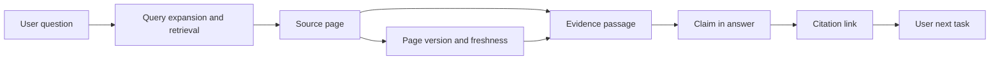

GEO is often presented as a new ranking trick or a vendor score. My practical question is narrower: can a page be read, can its facts be understood, can a claim find evidence, can an answer cite it correctly, and can a user or Agent complete the next task?

## Keep three systems separate

SEO handles public accessibility, discovery, indexing, understanding, and page quality. AI search adds query expansion, source selection, evidence composition, answer generation, and downstream action. Internal RAG is different again: permissions, versions, freshness, and task contracts constrain it.

Google, ChatGPT, Perplexity, and Claude do not share one crawler, index, retrieval, citation, or training pipeline. Allowing a crawler means only that site policy did not block it; it does not guarantee indexing, an answer, or a citation. Proposals such as llms.txt can be tested, but are not citation switches. [Google AI features](https://developers.google.com/search/docs/appearance/ai-features) · [OpenAI crawlers](https://developers.openai.com/api/docs/bots) · [Perplexity crawlers](https://docs.perplexity.ai/docs/resources/perplexity-crawlers)

## Claim, evidence, citation

For important pages, store claim ID, page version, claim text, evidence paragraph, source, update time, entity, allowed citation form, model, market, timestamp, and review result. Mentioning an entity is not a citation. Linking to a homepage may not support a procedure. Claim support requires a source passage that contains the claim and its scope.

Replay 20–50 real questions before and after changes. Record answer presence, citations, citation correctness, claim support, page arrival, and downstream action. When a product does not expose retrieval, record the observable lower bound; do not turn “not shown” into “not retrieved.”

For a question such as “how do I fix this configuration error,” mentioning the brand is a mention; linking to the homepage is a citation; a passage that contains the error condition, repair steps, and applicable version is claim support. The distinction tells you whether to improve page evidence or merely chase mentions.

## Connect GEO to SEO engineering

Stable page identity, clear definitions, authorship, factual sources, citable passages, update times, visible text, and links remain prerequisites. A workbench can show question sets, page versions, answer diffs, sources, and evidence labels. Backend records runs and review actions; async jobs handle access, replay, source parsing, and evaluation.

Keep retriever recall, external citations, answer quality, and Agent task completion in separate reports. They can share IDs, not one GEO score.

Acceptance is more accurate citations, reviewable claims, replayable versions, and a repair queue for wrong citations—not simply more answers mentioning the site. Every conclusion needs sampling method and window because model, locale, account, time, repetition, and task all affect output.

## A replayable GEO pilot

Start with one topic whose facts have clear boundaries and 20–50 real questions, not a vendor “AI visibility score.” Save model, version, locale, time, account state, raw question, raw answer, source links, and human judgment for every run.

A claim record needs more than a sentence: store evidence passage, constraints, update time, and allowed citation scope. Mention is not citation. A homepage link may be a citation without supporting a procedure. Claim support requires a source passage that contains the claim and its scope.

Keep external AI search and internal RAG in separate reports. Internal systems can expose permissions, retrieved chunks, reranking, answer, and Agent task completion; external systems often expose only the answer and some sources. Shared IDs are useful, but internal recall is not external retrieval and external citation is not internal knowledge quality.

The valuable GEO system makes facts clearer, evidence easier to check, and versions replayable. It should not become another race toward an unexplained score.

## Build a small, real question set

Do not choose only easy questions or brand terms. Include beginner, comparison, troubleshooting, constraint-heavy, and action-oriented questions. Record locale, language, time, audience, and expected evidence so that later runs are comparable.

Save raw answers and source snapshots, not just a visible/not-visible flag. An answer can mention the right entity but cite the wrong page, or give a correct conclusion without its limiting condition. Review entity, freshness, scope, source, and action errors separately.

## Make pages citable without writing machine-only text

Write definitions, scope, conclusions, evidence, update time, and limitations clearly, then use headings, lists, tables, and stable passages to help a reader locate them. Internal RAG improvements should feed back into content versions and evaluation sets: identify the missing fact, stale evidence, permission error, or chunk that dropped a constraint.

## Report GEO conclusions conservatively

External systems change with model, locale, account state, and query time. Report citation changes within a defined window, question set, and run condition; do not announce that a site has been “indexed by AI.”

## The GEO evidence chain

Separate mention, citation, and claim support. A simple claim-support metric is:

$$
\text{Claim Support Rate} = \frac{\text{Supported Claims}}{\text{Claims Checked}}
$$

This is not the number of times an AI mentioned the site. A homepage link that does not support a specific procedure should not be marked as supported.

## Public references

- [Google AI features and your website](https://developers.google.com/search/docs/appearance/ai-features)
- [OpenAI crawler documentation](https://developers.openai.com/api/docs/bots)
- [Perplexity crawlers](https://docs.perplexity.ai/docs/resources/perplexity-crawlers)
- [Anthropic crawler controls](https://privacy.claude.com/en/articles/8896518-does-anthropic-crawl-data-from-the-web-and-how-can-site-owners-block-the-crawler)
- [llms.txt proposal](https://llmstxt.org/)
