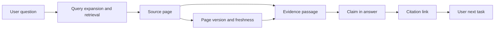

GEO 很容易变成新的排名技巧：买一个可见性分数，跑几次问题，再根据分数改标题。对我来说更值得追的是几个朴素的问题：页面能不能被读到，事实有没有写清楚，回答里的引用是否真的支持这句话，用户能不能继续完成任务。

## 先把三条系统边界分开

传统 SEO 负责公开页面的可访问、发现、索引、理解和页面质量；AI 搜索增加查询扩展、来源选择、证据组合、回答生成和行动后续。内部 RAG 又不同：它受权限、版本、新鲜度和业务任务约束。

Google、ChatGPT、Perplexity 和 Claude 的 crawler、索引、检索、引用和训练管线并不共享。允许某个 crawler 访问，只表示站点策略没有阻止它，不表示页面一定进入索引、答案或引用。llms.txt 等提案可以测试，不能当作引用开关。[Google AI features](https://developers.google.com/search/docs/appearance/ai-features) · [OpenAI crawlers](https://developers.openai.com/api/docs/bots) · [Perplexity crawlers](https://docs.perplexity.ai/docs/resources/perplexity-crawlers)

## 主张—证据—引用

为每个重要页面建立 claim_id、页面版本、主张文本、证据段落、来源、更新时间、实体、允许的引用方式、运行模型、地区、时间和复核结果。回答提到实体是 mention；给出首页链接不一定支持步骤；只有来源片段明确包含主张和范围，才接近 claim support。

固定一组 20–50 个真实问题，回放前后记录答案、引用、引用正确性、主张支持率、页面到达和业务后续。外部产品不暴露 retrieval 过程时，只能记录可确认下界，不能把“没有展示”写成“没有检索”。

例如问题是“如何修复某个配置错误”，回答提到了品牌只能算 mention；回答附了首页链接只能算 citation；引用的段落同时写明错误条件、修复步骤和适用版本，才算 claim support。这个区别决定了后面该改页面内容，还是只是在追求被提及。

## GEO 工程如何接回 SEO

页面主身份、清楚定义、作者/组织、事实来源、可引用段落、更新时间、正文上下文和内链仍是准入基础。前端工作台展示问题集、页面版本、回答差异、来源和证据标注；后端保存运行记录和复核动作；异步任务负责访问、回放、来源解析和评测。

内部 RAG 的 retriever recall、外部 citation、最终回答质量和 Agent 任务完成率分开报表。它们可以共享 content_id、query_id、page_version、run_id 和 evidence_id，但不能合成一个 GEO 分数。

## 验收标准

不是“被回答次数更多”，而是引用更准确、主张更容易核验、页面版本可回放、错误引用能进入修订队列。模型、地区、账号、时间、重复查询和任务都会影响结果，所以任何 GEO 结论都应带采样方法和观察窗口。

## 一个可回放的 GEO 试点

试点从一个事实边界清楚的主题开始，整理 20–50 个真实问题，而不是先买一个“AI 可见性分数”。每次运行保存模型、版本、地区、时间、账号状态、原始问题、原始回答、来源链接和人工判断。这样即使外部系统不暴露 retrieval，也能知道观察到的到底是什么。

主张库里，一条主张不只是句子，还要有证据段落、限定条件、更新时间和允许的引用范围。回答提到品牌是 mention；链接到首页是 citation，但可能不能支持具体步骤；只有来源片段真的包含主张和范围，才接近 claim support。把这三种情况混为“被引用”，会让团队高估页面改写的效果。

内部 RAG 和外部 AI 搜索要分报表。内部系统可以知道权限过滤、召回片段、重排、回答和 Agent 任务是否完成；外部系统通常只能看到最终回答和部分来源。两者可以共享 content_id、query_id、page_version、run_id 和 evidence_id，但不能把内部 recall 当成外部检索，也不能把外部 citation 当成内部知识质量。

如果一项 GEO 工作最后没有让事实更清楚、证据更容易核验、页面版本更容易回放，那它很可能只是换了一套神秘分数。Google 最近的公开说明也强调，生成式搜索仍然依赖原有的抓取、索引和页面质量基础，并没有一个专门的“AI Schema”可以替代这些工作。[Google AI features guide](https://developers.google.com/search/docs/fundamentals/ai-optimization-guide)

## 先做一个小而真实的问题集

问题集不要只挑最容易回答的问题，也不要全是品牌词。可以按新手问题、比较问题、排错问题、带限制条件的问题和需要下一步行动的问题分层，每类先选几条。每条问题记录地区、语言、时间、目标用户和预期证据，避免同一个问题被不同人用不同口径重复测试。

回放时保存原始回答和来源快照，不只保存一个“可见/不可见”结果。回答可能提到了正确实体，却引用了错误页面；也可能给出了正确结论，但没有支持限定条件。人工评测表至少区分 mention、citation 和 claim support，并记录错误类型：实体错、时效错、范围错、来源错或行动建议错。

## 让页面更容易被引用，但不制造专门的“机器文本”

可引用不等于把正文写成关键词列表。先把定义、范围、结论、证据、更新时间和限制条件写清楚，再用小标题、列表、表格和稳定段落帮助读者定位。页面仍然要为人完成任务，不能为了某个模型的输出格式牺牲上下文。

内部 RAG 的改进也要回到内容资产：缺的是什么事实，哪一段证据过期，哪种权限过滤出错，哪个 chunk 把限定条件切掉。把这些问题反馈给内容版本和评测集，GEO 才会成为可持续的质量工程，而不是一次性的提示词调试。

## GEO 结论的保守表达

外部系统会变化，模型、地区、账号状态和查询时间都会影响结果。因此报告应写成“在某时间窗、某问题集和某运行条件下观察到的引用变化”，不要轻易宣布“站点已经被 AI 收录”。这种说法听起来保守，却能让下一轮测试真正验证上一轮改了什么。

评测时至少把三件事分开：提到了实体（mention）、放了一个链接（citation）、链接内容确实支持这句话（claim support）。主张支持率可以写成：

$$
\text{Claim Support Rate} = \frac{\text{Supported Claims}}{\text{Claims Checked}}
$$

假设检查 50 条主张，其中 32 条的引用段落确实支持主张，那么 Claim Support Rate 是 64%。它不等于“被 AI 提到的次数”：如果回答引用了首页，但首页没有支持具体步骤，这条引用就不应该记为 supported。

## 公开资料

- [Google AI features and your website](https://developers.google.com/search/docs/appearance/ai-features)
- [OpenAI crawler documentation](https://developers.openai.com/api/docs/bots)
- [Perplexity crawlers](https://docs.perplexity.ai/docs/resources/perplexity-crawlers)
- [Anthropic crawler controls](https://privacy.claude.com/en/articles/8896518-does-anthropic-crawl-data-from-the-web-and-how-can-site-owners-block-the-crawler)
- [llms.txt proposal](https://llmstxt.org/)
