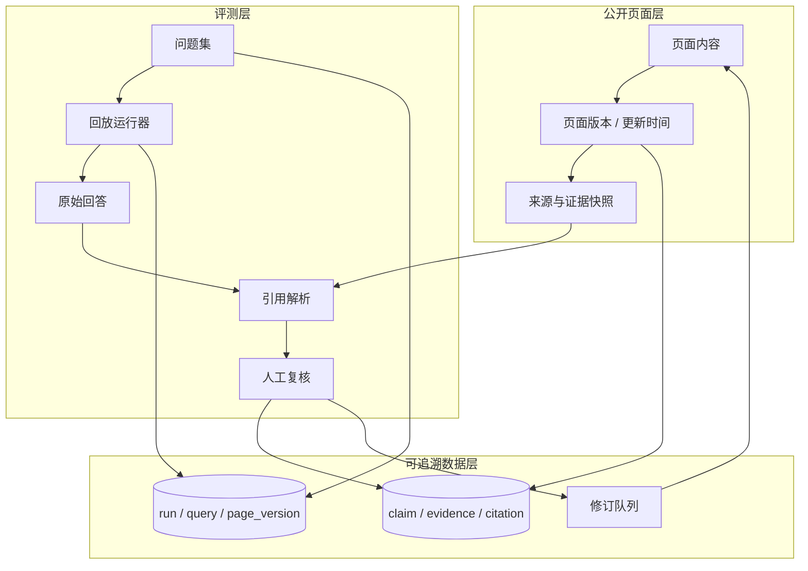
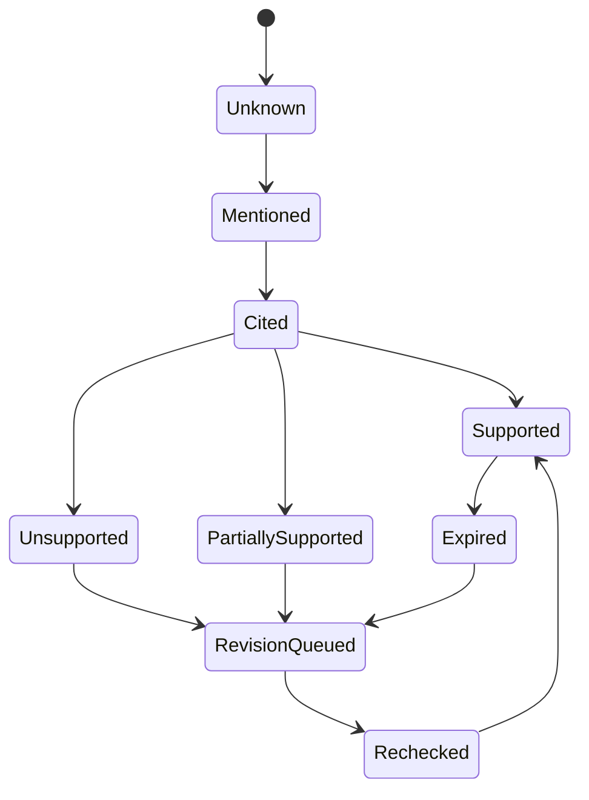

GEO 很容易变成新的排名技巧：买一个可见性分数，跑几次问题，再根据分数改标题。对我来说更值得追的是几个朴素的问题：页面能不能被读到，事实有没有写清楚，回答里的引用是否真的支持这句话，用户能不能继续完成任务。

## GEO 到底和 SEO 有什么不同

SEO 主要解决“页面能不能被发现、理解、展示和点击”；GEO 继续追问“页面被找到以后，能不能被正确选作来源、支持回答中的主张，并帮助用户完成下一步”。

两者共享同一块基础：页面可访问，正文对用户可见，定义和范围清楚，作者与来源可信，URL 和内链稳定，更新时间可判断。GEO 不是 SEO 的替代品，而是把“页面被找到以后是否能被正确使用”继续往后追。

在本文的工作模型中，传统 SEO 负责公开页面的可访问、发现、索引、理解和页面质量；AI 搜索增加查询扩展、来源选择、证据组合、回答生成和行动后续。内部 RAG 又不同：它受权限、版本、新鲜度和业务任务约束。这是一个用于拆解问题的操作性模型，不是所有平台共享的官方流程。

Google Search、OpenAI/ChatGPT、Perplexity 和 Anthropic 各自维护不同的 crawler、索引、检索、引用和训练管线，不能假设一个系统的访问设置会传递到另一个系统。允许某个 crawler 访问，只表示相应的站点策略没有阻止它，不表示页面一定进入索引、答案或引用。`llms.txt` 是一个开放的社区提案，可以作为实验性导航文件测试，但不能当作引用开关。[Google AI features](https://developers.google.com/search/docs/appearance/ai-features) · [OpenAI crawlers](https://developers.openai.com/api/docs/bots) · [Perplexity crawlers](https://docs.perplexity.ai/docs/resources/perplexity-crawlers) · [Anthropic crawler controls](https://privacy.claude.com/en/articles/8896518-does-anthropic-crawl-data-from-the-web-and-how-can-site-owners-block-the-crawler)

## 先把几个流行误区砍掉

官方资料反而给出了几条很反直觉、但很实用的边界。

Google 明确说，AI Overviews 和 AI Mode 没有额外的技术要求：页面首先要满足普通 Search 的技术要求，已被索引，并且有资格在搜索结果中显示 snippet。也不需要专门的 AI Schema、AI 文件、特殊 markup 或生成式 AI 专用 Markdown。对适用的 Search 外观和理解场景，结构化数据仍然有价值，但必须准确描述页面主体，并与页面上的可见内容一致；它不是 AI 引用开关，也不保证展示或引用。[Google 的 AI 功能说明](https://developers.google.com/search/docs/appearance/ai-features) 和 [生成式 AI 优化指南](https://developers.google.com/search/docs/fundamentals/ai-optimization-guide) 都把重点放在普通 SEO 基础、独特内容和用户满意度上。

这也意味着几种常见做法不值得当成 GEO 策略：

- 不要为了覆盖想象中的每个 fan-out 变体而批量制造低价值页面。fan-out 页面本身不自动等同于违规；如果内容规模化、主要为了操纵搜索排名或生成式结果，且没有为用户增加价值，可能触及 Google 的 scaled content abuse 政策。
- 不要为了“方便模型切块”把所有页面强行切成很短的段落。Google 的公开资料没有规定面向这些 AI features 的固定 chunk 大小、段落长度或理想页面长度；页面仍应按读者理解任务组织。
- 不要把购买或制造没有真实语境的外部提及当成本文的 GEO 评测策略。mention 数量应与事实可信度、citation 是否支持具体主张分开记录，不能直接互相替代。
- 不要把 `llms.txt`、AI 专用文件或一套新 Schema 当成进入 AI 结果的开关。它是开放的社区提案/实验性导航文件；Google 的官方指南没有要求这些特殊入口，结构化数据仍应服务于正常 Search 功能并与页面可见内容一致。

真正值得做的是把页面写成一个有独立价值的答案来源：有自己的观察、数据、适用边界和可验证细节，而不是把网上已有的泛泛总结重新包装一遍。Google 还说明生成式搜索可能使用 query fan-out，把一个问题拆成多个相关子查询；这更适合提醒我们覆盖用户任务的必要上下文，而不是按每个变体制造页面。[Google scaled content abuse policy](https://developers.google.com/search/docs/essentials/spam-policies#scaled-content)

## 先检查访问控制，再讨论内容优化

“AI 看不到我”时，一个值得优先排查的方向是访问控制：robots.txt、CDN 或 WAF 可能把不同用途的访问混在了一起。不同 crawler 的含义并不相同：

| User agent | 用途 | 控制含义 |
| --- | --- | --- |
| `OAI-SearchBot` | 出现在 ChatGPT Search 的搜索结果中 | 控制自动搜索抓取；禁止它会影响 ChatGPT Search 展示 |
| `GPTBot` | 可能用于 OpenAI 基础模型训练 | 与 Search 展示是独立选择 |
| `ChatGPT-User` | 用户在 ChatGPT 或 Custom GPT 中触发的访问 | 不是自动搜索抓取，也不决定 Search 展示 |
| `PerplexityBot` | 在 Perplexity 搜索中发现并链接网站 | 与用户触发的 `Perplexity-User` 不同 |
| `Perplexity-User` | 由用户请求触发的页面获取 | 不等同于自动搜索或索引抓取 |
| `Claude-SearchBot` | 改进 Claude 搜索相关性和准确性 | 与训练和用户触发访问分开控制 |
| `ClaudeBot` | Anthropic 的一般 crawler，可能用于模型训练 | 与 Claude 搜索展示是独立选择 |
| `Claude-User` | 用户在 Claude 中触发的页面访问 | 不等同于自动搜索索引 crawler |

例如，一个站点可以允许搜索抓取、禁止训练抓取，但这不是“让页面被引用”的保证：它只是解决了访问资格问题。OpenAI 的 crawler 文档明确区分 `OAI-SearchBot`、`GPTBot` 和 `ChatGPT-User`；Perplexity 也区分 `PerplexityBot` 与用户触发的 `Perplexity-User`，并建议 WAF 同时校验 User-Agent 和官方 IP 段；Anthropic 则分别说明 `Claude-SearchBot`、`ClaudeBot` 和 `Claude-User`，建议优先用 robots.txt 表达抓取偏好。User-Agent 可以被伪造，WAF 配置还应结合相应服务公布的 IP 列表和日志验证。[OpenAI crawler 文档](https://developers.openai.com/api/docs/bots) · [Perplexity crawler 文档](https://docs.perplexity.ai/docs/resources/perplexity-crawlers) · [Anthropic crawler 文档](https://privacy.claude.com/en/articles/8896518-does-anthropic-crawl-data-from-the-web-and-how-can-site-owners-block-the-crawler)

上线前至少做一次可复现的网络层 smoke test：

```bash
curl -fsSL https://example.com/robots.txt
curl -fsSL -A 'OAI-SearchBot' https://example.com/important-page
curl -fsSL -A 'PerplexityBot' https://example.com/important-page
curl -fsSL -A 'Claude-SearchBot' https://example.com/important-page
```

然后在 CDN/WAF 日志中确认请求没有被 403、挑战页、地理限制或速率规则拦截，并核对来源 IP 是否属于相应服务公布的 IP 段。`curl -A` 只是模拟 User-Agent，不能证明请求来自真实 crawler；这些命令只能检查网络响应和 crawler 实际收到的 HTML，不是索引、检索或引用验证。还要检查 HTML 是否包含标题、正文、canonical、结构化数据和内链。Google 建议用 [URL Inspection](https://support.google.com/webmasters/answer/9012289) 查看 Googlebot 的抓取/渲染视图，但该视图也不保证页面一定被索引或展示。

## 先区分提到、引用和支持

本文把 `mention`、`citation` 和 `claim support` 定义为三个用于人工复核的评测标签；它们不是 Google、OpenAI、Perplexity、Anthropic 或 Bing 统一提供的平台字段。这个区分也得到引用评测研究的启发：引用存在与否、引用是否支持主张，应该分开评估。[ALCE](https://aclanthology.org/2023.emnlp-main.398/)、[FActScore](https://aclanthology.org/2023.emnlp-main.741/) 和 [Generative Search Verifiability](https://aclanthology.org/2023.findings-emnlp.467/) 都从不同角度把事实正确性、引用质量或主张—证据支持拆开处理。假设用户问：“如何修复某个配置错误？”回答提到了你的品牌，只能算 mention；回答附了首页链接，可以算 citation，但首页未必支持具体步骤；只有引用的段落同时写明错误条件、修复步骤和适用版本，才接近 claim support。

这个区别决定了后面该改页面内容，还是只是在追求被提及。一个页面被 AI 提到，不等于页面内容已经被正确理解；一个页面被引用，也不等于引用真的支持回答。

## 一个可执行的 GEO 回路

GEO 不必从购买“AI 可见性分数”开始。可以先选一个事实边界清楚的主题，把 20–50 个真实问题作为起步样本，按新手、比较、排错、限制条件和下一步行动分层；这个数量是本文的实践起点，不是平台标准或通用统计阈值。每条问题记录地区、语言、目标用户、时间和预期证据。


具体可以这样做：

1. 盘点页面的主身份、主题、来源、更新时间、内链和业务后续，确认页面要帮助谁完成什么任务。
2. 从站内搜索、客服问题、销售问题、搜索查询和真实用户任务中建立问题集，不要只挑品牌词或最容易回答的问题。
3. 把问题拆成需要回答的主张，为每条主张指定证据段落、适用范围、失效条件和允许的引用页面。
4. 优化页面内容，再考虑关键词：补清楚定义、结论、证据、限制条件、更新时间和验证方式。
5. 在固定的模型、地区、语言、账号状态和时间窗口下回放，保存原始问题、原始回答、来源链接和页面版本。
6. 人工判断答案是否正确、引用是否支持主张，并把错误归类为实体、时效、范围、来源或行动建议错误。
7. 发布修订后的页面，重新回放同一组问题，比较变化，而不是换一批问题后宣布成功。

这个流程用于形成可重复观测、发现回归和审计版本差异，不自动构成实验因果证明。

## 一个可回放的 GEO 架构

如果只是做一次内容检查，一张表格就够了；如果要长期运行，就需要把页面版本、问题、运行、回答、引用和证据连接起来。这里的重点不是做一个“GEO 总分服务”，而是让每个结论都能回到原始问题、页面版本和证据片段。



公开页面层负责事实和版本，评测层负责问题回放与人工判断，可追溯数据层负责把它们串起来。这样一次“引用变差”的结果，至少可以继续追问：是页面改了、问题变了、模型变了、引用页面选错了，还是证据段落本来就不完整。

## 评测记录应该保存什么

一条记录不只是“这次被提到了”或“这次没有被提到”。最小的数据模型可以包括：

```text
query_id: q-042
question: 如何修复 X 配置错误？
run_id: run-2026-08-20-01
model: provider/model-version
locale: zh-CN / region
page_version: page-17
answer_claim: 需要把配置项 X 改为 Y
citation_url: /docs/configuration
evidence_id: ev-883
evidence_snapshot: sha256:...
label: supported | partial | unsupported
error_type: none | entity | freshness | scope | source | action
```

其中 `page_version` 和 `evidence_snapshot` 尤其重要。页面后来更新以后，如果没有保存旧版本，就无法判断当时的回答到底引用了什么。外部系统不暴露 retrieval 过程时，只记录可确认的下界，不把“没有展示”写成“没有检索”。

## 用状态机管理证据，而不是管理“AI 收录”

页面是否被抓取、是否进入索引，和某次回答是否选择它，不是一条确定的状态链。更适合管理的是证据复核状态：



这个状态机是本文建议的 evidence review protocol，不是任何平台公开承诺的“AI 收录流程”。`Mentioned` 只是观察到实体出现，`Cited` 表示回答放了来源，`Supported` 才表示来源片段确实支持主张。状态转换还应保留运行时间、模型、问题集和证据快照，否则下一次复核只能凭印象比较。

## 外部 AI 搜索和内部 RAG 不要混成一套指标

内部 RAG 可以知道权限过滤、召回片段、重排、回答和 Agent 任务是否完成；外部 AI 搜索通常只能看到最终回答和部分来源。两者可以共享 `content_id`、`query_id`、`page_version`、`run_id` 和 `evidence_id`，但不能把内部 retriever recall 当成外部检索，也不能把外部 citation 当成内部知识质量。

这一区分也影响优化方向：内部 RAG 召回差，可能要修 chunk、权限或重排；外部回答缺证据，可能要修公开页面的结构、限定条件、来源和内链。两类问题可以互相提供线索，但不能用同一个 GEO 分数掩盖它们的差异。

## 页面应该怎样优化

可引用不等于把正文写成关键词列表。页面仍然首先为人完成任务。比如：

原来的写法：

> 修改配置即可解决问题。

更好的写法：

> 在 v2.4 及以上版本，如果出现 `CONFIG_INVALID`，请将 `mode` 从 `legacy` 改为 `strict`。修改后重新启动服务，并检查 `/health` 返回 200。v2.3 及以下版本不适用此步骤。

后一个段落更容易被人工核验，也更便于评测证据边界，因为它同时说明了错误条件、修复步骤、适用版本和验证方式。实际优化时可以优先检查：

- 一个稳定段落是否只表达一个主要主张；
- 结论和例外条件是否放在一起；
- 关键事实是否有来源、更新时间和版本；
- 排错文档是否说明错误条件、修复步骤和验证方式；
- 页面更新后，旧回答是否仍然可以通过页面版本或证据快照复核。

## 如何评估，不把结果夸大

至少把四件事分开：答案本身是否正确、引用是否真的支持答案、被检查的主张中有多少得到证据支持、用户或 Agent 是否完成下一步任务。

主张支持率可以写成：

$$
\text{Claim Support Rate} = \frac{\text{Supported Claims}}{\text{Claims Checked}}
$$

假设检查 50 条主张，其中 32 条的引用段落确实支持主张，那么支持率是 64%。它不等于“被 AI 提到的次数”：如果回答引用了首页，但首页没有支持具体步骤，这条引用就不应该记为 supported。

外部系统会变化，模型、地区、账号状态、查询时间和问题措辞都会影响结果。因此报告应写成“在某时间窗、某问题集和某运行条件下观察到的引用变化”，不要轻易宣布“站点已经被 AI 收录”。前后回放可以显示变化，但不能单独证明页面改动造成变化。

还要区分三类数据来源：

- **Search Console**：Google 把 AI 功能中的搜索流量计入 Web 搜索类型；公开报告适合观察曝光、点击、CTR 等聚合表现，但公开字段不提供每个回答使用的 source URL、引用文字或证据片段粒度。
- **Bing AI Performance**：可以看到页面引用活动、聚合后的 grounding queries，以及部分场景下的 Citation Share。Microsoft 说明这些是采样/聚合观测：grounding query 是用于检索被引用内容的关键短语，不是完整用户 prompt；Citation Share 是特定 grounding query 下获得的引用份额。这些数据不是排名、权威度、流量、点击或质量分数，也不是每一次回答的完整日志。
- **自建回放**：可以保存原始问题、回答、来源和人工标签，但只代表自己的采样窗口，不能冒充平台内部检索数据。

因此，最小的观测表最好同时保留：`query_set_version`、`run_at`、`provider/model`、`locale`、`page_version`、`answer`、`citations`、`claim_labels` 和 `downstream_action`。Bing 的 citation activity 可以用来发现主题和页面的趋势，但不能把它当作精确的点击或归因系统。[Bing AI Performance](https://www.bing.com/webmasters/help/ai-performance-9f8e7d6c) · [Microsoft Bing Webmaster Blog](https://blogs.bing.com/webmaster/February-2026/Introducing-AI-Performance-in-Bing-Webmaster-Tools-Public-Preview)

如果一项 GEO 工作最后没有让事实更清楚、证据更容易核验、页面版本更容易回放，那它很可能只是换了一套神秘分数。

## 延伸阅读

本文大部分引用已经在正文对应位置给出（Google AI features、OpenAI/Perplexity/Anthropic crawler 文档、scaled content abuse 政策、ALCE/FActScore/Verifiability 评测研究、Bing AI Performance 等）。以下是正文里未展开、但对深入了解本文方法论有用的几份材料：

- [`llms.txt` proposal](https://llmstxt.org/)
- [Google Search technical requirements](https://developers.google.com/search/docs/essentials/technical)
- [RFC 9309: Robots Exclusion Protocol](https://www.rfc-editor.org/rfc/rfc9309)
- [Google Search Console Performance report](https://developers.google.com/search/docs/monitor-debug/search-console-start)
- [Google Generative AI performance reports](https://developers.google.com/search/blog/2026/06/gen-ai-performance-reports)
- [AttributionBench: How Hard is Automatic Attribution Evaluation?](https://aclanthology.org/2024.findings-acl.886/)
