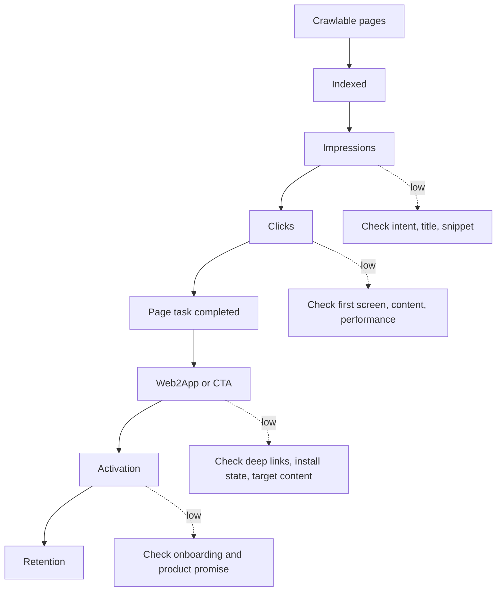

The easiest way to sell SEO is a traffic curve. It is also the easiest way to mislead a team. In one project, impressions, clicks, and Web UV all grew while first App opens did not. The missing piece was that users could not return to the original content after crossing platforms.

I separate two chains:

```text
Search: crawlable → indexed → impressions → clicks → Web UV
Business: Web UV → reading / CTA → app open → activation → re-engagement → retention
```

## Build the metric dictionary first

Every metric needs a formula, source, window, deduplication key, page owner, and responsible team. “Indexed” may come from a Search Console report, URL Inspection sample, or an internal state; those facts should not be added without qualification. Submission success, crawl success, index success, and impression success are separate states.

Slice by page type, intent, locale, market, device, and page age. A site-wide average is useful for direction, not for choosing the next engineering action.

## Use the model to queue work

```text
estimated value = impressions × CTR × qualified-CVR × cohort-LTV
```

This is directional. Each CVR needs a stage; LTV needs a cohort and window; attribution must expose cross-device and privacy gaps. The model locates the bottleneck: no impressions means demand or indexing; impressions without clicks means intent or snippets; clicks without consumption means page or performance; consumption without activation means CTA, deep link, or first-run experience; weak retention means the product promise was not fulfilled.

Run the numbers once instead of leaving the formula abstract. With 10,000 impressions and a 3% CTR, there are 300 clicks. If 40% complete the page task, that produces 120 qualified tasks. At an 8% activation rate, the result is 9.6, or roughly 10 activations:

```text
10,000 impressions × 3% CTR = 300 clicks
300 clicks × 40% task completion = 120 qualified tasks
120 qualified tasks × 8% activation rate = 9.6 ≈ 10 activations
```

If impressions double but activations remain near 10, indexing is not the current bottleneck. Look at page completion, CTA placement, deep links, or first use. Each stage has a different denominator.

## The Web2App break

The cross-platform contract needs content ID, page type, source, query intent, install state, route result, fallback reason, content arrival, and first use. Installed users should return to the target content. Uninstalled users should retain a useful Web preview. Failed links, expired parameters, and missing targets need normal fallbacks.

The key acceptance event is arrival at the original content or task, not App launch. A failure should distinguish domain association, parameter, store, target-content, and user-return causes. Cross-device gaps remain unobservable rather than becoming invented attribution.

The model is most useful when it shows that adding more pages is not the current bottleneck.

## How a funnel argument gets resolved

When a team asks, “Search traffic grew; why did downloads not grow?”, it may be asking five different questions: did intent change, did the page deliver its promise, was the CTA placed correctly, did the deep link preserve the task, and did the first App experience complete it?

I segment a month of data by page type and intent before looking at overall CVR. A tutorial, a tool, and a comparison page have different jobs. One denominator produces a stable but useless average.

Keep failed Web2App samples. Unknown install state, broken Universal Link association, expired parameters, missing targets, and deliberate user returns can all look like “no download.” The event contract must record the reason, or a routing problem will be misdiagnosed as copy.

The value model decides next week’s work: add pages, fix indexing, change the snippet, repair deep links, improve first use, or stop a low-value topic. It should not manufacture a precise annual revenue forecast.

## Write the event contract before attribution

The cross-platform path needs event timing and deduplication rules. `web_view` should mean that the page was usable, not merely requested; `cta_click` should include page version and target; `app_open` should distinguish cold start, warm start, and return from the store; `content_arrival` should confirm that the intended content was reached. Every event needs a timestamp, a cohort key, and a reason when the next step did not happen.

## Segment the funnel before choosing work

Build the funnel by page type: page count, crawlable pages, indexed pages, pages with impressions, clicks, completed page tasks, product actions, and later retention. This separates a tutorial with good CTR but poor reading completion from a tool with low exposure but strong activation. When results disagree with the hypothesis, make the smallest change that distinguishes the likely explanations.

## Define conversion before reporting it

Conversion differs by page. A tutorial may count completed reading, a comparison page may count a trial click, and a download page may count a successful install and open. Write down what counts, how repeats are deduplicated, and how failure is recorded. If consumption is unstable, cross-device gaps are large, or LTV rests on a tiny sample, downgrade the model to a prioritization tool.

## How to read the funnel



Each stage needs its own denominator. A lower CTR does not prove that page consumption fell, and a lower app-open rate does not prove that search had no value.

$$
V \approx I \times CTR \times QCVR \times LTV
$$

Here $I$ is impressions and $QCVR$ is the product conversion rate after a qualified page task. This is a prioritization model, not a finance forecast. Attach page type, time window, and deduplication rules to every variable.

## Public references

- [Google Search Console Performance report](https://support.google.com/webmasters/answer/7042828)
- [Google Analytics cross-platform measurement](https://support.google.com/analytics/answer/11593727)
- [Apple Universal Links](https://developer.apple.com/documentation/xcode/supporting-associated-domains)
- [Android App Links](https://developer.android.com/training/app-links)
