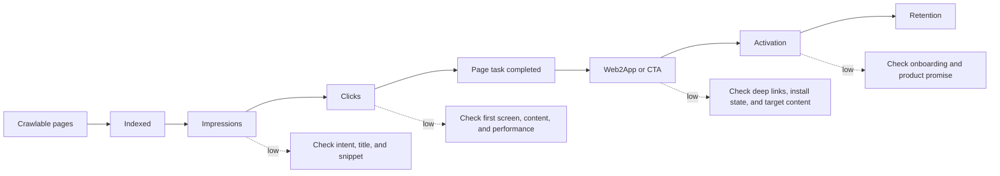

最容易向别人解释 SEO 的方式是放一张流量曲线。问题是，曲线通常只解释了“有多少人来”，没有解释“他们来干什么”。一次项目里，曝光、点击和 Web UV 都在涨，App 首次打开却没有动。最后查到的不是 SEO 失效，而是跨端跳转把用户送到了 App 首页，原来搜索的内容丢了。

所以我把 SEO 价值拆成两条链：

```text
搜索链：crawlable → indexed → impressions → clicks → Web UV
业务链：Web UV → reading / CTA → app open → activation → re-engagement → retention
```

## 先建立指标字典

每个指标必须有公式、来源、时间窗口、去重键、页面归属和负责人。“已收录”究竟来自 Search Console 报告、URL Inspection 抽样还是内部状态，不能不加说明地相加。Crawl 成功、提交成功、索引成功和获得曝光必须是不同状态。

我通常按页面类型、意图、语言、国家、设备和页面年龄切片。总平均值适合看方向，不适合决定下一项工程动作。

## 价值模型只用来排队

可以写一个方向性模型：

```text
estimated value = impressions × CTR × qualified-CVR × cohort-LTV
```

但每个 CVR 都要说明阶段，LTV 要说明 cohort 和窗口，归因要承认跨设备和隐私造成的不可观测。模型的用途不是预测精确收入，而是定位瓶颈：没有曝光查需求和收录；有曝光没点击查意图和摘要；有点击没消费查页面和性能；有消费没激活查 CTA、深链和首次体验；激活后留存弱则回到产品承诺。

把它算一遍会更容易发现问题。假设一个月有 10,000 次曝光，CTR 为 3%，得到 300 次点击；其中 40% 完成页面任务，是 120 次合格消费；合格消费到激活的转化率为 8%，最后得到约 10 次激活。于是：

```text
10,000 impressions × 3% CTR = 300 clicks
300 clicks × 40% task completion = 120 qualified tasks
120 qualified tasks × 8% activation rate = 9.6 ≈ 10 activations
```

如果曝光翻倍但激活仍接近 10 次，瓶颈不在收录量，而在页面任务、CTA、深链或首次体验。这个演算也提醒我们：每一层的分母不同，不能用“激活 ÷ 曝光”倒推出页面本身的问题。



## Web2App 的断点

跨端事件至少需要 `content_id`、`page_type`、`source`、`query_intent`、`install_state`、`route_result`、`fallback_reason`、`content_arrival` 和 `first_use`。已安装用户应回到对应内容；未安装用户先获得有用的 Web 预览；唤起失败、参数过期和目标不存在都要有正常回退。

关键验收不是 App 启动，而是用户是否到达原内容或同一任务。一次失败要能区分域名关联、参数、商店、目标内容和用户主动返回；跨设备缺失标成不可观测，不补成虚假归因。

## 复盘时问三个问题

1. 哪一层漏斗真的改变了？
2. 这个变化能否被页面、事件和时间窗口共同支持？
3. 下一笔资源投入能改善哪一个瓶颈，而不是哪个数字最容易展示？

这张表有时会得出一个不太讨喜的结论：流量不是当前的瓶颈。比如已有页面的点击后阅读完成率很低，或者深链失败占了很大一部分，这时继续扩页面只会把更多人送进同一个坏路径。能把这件事讲清楚，已经比报一个漂亮的归因金额有用。

## 一次漏斗争论怎样被拆开

业务团队经常会问：“搜索流量涨了，为什么下载没有涨？”这个问题表面上是在问转化率，实际上可能包含五个不同问题：来的是否是同一类意图，页面是否完成了信息交付，CTA 是否在正确位置，深链是否把用户带到目标内容，App 首次体验是否兑现了搜索页的承诺。

数据分析从页面类型和意图切片开始，而不是直接看全站平均 CVR。教程页的目标可能是继续阅读，工具页的目标可能是启动，比较页的目标可能是下载；把它们放进同一个分母，最后得到的只是一条很稳定但没有用的平均线。

Web2App 的排查尤其需要保留失败样本。安装状态未知、Universal Link 关联失败、参数过期、目标内容删除、用户主动返回，这些情况在报表里都可能表现成“没有下载”。事件契约必须把失败理由写出来，否则团队会把路由工程问题误判为 CTA 文案问题。

价值模型的作用，是决定下一周做什么：补页面、修索引、改摘要、修深链、改善首次体验，还是停止一个低价值主题。它不应该被用来制造一个看起来精确的年度收入预测。

## 先写事件契约，再谈归因

跨端链路至少要约定事件发生的时机和去重方式。`web_view` 应该代表页面真正可用，而不是请求发出；`cta_click` 要带页面版本和目标；`app_open` 要区分冷启动、热启动和从商店返回；`content_arrival` 要确认用户确实到了对应内容。每个事件还要有时间戳、匿名会话或 cohort 键，以及“为什么没有下一步”的失败字段。

这一步看起来像产品埋点，实际上直接决定 SEO 判断能不能成立。没有 `content_id`，Web 访问和 App 行为只能按渠道粗略拼接；没有 `route_result`，深链失败会被算成普通流失；没有页面版本，改 CTA 后的结果又会和旧版本混在一起。归因不是事后找一个数字，而是上线前把可观察性设计进去。

## 用分层漏斗找到下一项工作

按页面类型分层的漏斗表至少包括：页面数、可抓取数、可索引数、有曝光数、有点击数、完成页面任务数、触发产品动作数，以及动作后的留存。每一层都保留分母和时间窗口。这样可以看到“教程页点击率不错但继续阅读差”和“工具页曝光少但激活率高”是两种完全不同的机会。

当结果和预期不一致时，不要马上重写全部内容。先问哪一个环节最可能是瓶颈，再做一个能区分解释的小修复。例如有曝光无点击，先抽样比较查询与标题摘要是否匹配；有点击无消费，先看首屏速度、正文可见性和承诺兑现；有消费无激活，再排查 CTA 位置与跨端路径。每次只把资源投向一个瓶颈，复盘才不会变成口号。

## 先把“转化”说清楚

“转化”在不同页面上不是同一件事。教程页可能是读完关键步骤，产品比较页可能是点击试用，下载页可能是成功安装并打开。先把事件写成一句可以测试的话：什么时刻算完成、重复发生怎么算、失败怎么记。页面消费的定义不稳定、跨设备缺失严重，或者 LTV 只有很小的历史样本时，我会把模型降级成排序工具，暂时不展示精确金额。承认目前看不见，比拿估算值填满报表安全。

$$
V \approx I \times CTR \times QCVR \times LTV
$$

其中 $I$ 是曝光，$QCVR$ 是完成合格页面任务后的产品转化率。这个式子不是财务预测，只是帮助团队定位漏点。每个变量都要附上页面类型、时间窗和去重口径，否则乘出来的数字没有可比性。

## 参考链接

- [Google Search Console Performance report](https://support.google.com/webmasters/answer/7042828)
- [Google Analytics cross-platform measurement](https://support.google.com/analytics/answer/11593727)
- [Apple Universal Links](https://developer.apple.com/documentation/xcode/supporting-associated-domains)
- [Android App Links](https://developer.android.com/training/app-links)
