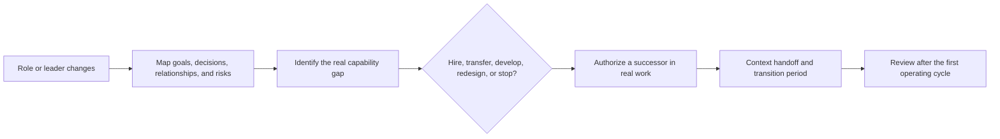

People move, roles change, and a position should not exist only to retain one person. What the organization needs to preserve is the ability to carry goals, relationships, decisions, and results through change.

Give a larger problem when the organization has a real gap and the person has repeatedly produced credible, reusable results. Do not promise a title or resources merely to prevent departure. An excellent frontline leader may be best kept leading a critical team; promotion is not the only retention path.

When a leader leaves or expands scope, first identify the actual gap: business context, people leadership, cross-team relationships, undocumented judgment, or a goal that should be reduced. The answer may be hiring, transfer, development, redesign, or no replacement.

Handoff is real when the new leader can explain goals, boundaries, and unresolved choices; collaborators use the new interface; and the first risk is handled or escalated through the new boundary. The former leader should support the transition without remaining the permanent default entry point.

Continuity does not mean preserving every old relationship or process. It means the team can still tell what matters, who owns what, which risks cannot wait, and where to make a new choice. Retention, replacement, and exit should all use standards stated before the decision, with fair review and appropriate HR and legal process.
