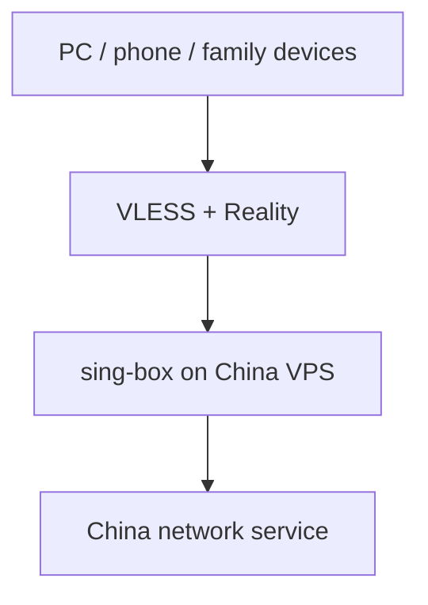
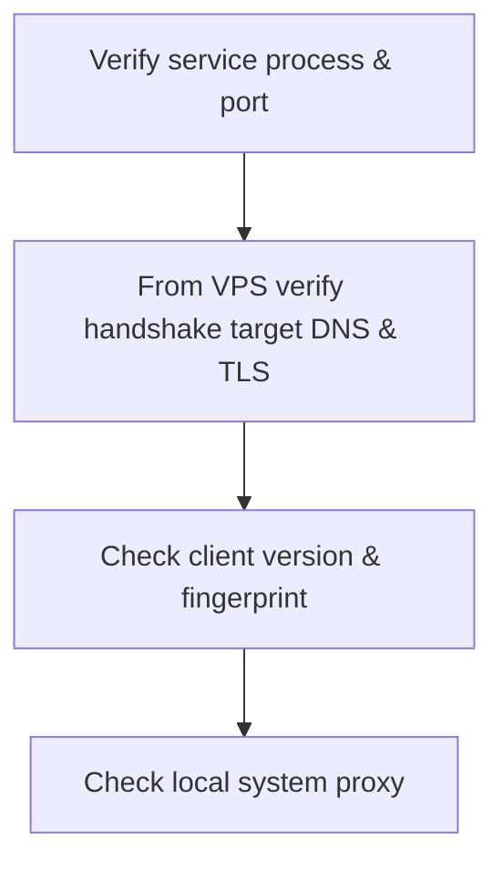

> Scenario: you are overseas and occasionally need to access services that are only available to mainland China IPs, or whose direct connection is unstable. This is a personal network troubleshooting log, not a general-purpose tutorial. Cloud providers, local laws, and terms of service each have their own boundaries; server addresses, keys, UUIDs, and subscription links should never appear in a public article.

At first this wasn't that complicated: I just wanted to temporarily open a mainland Chinese website.

Only later did I realize how easily a network solution inflates along a familiar path: first solve "can I use it," then "can my phone use it," and finally "can my family use it without having to understand any of this." Looking back, what really took time wasn't setting up a service, but repeatedly revising the assumption of "who the user is."

## First, get this straight: this is a "return-to-China proxy," not the other direction

This article only discusses one network direction: the device is overseas and needs to egress through mainland China to access websites and apps that only serve mainland IPs, or whose direct overseas connection is poor. It does not discuss any solution for accessing overseas networks from within mainland China, nor does it provide related methods.

| Need | User location | Server egress | Primary problem solved |
| --- | --- | --- | --- |
| Return-to-China proxy (scope of this article) | Overseas | Mainland China | Access websites and apps that only serve mainland IPs, or whose direct overseas connection is poor |

The protocol name, the client, even the transport-layer appearance are not the point; the point is simply to give the target service a usable mainland access path as seen from the network layer.

The two also have a difference that is easy to overlook: returning to China does not naturally mean lower risk. Different cloud providers, network operators, and locations have different rules for proxy services; and target platforms usually don't just look at "whether it's a mainland IP" — they also judge risk by combining account history, IP reputation, device, login location, and access cadence. So don't take "it connects" to mean the service necessarily permits this kind of use.

## Version one: SSH direct connection, first make it work for myself

The earliest solution was a mainland VPS plus SSH dynamic port forwarding:

```bash
ssh -D 1080 -N <user>@<server>
```

Configure the browser or the system to use SOCKS5 on the local port, and traffic egresses through the server. It has a few advantages that are hard to replace: no extra server-side program, no complex protocol, and when something breaks you almost only need to check whether SSH can connect.

For the need of "sitting in front of a computer and using it for ten minutes occasionally," it's already good enough.

But it's only friendly to people who know how to open a terminal. Every reconnect requires typing a command; the tunnel drops after the computer sleeps; some apps don't honor the system SOCKS proxy. More importantly, a phone isn't a smaller computer: iOS has no natural, ordinary-person-oriented SSH dynamic forwarding experience. At this point SSH hadn't failed — it had simply finished the first stage's job.

## The requirement changed: phones and family need to use it too

What really pushed me to change approaches wasn't speed, but the fact that there were more users.

I can accept "open a tunnel in the terminal, then switch the proxy manually"; family members shouldn't have to memorize ports, toggles, and error messages just to visit a website. A phone also needs a client that can save configuration, recover after disconnection, and start/stop with one tap as needed.

At this point I set a few very practical criteria for the solution:

1. Mac, iOS, and Android can all connect;
2. It doesn't depend on manually logging into the server every time;
3. I can issue separate configs to different devices, and revoke one individually when a device is lost;
4. Server-side problems can be located by reading logs, instead of only guessing "why doesn't it work today";
5. It doesn't turn into a project that needs daily operations.

I looked at simpler options like Shadowsocks, whose client ecosystem is also very mature. But in the end I chose sing-box to carry VLESS + Reality: on one hand it can converge the server and multi-platform clients into the same configuration model; on the other it can use a standard HTTPS port, without having to deal separately with domains and certificates.

The cost is also clear: there are more configuration fields, and you have to re-check the documentation when upgrading versions. It's not "better because it's more advanced," but better suited to the "multiple devices, occasional maintenance" requirement.

## Tool research and cost: what you save is the subscription, what you trade for it is maintenance

Before choosing sing-box, I compared the viable options by "who does the maintenance" rather than "how new the protocol is." The prices below are the public information as checked on 2026-08-14; cloud provider specs, promotions, and commercial service plans change quickly, so re-check the purchase page before ordering.

| Solution | Who it suits better | Software/service cost | Why I ultimately didn't choose it |
| --- | --- | --- | --- |
| SSH dynamic forwarding | Someone who occasionally uses it themselves on a single computer | The SSH client usually comes with the system; you only bear the VPS cost | Unfriendly to phones and family members who don't use the terminal; reconnection and the system proxy must be handled manually |
| Commercial return-to-China accelerator | People who want less hassle, or need TV/smart-device support | Monthly or yearly subscription; price, speed limits, and device count per each vendor's purchase page | Convenient, but long-term subscription costs more, and lacks server logs you can read yourself |
| Self-hosted sing-box + VLESS + Reality | Households with basic server maintenance ability and not many devices | sing-box is free open-source software; the main cost is the VPS | Initial deployment, upgrades, and troubleshooting all fall on you |
| Router-level return-to-China solution | People who want all household devices to connect automatically | One-time device cost, plus possible service subscription | Troubleshooting expands to the whole home network; overkill for my low-frequency needs |

Self-hosting doesn't mean "free." Taking the entry-level lightweight servers of mainstream domestic cloud providers as an example, a common configuration is about **2C2G, 200 GB/month traffic, ¥45/month or ¥459/year** — that's most of the fixed cost. Reality doesn't require buying an extra domain or certificate, and sing-box has no license fee, but backup, replacing machines, system security updates, and downtime should all be counted into the cost. Specs and prices are subject to each vendor's purchase page; see the [official documentation](https://sing-box.sagernet.org/) for sing-box's open-source license.

The value of a commercial product isn't just the route either: for example, the router Transocks publicly sells wraps phone, TV, and smart-home access into one-tap operation, with the device page priced at ¥699; whether a service subscription is still required, the specific plans, and the applicable scenarios should all be based on [its official purchase page](https://www.transocks.com/payment/shop). For households that need "works out of the box" and human support, that money may be more worthwhile than my own few evenings of tinkering.

My actual choice was a bit particular: my needs were low-frequency to begin with — I didn't need low-latency gaming or all-day 4K; and when I bought the VPS I happened to hit a sizable promotional discount, pushing the annual cost down to a range clearly below the regular listed price. I compared that actual cost against the commercial annual cards I would consider, rather than forcing a comparison against undiscounted list prices, and finally decided to self-host.

This doesn't mean self-hosting is necessarily cheaper. It only shows that, for the combination of "low usage + a VPS discount + willingness to maintain it myself," the annual cost is already acceptable; plus independent device identities, readable logs, and not being locked to a single vendor's client, it suits me better. Conversely, once you want TV, router, multi-user support, or stable customer service, what a commercial service is really selling is operations and experience, not just bandwidth.

### Commercial return-to-China accelerators: competitors, public pricing, and trade-offs

The following is not a performance ranking, nor a recommended purchase list. Experiences differ greatly across countries, carriers, and target apps; I've only listed the product positioning and prices I could confirm from **each vendor's official page** at the time. The price-check date is 2026-08-14, and promotions, exchange rates, taxes, device counts, and refund rules may all change.

| Product | Publicly verifiable price | Pros | Cons / ask before buying |
| --- | --- | --- | --- |
| [KuaiFan (快帆)](https://www.kuaifanvpn.com/pricing.php) | ¥25/month, ¥65/3 months, ¥99/6 months, ¥148/12 months | Transparent pricing tiers; suits people who want to try monthly first and then lower cost by paying yearly | The iOS page still gives instructions for configuring via a third-party client; before buying, confirm whether your device, location, and target apps are within the supported scope |
| [Transocks (穿梭)](https://www.transocks.com/) | The mobile version publicly advertises free routes; the paid version supports sharing across 3 devices; the smart router is ¥699 and still requires membership | Covers phone, computer, TV, and router scenarios; suits households with a TV/smart devices | VIP's real-time settlement price isn't shown on the public purchase page; the router isn't a one-time purchase — count membership renewal together with hardware cost |
| [Malus](https://api.getmalus.com/buy) | The official purchase page shows a "first month ¥9.9" promotion; other specific plans must be confirmed after logging in | Has free basic routes and video/game tiers; suits people who want to verify route quality before deciding to upgrade | Regular renewal prices are incomplete on the public page; confirm bandwidth, concurrent devices, and refund conditions for free vs. paid routes item by item before ordering |
| [Sixfast](https://www.sixfast.com/zh-CN/) | The public page offers a trial, but no fixed membership price verifiable without logging in was seen | Focuses on gaming, video, and TV, and claims one account can be used on 5 devices simultaneously | Plan prices need to be confirmed inside the client or at checkout; a "gaming-first" positioning may not be worth paying for purely web/occasional errands |
| [QuickFox](https://quick-fox.net/) | The official site confirms membership purchase and gift promotions for quarterly cards and above; no publicly verifiable fixed list price is shown | Covers video, gaming, live streaming, and work scenarios, aimed at overseas users who don't want to self-deploy | Without a public fixed price, cross-comparison and renewal budgeting are harder; check the trial, device count, and refund terms before deciding to pay yearly |

The easiest things to miscalculate here are the "first-month price," the "annual price," and the "list price." For my occasional needs, I should first compute the full-year cost using the actual discounts available, then look at devices and scope of use: because of the promotional discount, my VPS's actual annual cost was only about 40% of the regular list price, so I ended up self-hosting; without that discount, or if I only wanted TV, game consoles, and smart-home devices to connect seamlessly, a commercial product's multi-platform adaptation and customer service might be more worth the money. Whichever approach, don't fixate only on the lowest monthly average.

My comparison at the time was actually less complicated than this: with low-frequency use, even if a commercial service's annual card works out to a low monthly average, it's still a fixed expense I'm not eager to pay. Since the VPS happened to have a sizable discount, I compared by actual annual cost and finally chose to spend that money on a server I control myself.

## The final form: sing-box as the server, multi-platform clients each playing to their strengths

The final structure is actually not fancy: a mainland VPS runs sing-box; computers import into a client like Clash Verge; phones use a client that supports VLESS + Reality. Each device uses independent identity information, rather than sharing one universal link.



I deliberately didn't pursue "taking over the whole family's network uniformly." When daily use is just visiting a few sites, enabling the client per device is easier to understand and also easier to narrow down when something goes wrong. A router-level solution of course saves toggling, but it expands the troubleshooting scope to the entire home network, which doesn't suit this need.

## Five pitfalls actually encountered

### 1. sing-box 1.12+ requires an explicit DNS resolver

The first time I wrote the config and ran `sing-box check`, it errored:

```text
missing `route.default_domain_resolver` or `domain_resolver` in dial fields
```

This is the newer sing-box requiring a more explicit DNS resolution path. The fix isn't to patch fields everywhere, but to explicitly specify the default resolver in `route`:

```json
"route": {
  "default_domain_resolver": {
    "server": "<DNS_SERVER_TAG>"
  }
}
```

The key point here is to choose DNS from the server's perspective, and to actually verify the resolution result after deployment. Passing config validation doesn't mean the addresses it resolves are truly reachable on this network path.

### 2. Reality's handshake target must be reliably reachable from the VPS

This pitfall took the most time. The client kept failing the handshake, commonly showing `reality verification failed` or `EOF`; the server log showed `REALITY: processed invalid connection`.

At first I picked a "seemingly reliable" big overseas site as the handshake target. I repeatedly checked the config, keys, SNI, and client fingerprint, and it still didn't work. Later, after directly testing the TLS connection and capturing packets on the VPS, I found the domain was resolving to a wrong or unreachable address at the server's location.

Reality's handshake target isn't a name that automatically holds just because it's written in the config. It must be a target that **the server's network can reliably resolve and connect to**. Only after switching to a site that continuously tested reachable on the VPS did the problem disappear.

The conclusion is plain: don't pick a target by the site's reputation; first verify from the VPS that all three layers — DNS, TCP, and TLS — are stable. This also applies as general troubleshooting when deploying similar protocols.

### 3. The client must set the TLS fingerprint the protocol requires

When removing the client fingerprint and trying to let it use the system's default TLS, I got an error like this:

```text
uTLS is required by reality client
```

This is a requirement of the protocol client, not a mistyped server UUID. The client needs to specify a compatible `client-fingerprint`. When troubleshooting this kind of problem, first distinguish "the connection wasn't established" from "the client refused the config before even connecting," and you'll avoid a lot of detours. Set the fingerprint item to the value recommended in the client's official documentation; I won't go into specific values here.

### 4. Manually editing Clash Verge config gets lost after restart

I once directly modified Clash Verge's `profiles.yaml` to register a config, and after restart it reverted. The reason is that the app manages its config list through its own database — the file isn't a stable manual entry point.

The correct approach is to import the config through the GUI and let the client do the registration itself. There's also a small pitfall: the default mixed port may be `7897`, not the `7890` in many older tutorials. When the local port doesn't match, the most obvious symptom is that the client appears started but the browser gets no traffic at all.

### 5. "System proxy enabled" doesn't mean macOS is actually using the proxy

When Clash Verge's interface shows the system proxy is on but `scutil --proxy` shows no settings, it usually means macOS hasn't allowed the app to silently modify the network proxy.

This isn't a protocol issue. You can manually point the HTTP/HTTPS proxy to the local mixed port in system settings, or enable the client's TUN mode. Judge by the system's network state and actual access results, not just by the toggle in the client.

## Only after handing it to family did I realize config management matters more

After it worked technically, the remaining work felt more like product design.

I didn't forward the same config to everyone; instead I created a separate identity for each device and noted its purpose. That way, when a phone is replaced, lost, or retired, I only revoke the corresponding entry without affecting others. I also kept only the necessary operating instructions in the client: when to turn it on, how to turn it off after use, and where to look first when it won't connect.

For myself, logs and JSON configs are normal tools; for family, the best system is one you normally don't notice exists, and that doesn't require learning network protocols before it works again when something breaks. That standard in turn constrained me: rather do fewer fancy features, and keep the connection method and failure boundaries clearly delineated.

## Platform bans and account risk control: network access doesn't mean account safety

A return-to-China proxy solves the network path, not platform trust. Many services treat cloud-server IPs, frequently changing login locations, cross-region switches within a short time, and multiple people sharing the same egress as abnormal signals. At best they ask for re-verification; at worst they restrict login, freeze transaction capability, or even dispose of the account under their terms of service.

So I limit it to "accessing ordinary web pages or services that need a mainland network environment," rather than using it to circumvent a product's regional restrictions, eligibility checks, or account rules. For highly sensitive services like banking, payment, real-name verification, transactions, healthcare, and government affairs, prefer the login, verification, or customer-service channels the platform explicitly supports; don't count on switching the egress IP to bypass risk control — it may instead push a normal account into manual review.

The same boundary applies when configuring family devices: each device uses an independent identity and is enabled on demand; don't spread the config publicly, and don't treat one small VPS as everyone's long-term shared "universal mainland network." The former makes revocation and problem-locating easier; the latter amplifies security, privacy, compliance, and account risks all at once.

## Also avoid the "abnormally cheap" gray-market business

Gray-market business easily springs up around return-to-China network services. I'm not labeling all ordinary commercial services here, but pointing out several signals to steer clear of outright: "lifetime subscriptions" far below normal cost, links shared by many people with no device management, so-called home-broadband IPs of unknown origin, accounts that require proxy real-name registration or proxy payment, plus cracked clients, second-hand accounts, and unauthorized reselling.

They look cheap but actually shift the risk onto the user. A shared egress may mix in abusive traffic, lowering the reputation of the whole IP range; the owner of a config of unknown origin can stop service at any time, and may observe or tamper with traffic not protected by end-to-end encryption; and proxy real-name registration, fraudulent payment methods, and account trading escalate a network problem directly into account, financial, or even legal risk.

My bottom line is: the server and payment accounts are under my own control, clients are obtained from official channels, and configs go only to the identified device users. I won't touch any service that asks for account passwords, identity documents, or payment credentials, or that promises "unlimited traffic, never banned, absolutely no logs." Even when self-hosting, it shouldn't be rented out, shared publicly, or used to bypass platform rules.

## A redacted server-side structure

Below only the field relationships are kept; all real values are placeholders. Don't commit working real configs, private keys, or subscription links to a public repository.

```json
{
  "type": "vless",
  "listen_port": 443,
  "users": [{ "uuid": "<DEVICE_UUID>", "flow": "xtls-rprx-vision" }],
  "tls": {
    "enabled": true,
    "server_name": "<REACHABLE_HANDSHAKE_HOST>",
    "reality": {
      "enabled": true,
      "handshake": {
        "server": "<REACHABLE_HANDSHAKE_HOST>",
        "server_port": 443
      },
      "private_key": "<PRIVATE_KEY>",
      "short_id": ["<SHORT_ID>"]
    }
  }
}
```

What's truly worth saving isn't any particular JSON, but the troubleshooting order: first verify the service process and port, then verify the handshake target's resolution and TLS from the VPS, next check the client version and fingerprint, and finally check whether the local system proxy took effect. Following this chain, problems converge much faster than "try swapping a parameter from some tutorial."



## Conclusion: from "works" to "usable"

SSH direct connection is still my favorite tool for temporary needs: simple, transparent, and reliable. It's just that once the need expands from one computer to phones and family, it's no longer a complete answer.

sing-box plus VLESS + Reality isn't a set-and-forget endpoint either. It adds a layer of configuration and maintenance cost, but in return you get multi-device access, individually manageable identities, and a more observable failure surface. To me, that's the most valuable thing worth keeping from this whole exercise: not a proxy link, but a judgment method I can keep using next time I switch machines.
