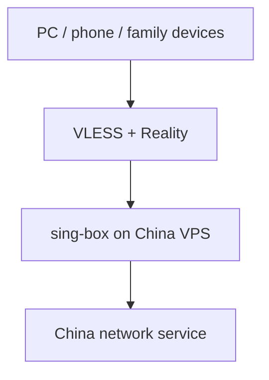
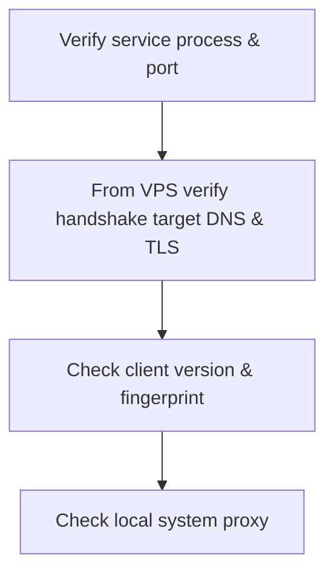

> 场景：人在境外，偶尔需要访问仅对国内 IP 开放、或直连不稳定的服务。这是一次个人网络排障记录，不是通用教程。云厂商、当地法律与服务条款都有自己的边界；服务器地址、密钥、UUID 和订阅链接都不应出现在公开文章里。

这件事一开始没那么复杂：我只想临时打开一个国内网站。

后来才发现，网络方案很容易沿着一个熟悉的路径膨胀：先解决“我能不能用”，再解决“手机能不能用”，最后变成“家人能不能不用理解这些也能用”。回头看，真正花时间的不是搭一个服务，而是不断调整“使用者是谁”的假设。

## 先分清：这是“回国代理”，不是其他方向

这篇文章只讨论一种网络方向：设备在境外，需要从中国大陆出口，去访问只向国内 IP 提供服务、或境外直连质量不佳的网站和应用。它不讨论从中国大陆境内访问境外网络的任何方案，也不提供相关方法。

| 需求 | 用户所在位置 | 服务器出口 | 主要解决的问题 |
| --- | --- | --- | --- |
| 回国代理（本文范围） | 境外 | 中国大陆 | 访问只向国内 IP 提供服务、或境外直连质量不佳的网站和应用 |

协议名称、客户端乃至传输层的表现形式都不是目的；目的只是让目标服务从网络层看到一个可用的国内访问路径。

两者还有一个容易被忽略的差别：回国并不天然意味着风险更低。不同云厂商、网络运营者和所在地对代理服务的规则不同；而且目标平台往往不会只看“是不是国内 IP”，还会结合账号历史、IP 信誉、设备、登录位置和访问节奏做风险判断。所以，不要把能连接理解成服务一定允许这样使用。

## 第一版：SSH 直连，先让自己能用

最早的方案就是一台国内 VPS 加 SSH 动态端口转发：

```bash
ssh -D 1080 -N <user>@<server>
```

浏览器或系统配置 SOCKS5 到本地端口，访问就能从服务器出口出去。它有几个很难被替代的优点：没有额外服务端程序、没有复杂协议、出了问题也几乎只需要检查 SSH 能不能连上。

对于“坐在电脑前、偶尔用十分钟”的需求，它已经足够好了。

但它只对会开终端的人友好。每次重连都要敲命令；电脑睡眠后隧道会断；有的应用不认系统 SOCKS 代理。更重要的是，手机不是电脑的缩小版：iOS 上没有一个自然的、面向普通人的 SSH 动态转发体验。到这里，SSH 没有失败，只是它完成了第一阶段的任务。

## 需求变了：手机和家人也要能用

真正推动我换方案的不是速度，而是使用对象变多了。

我可以接受“终端开一个隧道，再手动切代理”；家人不应该为了访问一个网站先记住端口、开关和报错信息。手机也需要一个能保存配置、断线后可恢复、按需要一键启停的客户端。

这时我给方案定了几个很实际的标准：

1. Mac、iOS、Android 至少都能接入；
2. 不依赖每次手动登录服务器；
3. 能给不同设备单独发配置，丢一台设备时可以单独撤销；
4. 服务端问题能看日志定位，而不是只能猜“今天为什么不行”；
5. 不把它做成一个需要日常运维的项目。

我看过 Shadowsocks 等更简单的选择，客户端生态也很成熟。但最后还是选了 sing-box 承载 VLESS + Reality：一方面它能把服务端和多端客户端收敛到同一套配置模型里；另一方面可以走标准 HTTPS 端口，不需要再额外处理域名与证书。

代价也很明确：配置字段变多了，版本升级时也要重新核对文档。它不是“更先进所以更好”，而是更贴合“多个设备、偶尔维护”的需求。

## 工具调研与费用：省的是订阅，换来的是维护

在选 sing-box 之前，我把可行方案按“谁来维护”而不是“协议有多新”做了一遍比较。下面的费用是 2026-08-14 核对时的公开信息；云厂商规格、促销和商业服务套餐变化都很快，下单前应重新看购买页。

| 方案 | 谁更适合 | 软件/服务成本 | 我最终没有选它的原因 |
| --- | --- | --- | --- |
| SSH 动态转发 | 只在一台电脑上偶尔自用的人 | SSH 客户端通常随系统提供；只承担 VPS 费用 | 对手机和不使用终端的家人不友好，重连与系统代理也要手动处理 |
| 商业回国加速器 | 想少折腾、需要电视或智能设备支持的人 | 按月或按年订阅；价格、限速与设备数以各家购买页为准 | 方便，但长期订阅的成本更高，也缺少自己可读的服务端日志 |
| 自建 sing-box + VLESS + Reality | 有基本服务器维护能力、设备不多的家庭 | sing-box 是免费开源软件；主要成本是 VPS | 初次部署、升级与排障都需要自己承担 |
| 路由器级回国方案 | 想让全家设备自动接入的人 | 设备一次性成本，外加可能的服务订阅 | 排障会扩展到整个家庭网络；对我这类低频需求过度了 |

自建并不等于“免费”。以国内主流云厂商的轻量服务器入门档为例，常见配置约为 **2C2G、200 GB/月流量，¥45/月或 ¥459/年**，这就是绝大部分固定成本。Reality 不要求额外购买域名或证书，sing-box 也没有授权费，但备份、换机、系统安全更新和故障时间都应算进成本。规格与价格以各家购买页为准；sing-box 的开源许可证见[官方文档](https://sing-box.sagernet.org/)。

商业产品的价值也不只是线路：例如穿梭公开销售的路由器把手机、电视和智能家居的接入封装成了一键操作，设备页面标价 ¥699；是否仍需服务订阅、具体套餐和适用场景都应以[其官方购买页](https://www.transocks.com/payment/shop)为准。对需要“开箱即用”和有人支持的家庭，这笔钱可能比我自己折腾几个晚上更划算。

我的实际选择有一点特殊：需求本来就低频，不需要游戏低延迟或全天候 4K；同时我购买 VPS 时正好遇到较大的促销折扣，年度成本被压到了一个明显低于常规标价的范围。我拿这个实际成本去和自己会考虑的商业年卡比较，而不是拿没有折扣的标价硬比，最后决定自建。

这不表示自建一定更便宜。它只是说明，对“低使用需求 + 有 VPS 折扣 + 愿意自己维护”的组合，年度成本已经在可接受范围；加上独立设备身份、可读日志和不受单一服务商客户端限制，对我更合适。反过来，一旦追求电视、路由器、多人支持或稳定的客服响应，商业服务实际出售的是运维与体验，而不只是带宽。

### 商业回国加速器：竞品、公开定价与取舍

下面不是性能排名，也不是推荐购买清单。不同国家、运营商和目标应用下的体验差异很大；我只把当时能从**各家官方页面**确认的产品定位和价格列出来。价格核对日期为 2026-08-14，促销、汇率、税费、设备数和退款规则都可能变化。

| 产品 | 可公开核验的价格 | Pros | Cons / 购买前要问清 |
| --- | --- | --- | --- |
| [快帆](https://www.kuaifanvpn.com/pricing.php) | ¥25/月、¥65/3 个月、¥99/6 个月、¥148/12 个月 | 价格档位透明；适合想先按月试用、再按年降低成本的人 | iOS 页面仍给出借助第三方客户端配置的说明；购买前应确认自己的设备、所在地和目标应用是否在支持范围内 |
| [穿梭 Transocks](https://www.transocks.com/) | 手机版公开宣称有免费线路；付费版支持 3 台设备共用；智能路由器 ¥699，且仍需会员 | 覆盖手机、电脑、TV 和路由器场景，适合家中有电视/智能设备的人 | VIP 的实时结算价不在公开购买页展示；路由器不是一次买断服务，需把会员续费与硬件成本一起算 |
| [Malus](https://api.getmalus.com/buy) | 官方购买页显示“首月 ¥9.9”活动；其余具体套餐需登录后确认 | 有免费基础线路与影音/游戏分层，适合先验证线路质量再决定是否升级的人 | 常规续费价在公开页面不完整；免费与付费线路的带宽、并发设备、退款条件要在下单前逐项确认 |
| [Sixfast](https://www.sixfast.com/zh-CN/) | 公开页提供试用，但未见可不登录核验的固定会员价 | 重点覆盖游戏、影音和 TV，并宣称一个账号可同时使用 5 台设备 | 套餐价格需要进客户端或结算页确认；“游戏优先”的产品定位未必值得为纯网页/偶尔办事付费 |
| [QuickFox](https://quick-fox.net/) | 官网确认提供会员购买与季度卡以上赠送活动；未展示可公开核验的固定标价 | 覆盖影音、游戏、直播与办公等场景，面向不想自行部署的海外用户 | 没有公开固定价时，横向比价和续费预算更困难；先看试用、设备数、退款条款再决定是否年付 |

这里最容易误算的是“首月价”“年付价”和“标价”。对我这种偶发需求，应该先用拿得到的实际折扣计算全年成本，再看设备与使用范围：我的 VPS 因促销折扣，实际年成本只有常规标价的四成左右，所以最后去自建；如果没有这个折扣，或只想让电视、游戏机、智能家居无感接入，商业产品的多端适配和客服可能更值得那笔钱。无论哪种方案，都不要只盯最低月均价。

我当时的对比其实没有这么复杂：低频使用时，商业服务的年卡即使折算下来月均不高，仍然是一笔我不太愿意付的固定支出。既然 VPS 正好有较大折扣，我就按实际年度成本去比，最后选择把这笔钱花在自己能控制的服务器上。

## 最终形态：sing-box 做服务端，多端客户端各取所长

最后的结构其实并不花哨：国内 VPS 运行 sing-box；电脑导入到 Clash Verge 一类客户端；手机则使用支持 VLESS + Reality 的客户端。每一台设备使用独立身份信息，不共享一条万能链接。



我刻意没有追求“全家网络统一接管”。日常只是访问几个站点时，按设备启用客户端更容易理解，也更容易在出现问题时缩小范围。路由器级方案当然更省开关，但它把排障范围扩大到了整个家庭网络，不适合这次需求。

## 五个实际踩到的坑

### 1. sing-box 1.12+ 需要明确 DNS 解析器

第一次写好配置执行 `sing-box check`，报错：

```text
missing `route.default_domain_resolver` or `domain_resolver` in dial fields
```

这是新版 sing-box 对 DNS 解析路径要求更明确。解决方式不是到处补字段，而是在 `route` 中显式指定默认解析器：

```json
"route": {
  "default_domain_resolver": {
    "server": "<DNS_SERVER_TAG>"
  }
}
```

这里的要点是从服务器视角选 DNS，并在部署后实际验证解析结果。配置能通过校验，不代表它解析到的地址在这条网络路径上真的可达。

### 2. Reality 的握手目标，必须从 VPS 上稳定可达

这个坑耗时最多。客户端不断握手失败，常见表现是 `reality verification failed`、`EOF`；服务端日志里则是 `REALITY: processed invalid connection`。

一开始我选了一个“看起来很可靠”的海外大站当握手目标。配置、密钥、SNI、客户端指纹都反复检查过，还是不行。后来在 VPS 上直接测试 TLS 连接并抓包，才发现域名在服务器所在地解析到了错误或不可达的地址。

Reality 的握手目标不是一个写在配置里就自动成立的名字。它必须是**服务端所在网络能够稳定解析并连接**的目标。换成 VPS 上连续测试可达的站点后，问题才消失。

这个结论很朴素：别凭网站名气选目标，先从 VPS 上验证 DNS、TCP 和 TLS 三层都稳定。这条同样适用于部署同类协议时的通用排障。

### 3. 客户端需要设置协议要求的 TLS 指纹

去掉客户端指纹、尝试让它使用系统默认 TLS 时，收到过这样的报错：

```text
uTLS is required by reality client
```

这是协议客户端的要求，不是服务端 UUID 填错。客户端需要指定兼容的 `client-fingerprint`。排查这类问题时，先分清是“连接没有建立”，还是“客户端在建立连接前就拒绝配置”，会少走不少弯路。指纹项按客户端官方文档的推荐值设置即可，具体取值不展开。

### 4. Clash Verge 手改配置，重启后会丢

我曾直接修改 Clash Verge 的 `profiles.yaml` 注册配置，重启后它又恢复了。原因是应用通过自己的数据库管理配置列表，文件并不是稳定的手工入口。

正确做法是通过图形界面导入配置，让客户端自己完成登记。还有一个小坑：默认混合端口可能是 `7897`，并不是很多旧教程中的 `7890`。本地端口不一致时，最直观的症状就是客户端看似已启动、浏览器却完全没有流量。

### 5. “系统代理已开启”不等于 macOS 真用了代理

Clash Verge 的界面显示系统代理已开启，但用 `scutil --proxy` 查看不到设置，通常表示 macOS 没有允许应用静默修改网络代理。

这不是协议问题。可以在系统设置中手动把 HTTP/HTTPS 代理指向本地混合端口，或启用客户端的 TUN 模式。判断时以系统网络状态和实际访问结果为准，不要只看客户端上的开关。

## 给家人用之后，才意识到配置管理更重要

技术上跑通以后，剩下的工作反而更像产品设计。

我没有把同一份配置转发给所有人，而是每台设备单独创建身份并注明用途。这样某个手机换机、遗失或不再使用时，只撤销对应条目，不会影响其他人。客户端里也只保留必要的操作说明：何时打开、用完怎么关闭、连接不上先看哪一处。

对自己而言，日志和 JSON 配置是正常工具；对家人而言，最好的系统是平时感觉不到它存在，出问题时也不用先学习网络协议。这个标准反过来约束了我：宁可少做几个花哨功能，也要把连接方式和故障边界收敛清楚。

## 平台封禁与账号风控：网络可用，不代表账号安全

回国代理解决的是网络路径，不是平台信任。很多服务会把云服务器 IP、频繁变化的登录地点、短时间跨地区切换、多人共用同一出口等情况视为异常信号。轻则要求再次验证，重则限制登录、冻结交易能力，甚至按服务条款处置账号。

因此我把它限定为“访问需要国内网络环境的普通网页或服务”，而不是用来规避产品的地区限制、资格校验或账号规则。涉及银行、支付、实名、交易、医疗、政务等高敏感服务时，更应优先使用该平台明确支持的登录、验证或客服渠道；不要指望切换出口 IP 能绕过风控，反而可能把正常账号推入人工审核。

给家人配置时也有同样的边界：每个设备使用独立身份，按需开启；不要把配置公开传播，更不要把一台小 VPS 当作所有人长期共享的“万能国内网络”。前者便于撤销和定位问题，后者则会同时放大安全、隐私、合规与账号风险。

## 也要避开“便宜得不正常”的灰产

回国网络服务周边很容易出现灰色生意。这里说的不是把普通商业服务一概贴标签，而是几种应该直接绕开的信号：远低于正常成本的“永久订阅”、多人共享却没有设备管理的链接、来路不明的所谓家庭宽带 IP、要求代实名或代付的账号，以及破解客户端、二手账号和未经授权的转售。

它们看起来便宜，实际把风险转嫁给使用者。共享出口可能混入滥用流量，导致整个 IP 段信誉下降；来路不明的配置拥有者可以随时停服，也可能观察或篡改未受端到端加密保护的流量；而代实名、盗刷支付方式、买卖账号等情况，则会把网络问题直接升级为账号、资金乃至法律风险。

我的底线是：服务器和支付账户由自己控制，客户端从官方渠道获取，配置只发给明确的设备使用者；任何要求提供账号密码、身份证明、支付凭据，或承诺“无限流量、永不封号、绝对不留日志”的服务，都不碰。即便是自建，也不应把它出租、公开分享或用于绕过平台规则。

## 一份脱敏的服务端结构

下面只保留字段关系，所有真实值都是占位符。不要把可工作的真实配置、私钥或订阅链接提交到公开仓库。

```json
{
  "type": "vless",
  "listen_port": 443,
  "users": [{ "uuid": "<DEVICE_UUID>", "flow": "xtls-rprx-vision" }],
  "tls": {
    "enabled": true,
    "server_name": "<REACHABLE_HANDSHAKE_HOST>",
    "reality": {
      "enabled": true,
      "handshake": {
        "server": "<REACHABLE_HANDSHAKE_HOST>",
        "server_port": 443
      },
      "private_key": "<PRIVATE_KEY>",
      "short_id": ["<SHORT_ID>"]
    }
  }
}
```

真正值得保存的不是某一份 JSON，而是排障顺序：先验证服务进程和端口，再从 VPS 验证握手目标的解析与 TLS，接着看客户端版本和指纹，最后检查本机系统代理有没有生效。按这条链路排，问题会比“换一个教程里的参数试试”收敛得快得多。



## 结尾：从“能用”到“可用”

SSH 直连仍然是我遇到临时需求时最喜欢的工具：简单、透明、可靠。只是当需求从一台电脑扩展到手机和家人，它就不再是完整答案。

sing-box 加 VLESS + Reality 也不是一劳永逸的终点。它多了一层配置与维护成本，但换来了多设备接入、可单独管理的身份，以及更可观察的故障现场。对我来说，这才是这次折腾最值得保留的东西：不是一条代理链接，而是一套下次换机器时还能接着用的判断方法。
