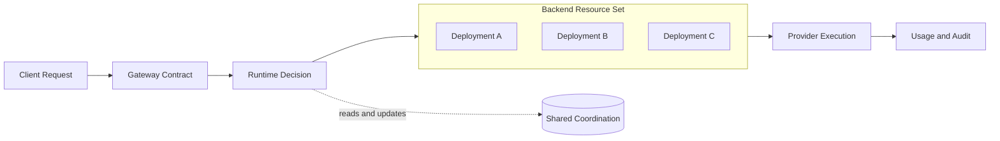
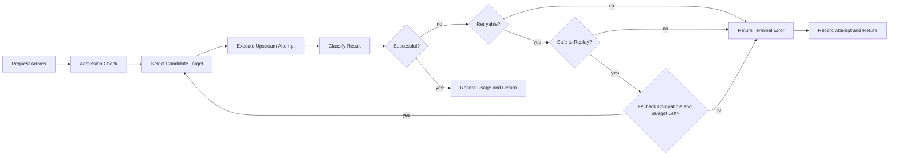
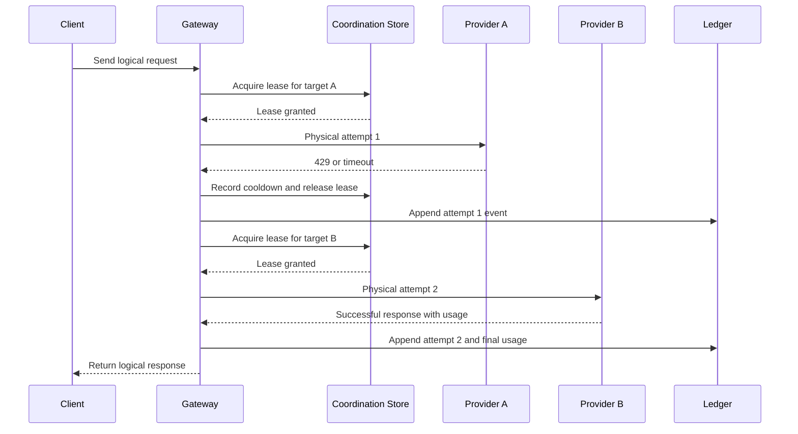
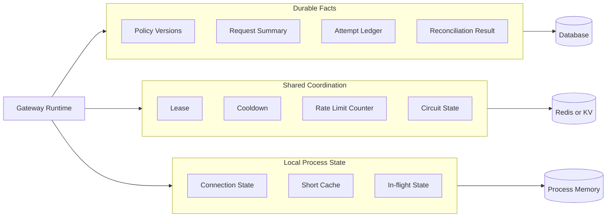
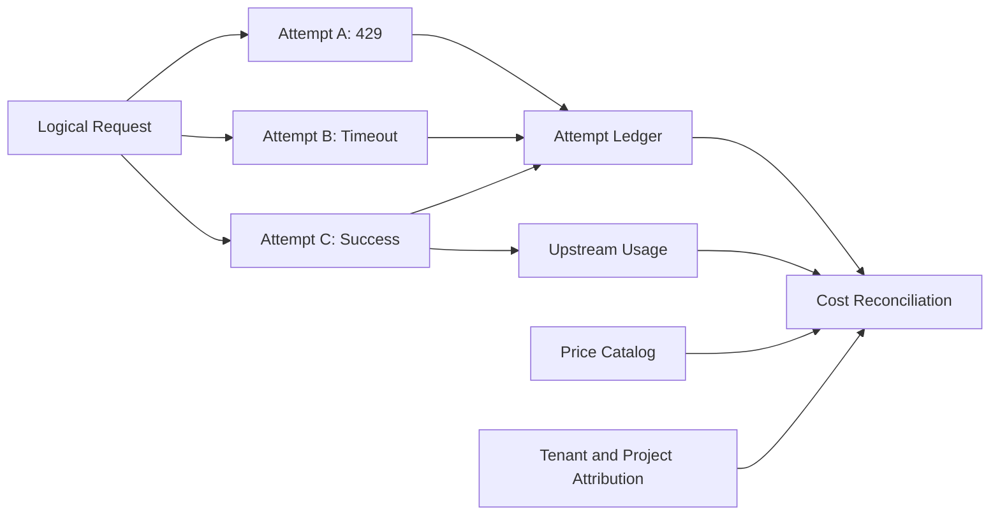

“The model is down. Why not just switch to another one?”

When there is only one model, one credential resource, and one caller, that is more or less the right answer. Send the request, wait for the response, and let the client try again if it fails. The system is simple because the problem is simple.

That answer stops being enough once the models and resources multiply.

Which deployment should receive the request? If one credential resource is rate-limited, can another candidate resource take over? Does the backup model support the original request's tool calls and context length? Once streaming has started, can the request be sent again? If the upstream has already executed the request but the response timed out on the way back, will a retry execute the action twice?

Taken together, these questions turn an AI Gateway into more than a “unified entry point.” It chooses between callers and model resources, and it must leave behind records that make those choices explainable.



The useful question is not which AI Gateway is best. It is what happens along one request: what decisions does the Gateway make for its callers, which questions do the public designs of LiteLLM, Portkey, Helicone, and Azure put first, and what separates a basic design from an enterprise platform?

## 1. AI Gateway faces a set of backend resources, not one model

This section establishes the resource model. Whenever the article discusses routing, rate limits, or fallback, it returns to the same question: what exactly is the Gateway managing, and which resources can actually substitute for one another?

A traditional API Gateway also handles authentication, routing, rate limiting, caching, and load balancing. The special difficulty in an AI Gateway is not that it rearranges those familiar terms. It is that the resources consumed by an AI request, and the meaning of its failures, are harder to describe with one number.

### 1.1 AI capacity is not measured in request count alone

A request may carry a very long context and may produce a very long output. Equal request counts do not imply equal consumption, so RPM is only one part of the picture; TPM, context windows, concurrency, and budget matter too.

### 1.2 A model name is not an execution target

A model name does not necessarily identify the actual execution target. The same public model may correspond to deployments in different regions, different API keys, or even different providers. The caller wants a stable model name; the Gateway has to choose among several concrete resources behind it.

### 1.3 Failures and side effects are resource constraints too

Failures cannot be classified by HTTP status alone. A 429 may be a transient rate limit or an exhausted quota window. A 401 may only mean that the current credential is invalid. A timeout may happen before the request is sent, after the upstream has executed it but before the response returns, or after streaming has already begun.

Tool calls and other side effects add another boundary. Sending a failed request again may cost a little more, or it may execute the same action twice.

An AI Gateway is therefore not just several SDKs behind one endpoint. It maintains a stable contract between callers and model resources while handling the boundaries of selection, capacity, and failure.

## 2. The runtime decision chain of one request

This section focuses on decisions in the request path: whether the request may enter, which target should receive it, whether execution can continue after a failure, and when it must stop.

Once a request is split into stages, the Gateway's work becomes less mysterious.

### 2.1 Entry, admission, and backend selection

First comes identity. Who is calling, which models may they use, and which team or project should receive the usage? If every caller shares an undifferentiated key, quota, audit, and failure attribution all become vague.

Next comes model matching. The caller provides a model name; the Gateway must find the corresponding provider, region, version, and candidate resources. Sometimes the name directly identifies a provider. Sometimes it is only an alias that a policy must interpret.

Then comes capacity admission. A target selected by routing policy is not necessarily able to accept the request right now. The Gateway must also check global concurrency, deployment RPM/TPM, credential state, session limits, and budget.

Only then does it choose a concrete resource. It may use priority, round-robin selection, weights, latency, cost, or session affinity. Priority is easy to explain. Latency and cost are more flexible, but they require current data and can create a feedback loop: the fastest target receives more traffic, then stops being fast as its traffic grows.

Execution is not just forwarding a request body. Authentication, model names, tool formats, streaming events, error structures, and token accounting can differ across providers. The Gateway has to hide those differences behind the downstream contract.

Finally comes failure classification and result recording. The Gateway needs to know whether a failure affects the caller, the current credential resource, the current deployment, or the provider as a whole. It also needs to record which physical attempts a logical request went through, whether it switched targets, and how many resources it ultimately consumed.

If all that survives is a “request failed” log, the system may run, but it will be difficult to explain.

The decision chain below separates the independent questions behind “can this request switch targets?” The Gateway does not keep trying whenever it sees an error. It first checks the error category, execution stage, target compatibility, and remaining budget.



### 2.2 What public designs put first

LiteLLM's routing documentation organizes calls around model groups and deployments, and discusses weights, latency routing, maximum concurrency, cooldown, and fallback. It is useful for understanding how a Gateway manages multiple concrete deployments behind a unified interface. [LiteLLM Routing](https://docs.litellm.ai/docs/routing)

Portkey presents something closer to a composable policy tree. A target can be a provider, or another load-balancing or fallback policy, which allows a configuration such as “load-balance across a group of keys, then switch providers if that group fails as a whole.” [Portkey AI Gateway](https://portkey.ai/docs/product/ai-gateway) [Portkey Fallbacks](https://portkey.ai/docs/product/ai-gateway/fallbacks)

Helicone is closer to an observability and operations platform, but it puts another question in the foreground: after a request is sent, the system should know which path it took, what it consumed, what it cost, and whether the failure came from the Gateway or the upstream. [Helicone GitHub](https://github.com/Helicone/helicone)

Azure's multi-backend AI Gateway architecture describes token throttling, backend load balancing, health checks, and circuit breaking as separate concerns. [Azure AI Gateway architecture](https://learn.microsoft.com/en-us/azure/architecture/ai-ml/guide/azure-openai-gateway-guide) That distinction is useful because product pages often call all of them “reliability,” even though they govern different kinds of state.

These sources are not a strict comparison of products from the same category. LiteLLM and Portkey are useful references for routing and failure policy; Helicone is useful for request records, cost, and call chains; Azure is closer to a backend-governance architecture reference. Putting them together is not a ranking exercise. It is a way to see how many different kinds of work sit underneath the four words “AI Gateway.”

### 2.3 Resource shape determines whether switching is needed

There is an easy concept to conflate here: whether an AI Gateway needs to switch depends on the shape of the resources it manages.

If the system has only one provider and one deployment, the caller may not need the Gateway to switch backends at all. The Gateway can focus on protocol normalization, authentication, permissions, rate limits, audit, and cost accounting; the upstream service can own capacity and availability.

If the system has multiple deployments, regions, or providers, switching becomes an ordinary reliability and governance capability. For example:

```text
同一模型
  ├── Azure East US
  ├── Azure West Europe
  ├── OpenAI
  └── Bedrock
```

The reasons may include:

- insufficient capacity in the current region;
- a failed health check for one deployment;
- cross-region disaster recovery;
- data residency or compliance requirements;
- cost policy;
- provider-level failover.

This is different from switching inside a credential resource pool. A credential resource pool asks whether the current resource still has quota, concurrency, and valid authorization. An enterprise Gateway asks which backend satisfies the request's region, capability, service level, and budget constraints.

Both may use retry, cooldown, fallback, and health checks, but they switch different things:

| Scenario | Switching object | Primary concern |
| --- | --- | --- |
| Credential resource pool | API key, OAuth credential, subscription resource | Rate limits, quota, credential state, resource concurrency |
| Enterprise multi-backend Gateway | Deployment, region, provider, cloud endpoint | Disaster recovery, capacity, compliance, cost, and SLA |
| Single-backend proxy | Usually no switching | Protocol normalization, authentication, measurement, and audit |

“Supports fallback” therefore does not automatically mean “this is a credential pool.” Public Gateways commonly use fallback for service governance across deployments or providers; a credential resource pool is only one more specific resource implementation.

Switching should not become the default action. The Gateway should switch only when the backup backend supports the required model capability, tools, context, streaming protocol, and data region, and when the request is still safe to replay. Otherwise, continuing to switch only adds cost and uncertainty.

When these public designs are placed next to this resource-scheduling model, the main difference is not the name of the algorithm. It is what the system treats as its core resource:

| Design emphasis | Core resource | Main question |
| --- | --- | --- |
| LiteLLM | model group / deployment | How should multiple providers and deployments be called and routed? |
| Portkey | config / target / policy | How should fallback, load balancing, and conditional policy compose? |
| Helicone | provider / model / metrics | How should latency, cost, quality, and call chains be observed? |
| Bifrost | virtual key / model catalog / provider key | How should governance routing adapt across providers and keys? |
| Resource-pool Gateway | pool / credential / deployment | How should credential state, quota, leases, and resource failures converge? |

These capabilities can be combined, but they do not replace one another. A resource-pool Gateway treats credentials and backend resources as runtime resources; an enterprise platform adds tenants, budgets, compliance, and organizational governance on top. Conversely, if a cloud platform already manages deployments and quotas, credential rotation is no longer the central problem. The Gateway's focus shifts toward identity, measurement, cost, and backend resilience.

### 2.4 Retry, cooldown, and fallback are different

These terms often appear next to one another in product documentation, but they should be separated in engineering design.

Retry tries the current request against the current target again. It usually handles transient network errors, connection timeouts, or explicitly recoverable failures.

Cooldown temporarily removes an unreliable target from the candidate set. It affects later requests, not necessarily only the request that triggered it.

Fallback moves the current request to another target. That target may be another key, deployment, provider, or even model. The Gateway needs to know whether the backup is compatible and which failures justify switching.

A circuit breaker is a more explicit traffic state machine: after failures cross a threshold, it opens; after a period, it enters half-open; a probe then decides whether traffic can recover. It may coexist with cooldown, but the two mechanisms should not be treated as synonyms.

| Mechanism | What it changes | Question it must answer |
| --- | --- | --- |
| Retry | Attempt count for the current request | Can this request still be replayed safely? |
| Cooldown | The candidate set for later requests | How long should this target stay out? |
| Fallback | The target for the current request | Does the new target preserve the required semantics and capabilities? |
| Circuit breaker | Admission state for a stream of traffic | When should it open, probe, and recover? |

Client retry answers “can I ask the Gateway again?” Gateway retry answers “can this logical request safely continue within the backend resource pool?” When a 429 appears, the system cannot treat it as simply “try again.” It must ask who returned it, whether Retry-After is meaningful, whether the current resource's window is exhausted, whether that resource should be cooled down, and whether another deployment for the same model is available.

The same reasoning applies to other failures. A 401 may require credential refresh, but the same invalid credential should not be retried forever. A 403 usually indicates a permission, region, or subscription constraint; switching providers may not help. A timeout requires checking whether the request was sent, whether the upstream may have executed it, and whether streaming has started. Invalid parameters, an unknown model, and an overlong context should normally be returned to the caller. Error classification exists to decide whether a request can still be replayed safely, not to make error names more elaborate.

### 2.5 Where fallback goes wrong

Suppose the first target is a deployment at provider A and the second is a compatible model at provider B. After A fails, the Gateway cannot simply throw the request at B.

It must first confirm at least four things: the failure happened at a replayable stage; the policy allows this failure category; the backup has not already been tried; and the request chain is still within its physical-attempt budget.

If SSE or WebSocket has already emitted the first part of the output, switching to B may concatenate two response streams for the client. Even if the Gateway retains the full context, it does not know from which generation state B should continue, and it cannot guarantee that a tool call has not already executed. If the request parameters are invalid, switching providers will not make the request valid.

Fallback is therefore a protocol-aware decision:

```text
Failure
  ├─ Invalid request?        → stop
  ├─ Output already started? → stop or surface error
  ├─ Retryable here?         → retry within budget
  ├─ Target unhealthy?       → cooldown / remove target
  ├─ Fallback allowed?       → move to next target
  └─ Otherwise               → terminal error
```

A fallback graph must not contain cycles. Validate it at configuration time and use a total attempt limit at runtime as a second guard. A backup model that does not support the original request's tools, context, or streaming protocol should never enter the candidate set. If multiple providers can incur cost, record them as multiple physical attempts under one logical request rather than preserving only the final success.

The client should not maintain attempt counts by incrementing a request header. The Gateway should maintain its own attempt budget, set of tried targets, and remaining time budget for every logical request. In addition to `max_total_attempts`, it should usually limit attempts per resource or target; otherwise, a fallback chain that looks finite can still consume time and quota repeatedly on the same resource.

Request-level attempt tracking is not the same as business idempotency. The Gateway can use a logical request ID to connect physical attempts and an attempt ID to distinguish each send. But if the request triggers a tool or another external side effect, the business layer still needs an Idempotency-Key or an idempotent executor. The Gateway cannot prove that an upstream did not execute after a timeout. It can only mark the state as unknown, restrict transparent retries, and pass that uncertainty upward.

The key point of fallback is not “send the request again.” It is to connect multiple physical attempts under the same logical request. The sequence below also shows why cooldown and leases need shared state: multiple Gateway replicas must converge on the same judgment about a target.



## 3. The Gateway's state and consistency model

Runtime policy is explainable only when state boundaries are clear. This section separates durable facts, shared coordination state, and process-local temporary state, then discusses leases, cooldown, audit, and failure-mode trade-offs.

### 3.1 How three kinds of state divide the work

An AI Gateway encounters at least three kinds of state.

Resource configuration, routing policy, audit records, and final request events are durable facts that should survive a service restart. Leases, cooldowns, rate-limit counters, session affinity, and short-lived locks are coordination state: they must be fast, atomic, expiring, and visible to every replica. The current request, connections, and some caches are process state. They can be fast, but they cannot pretend to be global facts.

```text
Durable Facts       → database
Distributed State   → shared coordination store
Process State       → local memory
```

This is not a hard split by technology name. It is a split by recoverability and cross-replica sharing: durable facts must be reconstructable, shared coordination must be atomically updated, and process state must be allowed to disappear.



Failure policy should follow the state type. Leases, permissions, and locks that prevent duplicate execution generally need to fail closed. Ordinary caches and some observability metrics may fail open. Usage or audit events that cannot be written should not disappear silently; they should enter a pending-reconciliation state.

The important question is not the fixed answer of “database or Redis.” It is who owns the write.

### 3.2 How leases, cooldown, and audit converge

If leases are written to the database, the request path takes on more latency and lock contention. If audit exists only in process memory, a restart makes the previous request impossible to explain. If every replica maintains resource cooldown independently, the replicas may still overwhelm an upstream that is already constrained.

A practical division is to keep configuration and final facts in the database, shared request-path coordination in a fast shared store, and only disposable short-lived state in process memory.

Leases belong in the shared coordination layer. When a resource is acquired, an atomic operation in the shared store checks concurrency, cooldown, and exclusion conditions, then writes a lease with an expiration. The lease holder renews it periodically and releases it idempotently when the request finishes. Every Gateway replica then sees the same capacity state, while expiration recovers capacity after a process crash. To stop a late request from overwriting newer state, leases and resource state also need version information and concurrency protection.

Audit should not depend on transient records in the coordination layer, and it should not be written only to local memory. After a request completes, the system can append to a durable, replayable event record and have an idempotent consumer persist it to the database. The logical request, every physical attempt, token usage, and final state remain connected. If the consumer restarts, events can be replayed instead of losing the cost and failure chain.

Cooldown must be shared, but not every part of it has to live in the same store. The request path can use shared expiration to exclude cooling resources quickly; the database can retain durable resource state, failure reasons, backoff level, and version. A short provider-level cooldown may exist only in the coordination layer, while facts such as a disabled resource, invalid credential, or exhausted quota should be persisted. Replicas then avoid contradictory decisions, and recovery can continue after a restart.

### 3.3 What to do when coordination storage fails

Coordination-storage failure cannot be handled by one global switch. Resource leases, global concurrency, security permissions, and locks that prevent duplicate execution should generally fail closed. Ordinary caches, latency metrics, and non-critical traffic shaping may fail open. Even when requests are allowed to continue, usage or audit events that could not be written should be marked for reconciliation rather than silently discarded.

This is where an AI Gateway starts to separate from an ordinary proxy: it does not only forward data; it has to draw the boundary between durable facts, distributed coordination, and process state.

## 4. The Gateway's measurement ledger: from request success to cost reconciliation

A successful request is a runtime result, not a governance result. This section explains how to preserve the full attempt chain and connect estimated usage, upstream usage, failure cost, and tenant attribution.

### 4.1 Why the final response is not enough

If we move from a single request to the company as a whole, the AI Gateway has another equally important responsibility: measurement and governance.

An enterprise usually wants to know more than whether a request succeeded. It wants to know who initiated it, which team and project owned it, which model it used, how many tokens it consumed, how many retries it took, and where the cost should be assigned.

The chain looks roughly like this:

```text
用户 / 团队 / 项目
        ↓
模型 / Provider / deployment / 区域
        ↓
输入 token / 输出 token / 缓存 token
        ↓
重试 / fallback / 失败尝试
        ↓
价格和预算
        ↓
成本中心、分摊和优化
```

This is the clearest difference between an enterprise Gateway and a simple resource-pool proxy. A resource pool asks “which resource is still available?” An enterprise platform also has to answer “who used what, why did it cost this much, and was the cost worth it?”

The Gateway therefore cannot record only the final response. A request may hit a 429 on target A, time out on target B, and finally succeed on target C. The system needs the full attempt chain to calculate cost correctly, explain latency, and judge the price of the success-rate improvement delivered by fallback.



Usage accounting is not simply token count multiplied by price. The Gateway needs to distinguish estimated tokens from usage returned by the upstream, successful requests from failed attempts, and handle duplicate requests, partial streaming responses, models with no price data, and different provider accounting conventions. Estimates can support admission; actual usage should correct the budget and billing record after completion.

The key is reconciliation with what the upstream actually received, not just counting the final successful response. A request's usage can be divided into four layers: the estimate before sending, facts observed during execution, actual usage returned by the provider, and the confirmation state of the ledger. The estimate can reserve TPM or budget in advance. The provider's input, output, and cached tokens can correct the ledger. If the upstream accepted the request but returned no usage, the system should preserve an “attempted, usage unknown” state for later compensation or manual reconciliation.

Otherwise, A's 429, B's timeout, and C's success collapse into one “successful request.” The user sees success, but the platform loses the cost, latency, and quota consumed by the first two attempts. The success rate looks better while unit cost is understated. The measurement object should be the complete attempt chain under one logical request, not the provider named in the final response.

From this perspective, an AI Gateway has two responsibility lines. One keeps requests reaching the backend reliably. The other turns model usage into attributable, measurable, controllable cost data. The first is runtime scheduling; the second is enterprise governance. With only the first, the system becomes a more complicated proxy. With only the second, it cannot explain why requests fail at peak load.

### 4.2 Storage and runtime cost are part of the Gateway design

The more complete the measurement, the more data the Gateway leaves behind. “Write the logs to a database” is not a sufficient design. First decide which data must be queryable online, which can be processed asynchronously, and which raw content should not be retained long term at all.

A rough capacity model is enough to begin: logical request volume × average physical attempts × event size gives the starting point for raw event volume. Then account for the amplification caused by indexes, replicas, queues, retry buffers, and retention periods. The real question is not whether a database can accept the writes in the quiet case, but whether peak writes, index growth, query patterns, and retention policy remain sustainable.

A practical division is to use Redis or another KV store only for leases, cooldown, rate-limit counters, and short-lived deduplication; use a relational database for tenants, policy versions, request summaries, attempt state, and reconciliation results; and use an event stream or object storage for replayable details archived by day or month. Prompt and response bodies should not automatically be retained with every runtime record unless the business truly needs them and has defined redaction, access control, and retention.

Server cost also follows the data path. Gateway instances are affected by connection count, TLS, serialization, streaming relay, and log writes. Redis is affected by command rate and key count. The database is affected by writes, indexes, and queries. An event stream is affected by throughput and retention. A design that synchronously writes every detail to the primary database may be simple at low traffic, but during a retry storm or upstream outage it can turn the Gateway's own storage path into the next bottleneck.

That is why the first version should preserve the smallest fact set that can explain a decision: logical request, physical attempt, target, error category, timestamps, token-usage state, and final result. Full raw content, debug-level logs, and high-dimensional metrics can be sampled asynchronously or retained briefly. Storage budget is not an operations issue to solve after launch; it is part of whether the Gateway can keep running.

### 4.3 The capability boundary of a basic Gateway

Counting only “how many providers are supported” or “whether fallback exists” mixes capabilities from different layers. A maturity view is more useful:

| Capability | Minimal Gateway | Production Gateway | Platform Gateway |
| --- | --- | --- | --- |
| Unified protocol | Required | Required | Required |
| Model/provider routing | Required | Required | Required |
| Multiple credentials or deployments | Optional | Usually needed | Required |
| RPM / TPM / concurrency limits | Basic limits | Layered limits | Dynamic capacity governance |
| Retry and fallback | Basic support | Error-aware | Composable policy graph |
| Cooldown / circuit breaker | At least one | Clear boundaries | Tunable by region and model |
| Session affinity | Optional | Useful for long context | Linked to cache and quality |
| Usage, cost, and audit | Basic logs | Traceable | Budget, allocation, and settlement loop |
| Latency / cost routing | Not required | Optional | Core capability |
| Cache / guardrails / canary | Not required | Optional | Platform capability |

This table also explains why supporting more providers does not automatically mean stronger scheduling. Provider count measures integration breadth; resource state, failure semantics, and audit determine whether runtime behavior is reliable.

### 4.4 What to solve first

The first version does not need dynamic cost optimization. Start with static policy: match a model to targets, choose by priority or round-robin, and move to a backup target only for a limited set of failures. Static policy is easier to explain and easier to test.

The harder parts come later. Dynamic latency routing is not a foundational requirement of a basic Gateway; it is a runtime policy built on observability and shared state.

If latency routing is introduced, it needs a stable observation window, a minimum sample count, outlier handling, and an update interval. Otherwise, the fastest target keeps receiving more traffic, becomes slower, and causes the router to swing between targets. Cost routing also needs current provider prices and actual token usage, even though both price tables and token conventions may change. A circuit breaker needs explicit open, probe, and recovery states rather than a simple TTL on a failed target.

Fallback can also change model quality. A higher success rate does not necessarily mean a better user experience: the backup model may be slower, more expensive, or unable to support the original tools and context. The Gateway needs to record those changes rather than report only the final 200.

Observability cannot stop at final success rate either. It should answer how many attempts a request took, which targets were rate-limited, at which stage the failure occurred, how often fallback succeeded, which tokens had no price, and where a streaming request was interrupted.

If only three things can be built first, I would start with the request lifecycle, error classification, and request events. Without them, adding more providers or more sophisticated routing only expands the part of the system that cannot be explained.

### 4.5 What decisions should the Gateway own?

The Gateway should not decide which model is “best” for the business. It is better suited to verifiable hard constraints: whether the context is too long, whether a target supports tools and streaming, whether it has capacity, whether the caller is authorized, and whether a failure can still be replayed safely.

The business should express the trade-off between reliability, latency, and cost through policy. An interactive coding request may value latency. A batch job may value cost. A critical task may accept more waiting in exchange for a higher success rate. One Gateway should not apply the same answer to every caller.

If a policy raises logical-request success rate from 95% to 98% but doubles P95 latency and increases the cost of each effective success by 30%, final success rate alone cannot tell us whether it improved the system. We also need to know whether those three points came from genuine backend recovery or from more retries and fallback; whether failed attempts incurred cost; whether they consumed extra quota; and whether the policy will push the system into a capacity bottleneck sooner. The trade-off may be worthwhile only for a particular request type, tenant SLA, budget, and capacity margin.

The Gateway should expose priority, weights, cost ceilings, latency ceilings, fallback switches, and maximum attempts, then record what actually happened. The business decides how to combine those parameters; the Gateway executes them faithfully and makes the result explainable.

This also clarifies several boundaries: multiple credentials are primarily capacity aggregation, not simple round-robin rotation; a 429 must first be attributed to a credential, deployment, or provider; when upstream execution is uncertain, the state should be unknown rather than simply failed; once streaming has begun, transparent switching is usually unsafe; and model quality judgment belongs in the business or a dedicated model-routing layer, while the Gateway checks capability compatibility.

## 5. From a basic Gateway to an enterprise platform

The first four sections describe the problems inside the Gateway. The public-design comparison appears in the runtime section because it helps show what different products emphasize. This final section returns those problems to the enterprise-platform context and separates runtime responsibilities from the control plane, data, and organizational governance they require.

### 5.1 What the enterprise control plane adds

The gap between the public designs and this basic model is not mainly the number of providers it can connect. It is whether the system has a complete governance capability. A basic Gateway asks whether a request can be scheduled correctly. An enterprise platform also manages policy, identity, budget, cost, compliance, and change risk.

The design above is enough to describe a coherent basic Gateway, but it is still short of an enterprise platform. An enterprise version turns these judgments into a configurable, verifiable, reversible, measurable control plane.

First, policy is not business-aware enough. The current discussion includes priority, weight, cost, and latency, but an enterprise system usually binds tenants, data regions, compliance requirements, model capabilities, service levels, and budgets into the same policy. Otherwise, “the business decides the trade-off” remains a principle without a real configuration interface.

Second, dynamic routing lacks a complete feedback controller. Latency, error-rate, and cost routing all depend on observation windows. A short window chases noise; a long window misses failures. An enterprise design also needs sampling rules, cold-start behavior, outlier handling, policy rollback, and protection against concentrating all traffic on one target.

Third, cooldown and circuit breaking need an explicit state machine. When does the circuit open? How long before half-open? Does a probe consume quota? How does traffic ramp back up after recovery? These decisions cannot live only in a TTL or a few if statements.

Fourth, an enterprise system must handle policy versions and configuration changes. Who changed the route, when did it take effect, which requests used the old version, how was it canaried, and how can it be rolled back? All of this needs an audit record. A hot configuration update is a release, not merely a database CRUD operation.

Fifth, cost and usage need a closed loop. The Gateway must distinguish estimated tokens, actual upstream tokens, cache hits, failed attempts, and duplicate requests, then attribute them to tenants, projects, and models. Final success rate without the cost of every physical attempt can make reliability optimization look cheaper by hiding the bill.

Sixth, the security boundary must be more precise. Enterprise designs usually need tenant isolation, key rotation, least privilege, sensitive-data retention rules, regional constraints, prompt/response redaction, and administrator audit. Once the Gateway can see every request, it becomes a high-value data boundary.

Seventh, unit tests are not enough. The system also needs load tests, fault injection, simulated upstream 429/5xx responses, interrupted streams, duplicate side effects, Redis or database failures, multi-replica contention, and recovery drills. Enterprise systems care about how policy converges in bad states, not only whether the happy path returns 200.

These gaps do not mean the basic design is wrong. They show that two boundaries are different: a basic Gateway must make the best possible decision in the request path; an enterprise Gateway must also govern who can make that decision, how it is released, how its effect is evaluated, and how mistakes are rolled back.

## Conclusion: AI Gateway Is a Request-Decision and Resource-Governance Layer

Following one request, an AI Gateway has three main responsibilities: at entry, it checks identity, capability, and capacity; during execution, it selects a backend and controls retry, cooldown, and fallback; after execution, it records the complete attempt chain, usage, and cost.

An AI Gateway is therefore neither a simple forwarding layer nor an intelligent decision-maker that chooses the “best model” for the business. It is a constraint layer between callers and model resources: it places a request into an appropriate resource pool, executes it within acceptable bounds, and turns what happened into traceable, measurable facts.

That boundary also determines what belongs in the Gateway and what does not. The Gateway should own protocol compatibility, resource scheduling, capacity governance, failure convergence, and usage measurement. Model quality, business semantics, prompt policy, and departmental finance processes should consume the data provided by the Gateway at higher layers.

Understanding an AI Gateway is not about memorizing how many providers it supports. It is about being able to follow one request and explain where the system makes a decision, what it uses as evidence, how it converges after failure, and why that state belongs at this layer. The next step is to acknowledge the boundary of the current design: which decisions are executable now, and which still require a control plane, data, and a validation system.

Being able to explain those questions along one request path is the beginning of understanding an AI Gateway.

## References

The following public sources serve as conceptual and architectural references. They are not a strict like-for-like product comparison; the synthesis and judgments below are derived from these sources together with systems-design analysis.

1. [LiteLLM Routing](https://docs.litellm.ai/docs/routing): model groups, deployments, weights, latency routing, concurrency, and cooldown.
2. [LiteLLM GitHub](https://github.com/BerriAI/litellm): an open-source unified model-calling and routing implementation.
3. [Portkey AI Gateway](https://portkey.ai/docs/product/ai-gateway): Gateway configuration, routing, and policy composition.
4. [Portkey Fallbacks](https://portkey.ai/docs/product/ai-gateway/fallbacks): fallback, retry, and layered target selection.
5. [Helicone GitHub](https://github.com/Helicone/helicone): request observability, call chains, and cost-recording direction.
6. [Bifrost GitHub](https://github.com/maximhq/bifrost): virtual keys, model catalogs, and provider/key routing governance.
7. [Azure OpenAI Gateway Architecture](https://learn.microsoft.com/en-us/azure/architecture/ai-ml/guide/azure-openai-gateway-guide): multi-backend access, throttling, load balancing, and health governance.
8. [Azure OpenAI Multi-backend Gateway](https://github.com/microsoftdocs/architecture-center/blob/main/docs/ai-ml/guide/azure-openai-gateway-multi-backend.md): an architecture example covering token throttling, backend load balancing, health checks, and circuit breaking.
