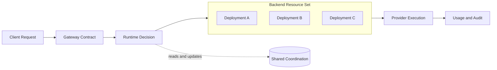
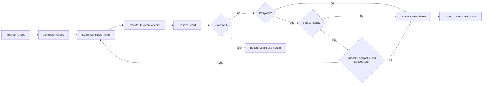
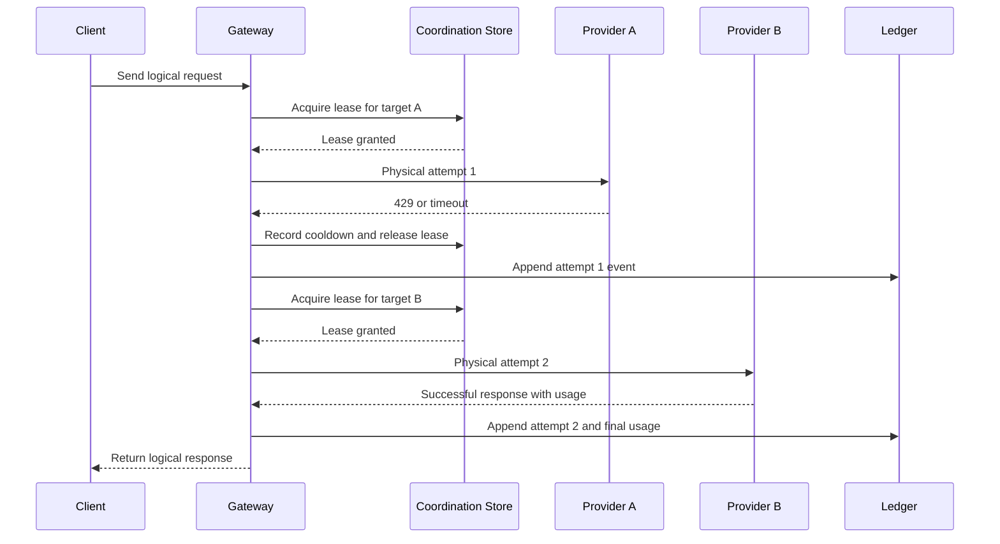
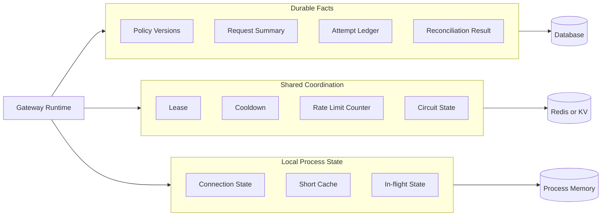
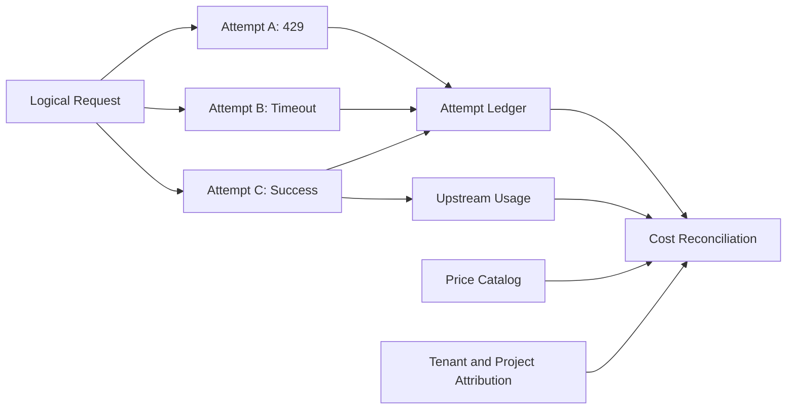

“这个模型挂了，换一个不就好了？”

在只有一个模型、一个凭证资源、一个调用方的时候，确实差不多就是这样。请求发出去，等响应回来；失败了，客户端再试一次。系统简单，问题也简单。

但一旦模型和资源变多，这句话就不够用了。

请求应该发给哪个 deployment？一个凭证资源被限流之后，能不能换另一个候选资源？备用模型是否支持原请求里的工具调用和上下文长度？响应已经开始流式输出以后，还能不能再发一次？如果上游已经执行了请求，只是响应在路上超时了，重试会不会把动作执行两遍？

这些问题叠在一起，AI 网关就不再只是一个“统一入口”。它在调用方和模型资源之间做选择，也要为这些选择留下可以解释的记录。



问题不在于先回答“哪个 AI 网关最好”，而在于沿着一次请求把问题拆开：网关究竟替调用方做了哪些决定，LiteLLM、Portkey、Helicone 和 Azure 的公开方案分别把哪些问题放在了前面，以及一个基础设计距离企业级平台还差什么。

## 一、AI Gateway 面对的不是一个模型，而是一组后端资源

这一部分先建立资源模型。后文讨论路由、限流和 fallback 时，都会回到同一个问题：网关究竟在管理什么资源，以及资源之间能否互相替代。

传统 API Gateway 也会做认证、路由、限流、缓存和负载均衡。AI 网关的特别之处，不在于它把这些词重新组合了一遍，而在于 AI 请求的资源和失败都更难用一个数字描述。

### 1.1 AI 请求的容量单位不是请求次数

一个请求可能带着很长的上下文，也可能产生很长的输出。请求次数相同，不代表消耗相同，所以 RPM 之外还要考虑 TPM、上下文窗口、并发和预算。

### 1.2 模型名不等于执行目标

模型名也不一定等于执行目标。同一个公开模型，可能对应不同区域的 deployment、不同的 API Key，甚至是不同的供应商。调用方只想要一个稳定的模型名，网关却要在多个实际资源之间作出选择。

### 1.3 失败和副作用也是资源约束

失败也不能只看 HTTP 状态码。429 可能是瞬时限流，也可能是一个配额窗口已经用完；401 可能只说明当前凭证失效；超时可能发生在请求尚未发出、上游已经执行但响应未返回，或者流式输出已经开始之后。

还有工具调用和其他副作用。把一次失败请求再发一遍，有时只是多花了一点钱，有时却可能执行两次动作。

所以，AI 网关不是把几个 SDK 包成一个入口。它要在调用方和模型资源之间维护一份稳定的契约，同时处理资源选择、容量和失败的边界。

## 二、一次请求的运行时决策链

这一部分只讨论请求路径上的决定：请求能不能进入、应该选择谁、失败后能否继续，以及什么时候必须停止。

把一次请求拆开以后，网关的工作就没有那么神秘了。

### 2.1 入口、准入与后端选择

首先是身份。调用方是谁，能使用哪些模型，应该把多少用量归到哪个团队或项目？如果所有调用都共享一个无法区分的 Key，后面的配额、审计和故障归因都会变得模糊。

接下来是模型匹配。调用方给的是一个模型名，网关要找到对应的 provider、区域、版本和候选资源。有时模型名还能直接决定 provider；有时它只是一个需要经过策略解释的别名。

然后是容量准入。一个目标被路由策略选中，不代表它现在就有能力接收请求。网关还要检查全局并发、deployment 的 RPM/TPM、凭证状态、会话限制和预算。

再往后才是具体资源选择。这里可以使用优先级、轮询、权重、延迟、成本或会话亲和性。优先级容易解释，延迟和成本更灵活，但它们需要实时数据，也容易形成反馈回路：越快的目标越容易得到更多流量，流量变多后又不再快。

执行阶段也不只是转发 body。不同 provider 的认证方式、模型名、工具格式、流式事件、错误结构和 token 统计可能都不一样。网关要把这些差异藏在下游契约后面。

最后是失败分类和结果记录。网关要知道失败影响的是调用方、当前凭证资源、当前 deployment，还是整个 provider；还要记录一次逻辑请求经历了哪些物理尝试，是否切过目标，最终使用了多少资源。

如果这些信息只留下一个“请求失败”的日志，系统可以运行，却很难解释。

下面这条决策链把“能不能切换”拆成了几个独立判断。网关不是遇到任何错误都继续尝试，而是先判断错误类别、执行阶段、目标兼容性和剩余预算。



### 2.2 公开方案各自把什么问题放在前面

LiteLLM 的路由文档把调用组织成 model group 和 deployment，并讨论权重、延迟路由、最大并发、cooldown 和 fallback。它适合用来理解：统一接口之后，网关怎样管理多个实际部署。[LiteLLM Routing](https://docs.litellm.ai/docs/routing)

Portkey 的表达方式更像一个可以组合的策略树。目标可以是 provider，也可以是另一个负载均衡或 fallback 策略，于是可以表达“先在一组 Key 里负载均衡，这一组整体失败后再换 provider”。[Portkey AI Gateway](https://portkey.ai/docs/product/ai-gateway) [Portkey Fallbacks](https://portkey.ai/docs/product/ai-gateway/fallbacks)

Helicone 更接近可观测性和运营平台，但它把另一个问题放到了前面：请求发出去之后，系统要知道它走了哪条路径、消耗了什么、花了多少，以及失败到底来自网关还是上游。[Helicone GitHub](https://github.com/Helicone/helicone)

Azure 的多后端 AI Gateway 架构则把 token 限流、后端负载均衡、健康检查和 circuit breaking 分开描述。[Azure AI Gateway architecture](https://learn.microsoft.com/en-us/azure/architecture/ai-ml/guide/azure-openai-gateway-guide) 这件事对我很有帮助，因为产品页面常常把它们统称为“可靠性”，但它们处理的并不是同一种状态。

这些资料不是同一类产品的严格测评。LiteLLM 和 Portkey 更适合拿来理解路由与故障策略，Helicone 更适合观察请求记录、成本和调用链，Azure 更像一份后端治理的架构参照。把它们放在一起，不是为了排一个名次，而是为了看清楚“AI 网关”这四个字下面其实压着几类不同的工作。

### 2.3 资源形态决定是否需要切换

这里有一个容易混在一起的概念：AI 网关是否需要切换，取决于它面对的资源形态。

如果系统只有一个 Provider、一个 deployment，调用方通常不需要网关做后端切换。网关可以专注于统一协议、认证、权限、限流、审计和成本统计；上游服务本身负责容量和可用性。

如果系统有多个 deployment、区域或 Provider，切换就变成了正常的可靠性和治理能力。例如：

```text
同一模型
  ├── Azure East US
  ├── Azure West Europe
  ├── OpenAI
  └── Bedrock
```

这时切换可能是为了：

- 当前区域容量不足；
- 某个 deployment 健康检查失败；
- 跨区域容灾；
- 数据驻留或合规要求；
- 成本策略；
- 供应商级故障转移。

这和凭证资源池里的切换不是一回事。凭证资源池更关心“当前资源还有没有配额、并发和有效授权”；企业网关更关心“哪个后端满足当前请求的区域、能力、服务等级和预算约束”。

两者都可能使用 retry、cooldown、fallback 和健康检查，但切换对象不同：

| 场景 | 切换对象 | 主要原因 |
| --- | --- | --- |
| 凭证资源池 | API Key、OAuth 凭证、订阅资源 | 限流、quota、凭证状态、资源并发 |
| 企业多后端网关 | deployment、区域、Provider、云端点 | 容灾、容量、合规、成本和 SLA |
| 单后端代理 | 通常不切换 | 统一协议、认证、度量和审计 |

因此，不能把“支持 fallback”直接等同于“这是一个凭证池”。公开 Gateway 常见的 fallback 是跨 deployment 或 Provider 的服务治理；凭证资源池只是其中一种更具体的资源实现。

但切换也不应该成为默认动作。只有在备用后端满足模型能力、工具、上下文、流式协议和数据区域要求，并且请求还处于可安全重放的阶段时，网关才应该切换。否则，继续切换只是在增加成本和不确定性。

把几类公开方案和这种资源调度思路放在一起看，差异主要不在算法名称，而在系统把什么当成核心资源：

| 方案侧重点 | 核心资源 | 更关心的问题 |
| --- | --- | --- |
| LiteLLM | model group / deployment | 多 Provider 统一调用和部署级路由 |
| Portkey | config / target / policy | fallback、负载均衡和条件策略如何组合 |
| Helicone | provider / model / metrics | 延迟、成本、质量和调用链如何观测 |
| Bifrost | virtual key / model catalog / provider key | 治理路由和 Provider、Key 两级自适应调度 |
| 资源池型网关 | pool / credential / deployment | 凭证状态、配额、租约和资源级故障如何收敛 |

这几类能力可以组合，但不能互相替代。资源池型网关把凭证和后端资源当成运行时资源；企业平台还要在上面补充租户、预算、合规和组织治理。相反，如果企业已经由云平台管理 deployment 和配额，凭证轮换就不是最主要的问题，网关的重点会转向身份、度量、成本和后端容灾。

### 2.4 Retry、cooldown、fallback 不是一件事

这几个词在产品文档里经常挨在一起，工程上却最好分开。

Retry 是当前请求对当前目标再试一次。它通常处理瞬时网络错误、连接超时或明确可恢复的错误。

Cooldown 是暂时把一个不可靠的目标从候选集合里拿开。它影响之后的请求，不一定只影响触发它的这一个请求。

Fallback 是换到另一个目标，可能是另一个 Key、deployment、provider，甚至是另一个模型。它需要知道备用目标是否兼容，也需要知道什么失败才值得切换。

Circuit breaker 是更明确的流量状态机：失败达到阈值后打开，过一段时间进入 half-open，再通过探测决定是否恢复。它可以和 cooldown 一起存在，但不应该把两个词当成同一个机制。

| 机制 | 它改变什么 | 要回答的问题 |
| --- | --- | --- |
| Retry | 当前请求的尝试次数 | 这次请求还能安全重发吗？ |
| Cooldown | 后续候选集合 | 这个目标多久不再参与选择？ |
| Fallback | 当前请求的目标 | 换目标后，语义和能力还成立吗？ |
| Circuit breaker | 一段流量的通行状态 | 什么时候打开、探测和恢复？ |

客户端重试解决的是“还能不能重新请求网关”，网关重试解决的是“这次逻辑请求能不能在后端资源池内安全地继续完成”。遇到 429 时，系统不能只把它当成“再试一次”。还要判断：429 是谁返回的，Retry-After 有没有意义，当前资源的窗口是否耗尽，是否应该暂时冷却它，是否可以切换到同一模型的另一个 deployment。

同样的判断也适用于其他失败。401 可能需要刷新凭证，但不应该对同一份失效凭证无限重试；403 通常表示权限、区域或订阅不允许，换 Provider 不一定有用；超时要先判断请求是否已经发出、上游是否可能已经执行，以及响应是否已经开始；参数错误、模型不存在、上下文超限这类失败则应该直接返回调用方。错误分类的目的不是让错误名称更丰富，而是决定一次请求还能不能安全地重放。

### 2.5 Fallback 最容易出错的地方

假设第一目标是 provider A 的一个 deployment，第二目标是 provider B 的兼容模型。A 失败后，网关不能直接把请求丢给 B。

它至少要先确认四件事：失败发生在允许重放的阶段；失败类别被当前策略允许；备用目标还没有被尝试过；整条请求链没有超过物理尝试预算。

如果 SSE 或 WebSocket 已经发出了第一段输出，再切换到 B，客户端可能收到两个响应流拼接在一起。网关即使保留了完整上下文，也不知道 B 应该从 A 的哪个生成状态继续，更无法保证工具调用没有已经执行。如果只是请求参数错误，换 Provider 也不会让请求变正确。

所以 fallback 更像一个带有协议语义的决策过程：

```text
Failure
  ├─ Invalid request?        → stop
  ├─ Output already started? → stop or surface error
  ├─ Retryable here?         → retry within budget
  ├─ Target unhealthy?       → cooldown / remove target
  ├─ Fallback allowed?       → move to next target
  └─ Otherwise               → terminal error
```

fallback 链不能允许环，应该在配置阶段校验，并在运行时用总尝试次数兜底。备用模型如果不支持原请求要求的工具、上下文或流式协议，就不应该进入候选集合。多个 provider 都产生费用时，系统要把它们记录为同一个逻辑请求下的多次物理尝试，而不是只保留最后一次成功。

尝试次数也不能由客户端通过请求头自行累加。网关应该为每个逻辑请求维护自己的 attempt budget、已尝试目标集合和剩余时间预算。除了 `max_total_attempts`，通常还需要限制单个资源或单个 target 的尝试次数；否则一个看似有限的 fallback 链仍然可能在同一资源上反复消耗时间和配额。

请求级的尝试记录也不等于业务幂等。网关可以用 logical request id 把多个物理尝试串起来，用 attempt id 区分每一次发送；但如果请求会触发工具或其他外部副作用，还需要业务侧提供 Idempotency-Key 或幂等执行器。网关无法证明上游在超时后一定没有执行，只能把状态标记为未知、限制透明重试，并把这个不确定性传给上层。

一次 fallback 的关键不是“把请求再发一次”，而是把同一个逻辑请求下的多次物理尝试串起来。下面的时序图也展示了为什么冷却和租约需要共享状态：多个网关副本必须对同一个目标形成一致判断。



## 三、网关的状态与一致性模型

运行时策略只有在状态边界清楚时才可解释。这里把持久事实、共享协调状态和进程内临时状态拆开，讨论租约、冷却、审计以及故障时的取舍。

### 3.1 三类状态如何分工

网关至少会遇到三类状态。

资源配置、路由策略、审计记录和最终请求事件属于持久事实，服务重启后还应该存在。租约、冷却、限流计数、会话亲和和短期锁属于协调状态，需要快速、原子、可过期，并且要让多个副本看见同一份结果。当前请求、连接和部分缓存则属于进程状态，它们可以很快，但不能冒充全局事实。

```text
Durable Facts       → database
Distributed State   → shared coordination store
Process State       → local memory
```

这不是按技术名词硬分层，而是按失败后能否恢复、是否需要跨副本共享来分层：持久事实要能重建，共享协调要能原子更新，进程状态则必须允许丢失。



故障策略也应该跟着状态类型走：租约、权限和防重复执行锁通常需要 fail-closed；普通缓存和部分观测指标可以 fail-open；无法写入的用量与审计事件则不能静默丢失，而应进入待对账状态。

这里真正重要的不是“数据库还是 Redis”这个固定答案，而是谁拥有写入权。

### 3.2 租约、冷却与审计如何收敛

如果把租约写进数据库，请求路径会承受更多延迟和锁竞争；如果把审计只放在进程内存里，进程一重启就无法解释刚才发生过什么。如果每个副本都各自维护资源冷却，多个副本加起来可能仍然把同一个已经受限的上游打爆。

一个比较实际的分工是：数据库保存配置和最终事实，Redis 负责请求路径上的共享协调，进程内存只保存可以丢失的短期状态。

租约应该放在共享协调层。获取资源时，通过共享存储中的原子操作检查并发、冷却和排除条件，再写入带过期时间的 lease；租约持有者定期续租，完成请求后由持有者幂等释放。这样多个网关副本看到的是同一份容量状态，进程崩溃时过期机制也能把没有释放的容量收回来。为了防止旧请求晚到后覆盖新状态，租约和资源状态还需要带版本信息，更新时做并发保护。

审计则不应该依赖共享协调层里的瞬时记录，更不能只写进本地内存。请求完成后，可以先把事件写入可持久化、可重放的事件记录，再由消费者以幂等方式落到数据库；逻辑请求、每次物理尝试、token 使用和最终状态都保留关联关系。这样即使消费者重启，事件也能重放，而不是因为一次进程故障丢掉成本和故障链。

冷却状态需要共享，但不一定所有内容都只放在同一种存储里。请求路径可以用共享状态的过期机制快速排除冷却中的资源，数据库保存资源的持久状态、失败原因、退避级别和版本。短暂的 provider 级冷却可以只由共享协调层维护；资源被禁用、凭证失效或 quota 耗尽这类事实则应该落库。不同副本因此不会各自做出相反判断，恢复过程也能在重启后继续。

### 3.3 协调存储故障时如何取舍

如果协调存储故障，也不能所有能力都用同一个开关处理。资源租约、全局并发、安全权限和防止重复执行的锁通常应该 fail-closed；普通缓存、延迟指标和非关键的流量塑形可以考虑 fail-open。即使允许请求继续，无法写入的 usage 或审计事件也应该标记为待对账，而不能悄悄丢掉。

这也是 AI 网关和普通代理开始拉开距离的地方：它不只是转发数据，还要把持久事实、分布式协调和进程状态的边界划清楚。

## 四、网关的度量账本：从请求成功到成本对账

请求成功只是运行时结果，不是治理结果。本部分讨论如何保存完整尝试链，并把预估用量、上游实际用量、失败成本和租户归因连接起来。

### 4.1 最终响应为什么不够

如果把视线从单个请求移到公司整体，AI 网关还有一条同样重要的线：度量和治理。

企业通常不只想知道“这次请求成功了吗”，还想知道请求是谁发起的、属于哪个团队和项目、用了什么模型、消耗了多少 token、经过了几次重试，以及最终应该把成本记到哪里。

这条链路大概是：

```text
用户 / 团队 / 项目
        ↓
模型 / Provider / deployment / 区域
        ↓
输入 token / 输出 token / 缓存 token
        ↓
重试 / fallback / 失败尝试
        ↓
价格和预算
        ↓
成本中心、分摊和优化
```

这也是企业网关和一个单纯的资源池代理之间最明显的区别。资源池更关心“还有哪个资源能用”；企业平台还要回答“谁用了什么资源，为什么花了这么多，以及这笔成本是否值得”。

因此，网关记录的不能只有最终响应。一次请求可能先在目标 A 上遇到 429，再在目标 B 上超时，最后由目标 C 返回成功。系统需要保留这条尝试链，才能正确计算成本、解释延迟，也才能判断 fallback 提高成功率的代价。



用量统计本身也不是把 token 数乘以价格这么简单。网关需要区分预估 token 和上游返回的实际 token，区分成功请求和失败尝试，处理重复请求、部分流式响应、没有价格数据的模型，以及不同 Provider 的 token 统计口径。预估值可以用于准入，实际值则应该在请求完成后修正预算和计费记录。

这里的关键是和上游发生过的实际调用对账，而不是只统计最后一次成功响应。可以把一条请求的用量拆成四层：网关在发送前的预估值、请求过程中观察到的事实、Provider 返回的实际 usage，以及当前账目的确认状态。预估值用于提前扣留 TPM 或预算；Provider 返回的 input、output、cached token 用于修正账目；如果上游已经接收请求但没有返回 usage，就保留“已尝试但用量未知”的状态，等待后续补偿或人工核对。

否则，A 目标的 429、B 目标的超时和 C 目标的成功会被压成一条“成功请求”。用户看到的确实是成功，但平台会漏掉前两次尝试产生的成本、延迟和配额消耗，最后得到的成功率看起来很好，单位请求成本却被低估了。度量的对象应该是一次逻辑请求下的完整尝试链，而不是响应体最后来自哪个 Provider。

从这个角度看，AI Gateway 同时有两条职责线：一条负责让请求稳定地到达后端，另一条负责把模型使用转化成可归因、可计量、可控制的成本数据。前者是运行时调度，后者是企业治理。只有前者，系统容易退化成一个更复杂的中转层；只有后者，又无法解释高峰期为什么失败。

### 4.2 存储与运行成本也是网关设计的一部分

度量做得越完整，网关留下的数据越多。不能只说“把日志落库”，还要先判断哪些数据必须在线可查，哪些数据可以异步处理，哪些原始内容根本不应该长期保存。

可以先用一个粗略模型估算容量：逻辑请求量 × 平均物理尝试数 × 单条事件大小，就是原始事件量的起点；再把索引、副本、消息队列、重试缓冲和保留周期带来的放大计算进去。真正需要关注的不是某个数据库能不能写进去，而是高峰写入、索引增长、查询模式和保留策略是否可持续。

因此，比较稳妥的分层是：Redis 或 KV 只保存租约、冷却、限流计数和短期去重；关系数据库保存租户、策略版本、请求摘要、尝试状态和对账结果；事件流或对象存储保存可重放的明细，按天或按月归档。Prompt 和 response 原文不应默认跟着每条运行时记录长期保存，除非业务确实需要，并且已经定义脱敏、访问控制和保留周期。

服务器成本也不能脱离数据路径单独估算。网关实例通常受连接数、TLS、序列化、流式转发和日志写入影响；Redis 受命令频率和 key 数量影响；数据库受写入量、索引和查询影响；事件流则受吞吐和保留时间影响。一个把所有明细同步写入主库的设计，可能在低流量时很简单，但在重试风暴或上游故障时会把网关自己的存储链路变成新的瓶颈。

这也是为什么第一版应该优先保留“能解释决策”的最小事实集：逻辑请求、物理尝试、目标、错误分类、时间、token 用量状态和最终结果。完整原文、调试级日志和高维指标可以异步采样或短期保留。存储预算不是上线后再补的运维问题，而是网关是否能持续运行的一部分。

### 4.3 基础网关的能力边界

只数“支持多少 provider”“有没有 fallback”，很容易把不同层次的能力放在一起比较。可以先按网关的成熟度看：

| 能力 | 最小网关 | 生产网关 | 平台化网关 |
| --- | --- | --- | --- |
| 统一协议 | 需要 | 需要 | 需要 |
| 模型/provider 路由 | 需要 | 需要 | 需要 |
| 多凭证或多 deployment 调度 | 可选 | 通常需要 | 需要 |
| RPM / TPM / 并发限制 | 基本限流 | 分层限流 | 动态容量治理 |
| Retry 与 fallback | 基本支持 | 按错误分类 | 可组合策略图 |
| Cooldown / circuit breaker | 至少一种 | 边界要清楚 | 可按区域和模型调整 |
| 会话亲和 | 可选 | 长上下文时有用 | 与缓存、质量联动 |
| 用量、成本和审计 | 基础日志 | 必须可追溯 | 预算、分摊和结算闭环 |
| 延迟 / 成本路由 | 不需要 | 可选 | 核心能力 |
| Cache / guardrails / canary | 不需要 | 可选 | 平台能力 |

这张表也解释了为什么“支持更多 provider”不等于“调度能力更强”。provider 数量代表接入广度；资源状态、失败语义和审计才决定系统运行时是否可靠。

### 4.4 真要做，第一版先解决什么

第一版不需要一开始就做动态成本优化。可以先用静态策略：根据模型匹配目标，按优先级或轮询选择资源，遇到有限类别的失败后进入备用目标。静态策略的好处是行为容易解释，也容易写测试。

接下来才是更难的部分。动态延迟路由不是基础网关必需的底层能力，而是一种建立在可观测性和共享状态之上的运行时策略。

如果把动态延迟路由作为策略，就需要有稳定的观测窗口、最小样本数、异常值处理和策略更新间隔。否则越快的目标越容易获得更多流量，流量增加后又变慢，路由就会在不同目标之间来回摆动。成本路由也需要知道不同 Provider 的价格和实际 token 使用，但价格表和 token 口径本身可能变化。circuit breaker 则需要定义打开、探测和恢复，而不是简单地给失败目标加一个 TTL。

fallback 还可能改变模型质量。更高的成功率不一定意味着更好的用户体验：备用模型可能更慢、更贵，或者不支持原请求的工具和上下文。网关需要把这些变化记录下来，不能只报告最后一个 200。

可观测性也不能只看最终成功率。至少要能回答：一次请求尝试了几次，哪些目标被限流，失败发生在哪个阶段，fallback 成功了多少次，哪些 token 没有价格，流式请求在哪里中断。

如果只能先做三件事，我会先把请求生命周期、错误分类和请求事件做好。没有这三件事，后面增加更多 provider 或更复杂的路由，只是在扩大无法解释的范围。

### 4.5 网关应该替谁做决定

网关不应该替业务决定“哪个模型最好”。它更适合负责那些可以验证的硬约束：请求的上下文是否超限，目标是否支持工具调用和流式输出，当前是否有容量，调用方是否有权限，以及失败后是否还能安全地重试。

至于可靠性、延迟和成本哪个更重要，应该由业务通过策略表达出来。交互式编程请求可能更看重延迟，批处理可能更看重成本，关键任务可能愿意多等一会儿来换取更高的成功率。同一个网关不能替所有调用方做同一个答案。

因此，如果一个策略把逻辑请求的成功率从 95% 提高到 98%，但同时让 P95 延迟翻倍、每次有效成功的成本增加 30%，不能只看最终成功率来判断它是否更好。还要确认这 3 个百分点来自真正的后端恢复，还是来自更多重试和 fallback；确认失败尝试是否产生了费用，是否消耗了额外配额，以及这套策略是否会让系统更快进入容量瓶颈。只有在请求类型、租户 SLA、预算和容量余量都允许的情况下，这个交换才可能是值得的。

网关应该提供优先级、权重、成本上限、延迟上限、fallback 开关和最大尝试次数，并把实际发生的事情记录下来。业务方决定这些参数怎么组合，网关负责忠实执行并让结果可解释。

这也解释了几个边界：多凭证首先是容量聚合，不是简单地轮流发送；429 要先判断影响的是凭证、deployment 还是 provider；无法确认上游是否执行过时，状态应该记为未知，而不能直接当作失败；流式输出开始后，通常不应该透明切到另一个目标；模型质量判断最好留在业务或专门的模型路由层，网关只做能力兼容判断。

## 五、从基础网关走向企业平台

前四部分描述了网关内部要解决的问题；公开方案的对照已经放在运行时决策部分，用来说明不同产品各自强调的边界。最后一部分再把这些问题放回企业平台的语境中，说明哪些能力属于运行时，哪些能力需要控制面、数据和组织治理支撑。

### 5.1 企业平台新增的控制面

把前面的公开方案和这套基础设计放在一起看，差距不主要在还能接入多少个 Provider，而在于系统是否具备完整的治理能力。基础网关关注请求能不能被正确调度，企业平台还要管理策略、身份、预算、成本、合规和变更风险。

上面的设计已经足以构成一个清楚的基础网关，但离企业级平台还有距离。企业方案会把这些判断做成可配置、可验证、可回滚、可度量的控制面。

第一，策略还不够业务化。现在讨论的是优先级、权重、成本和延迟，但企业系统通常还要把租户、数据区域、合规要求、模型能力、服务等级和预算绑定到同一套策略里。否则“业务自己决定取舍”仍然只是一句原则，没有真正的配置接口。

第二，动态路由缺少完整的反馈控制。延迟、错误率和成本路由都依赖观测窗口；窗口太短会追着噪声跑，太长又会错过故障。企业方案还需要定义指标采样、冷启动、异常值、策略回滚和防止流量集中到单一目标的保护。

第三，cooldown 和 circuit breaker 的边界还需要落成状态机。什么时候打开，多久后 half-open，探测请求占不占配额，恢复后如何逐步放量，这些不能只靠一个 TTL 或几条 if 语句。

第四，企业系统必须处理策略版本和配置变更。谁改了路由，什么时候生效，哪些请求使用旧版本，如何灰度，发现错误后怎样回滚，都需要留下审计记录。配置热更新本身也是一次发布，不能只当成数据库 CRUD。

第五，成本与用量需要真正闭环。网关要区分估算 token、上游实际 token、缓存命中、失败尝试和重复请求，并能把它们归属到租户、项目和模型。只有最终成功率，没有每次物理尝试的成本，可靠性优化可能只是把账单藏起来。

第六，安全边界还要更细。企业方案通常需要租户隔离、密钥轮换、最小权限、敏感数据留存策略、区域约束、prompt/response 脱敏和管理员操作审计。网关一旦能够看到所有请求，它本身就成了高价值的数据边界。

第七，验证方式不能只靠单元测试。还要有压测、故障注入、上游 429/5xx 模拟、流式中断、重复副作用、Redis 或数据库故障、多副本竞争和恢复演练。企业真正关心的是策略在坏状态下怎么收敛，而不是正常路径能不能返回 200。

这些缺口不意味着基础设计错误。它们只是说明两件事的边界不同：基础网关要在请求路径上作出尽可能正确的决定；企业级网关还要管理谁有权制定决定、决定如何发布、效果如何评估，以及错误如何回滚。

## 结语：AI Gateway 是请求决策与资源治理层

沿着一条请求链看，AI Gateway 主要承担三类职责：在请求进入时做身份、能力和容量判断；在执行过程中选择后端并控制重试、冷却和 fallback；在请求结束后记录完整的尝试链、用量和成本。

因此，AI Gateway 不是简单的接口转发层，也不是替业务选择“最好模型”的智能决策器。它更像调用方和模型资源之间的约束层：把请求放进合适的资源池，在可接受的边界内执行，并把结果变成可追溯、可计量的事实。

这个边界也决定了哪些能力应该放在网关里，哪些不应该放进来。网关应该负责协议兼容、资源调度、容量治理、故障收敛和使用度量；模型质量、业务语义、Prompt 策略和部门财务流程，则应该由上层系统消费网关提供的数据来完成。

理解 AI Gateway，关键不是记住它支持多少 Provider，而是能沿着一条请求链说明：系统在哪里作出决定，依据是什么，失败后如何收敛，为什么这个状态应该由这一层负责。再往前一步，还要能承认当前方案的边界：哪些判断已经能执行，哪些仍然需要控制面、数据和验证体系来支撑。

能沿着请求链把这些问题讲清楚，才算真正开始理解 AI 网关。

## 参考资料

以下公开资料作为概念和架构参照。它们并非同一类型产品的严格横向测评，后面的归纳和判断仍然是基于这些资料及系统设计分析得出的理解。

1. [LiteLLM Routing](https://docs.litellm.ai/docs/routing)：model group、deployment、权重、延迟路由、并发和 cooldown。
2. [LiteLLM GitHub](https://github.com/BerriAI/litellm)：开源统一模型调用与路由实现。
3. [Portkey AI Gateway](https://portkey.ai/docs/product/ai-gateway)：Gateway 配置、路由和策略组合。
4. [Portkey Fallbacks](https://portkey.ai/docs/product/ai-gateway/fallbacks)：fallback、重试和多层目标选择。
5. [Helicone GitHub](https://github.com/Helicone/helicone)：请求可观测性、调用链和成本记录方向。
6. [Bifrost GitHub](https://github.com/maximhq/bifrost)：virtual key、模型目录和 Provider/Key 路由治理。
7. [Azure OpenAI Gateway Architecture](https://learn.microsoft.com/en-us/azure/architecture/ai-ml/guide/azure-openai-gateway-guide)：多后端访问、限流、负载均衡和健康治理。
8. [Azure OpenAI Multi-backend Gateway](https://github.com/microsoftdocs/architecture-center/blob/main/docs/ai-ml/guide/azure-openai-gateway-multi-backend.md)：token 限流、后端负载均衡、健康检查和 circuit breaking 的架构示例。
