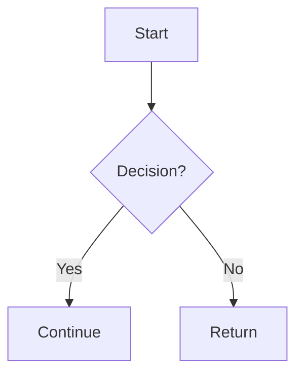

<!--
  这是写作内容的参考模板：本文件因 `draft: true` 不会发布。
  新建文章请复制到 src/content/writing/<year>/<month>/<slug>/zh.md，按需删改。
-->

正文从这里开始。

## 代码块

带语言标记即可获得语法高亮，浅色/深色主题自适应：

```ts
function greet(name: string): string {
  return `Hello, ${name}`;
}
```

## 图（Mermaid）



## 图片

正文图片用 Markdown 语法，路径相对文章目录（自动做 WebP 压缩/尺寸优化）：

```md

```

文章头图用 frontmatter 的 `hero` 字段（见 `docs/publishing-workflow.md`）。

## 数学公式（LaTeX / KaTeX）

行内公式：质能方程 $E = mc^2$。

块级公式：

$$
\int_0^1 x^2 \, dx = \frac{1}{3}
$$
